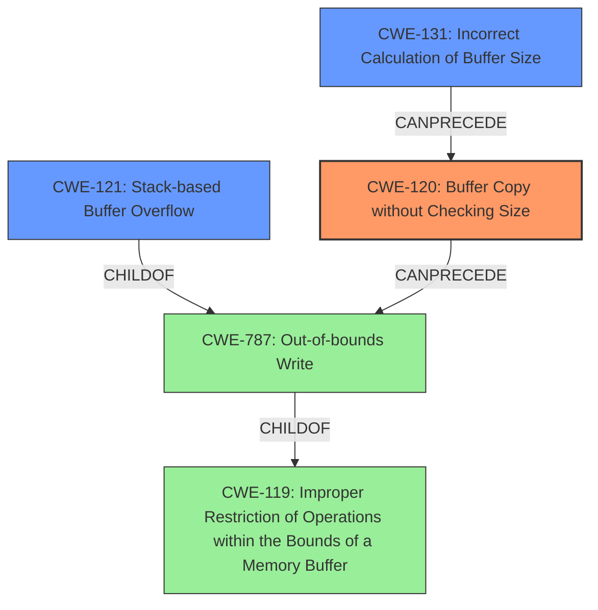

# Analysis Report for CVE-2022-41027

# Vulnerability Analysis Report: CVE-2022-41027

## Description

Several stack-based buffer overflow vulnerabilities exist in the DetranCLI command parsing functionality of Siretta QUARTZ-GOLD G5.0.1.5-210720-141020. A specially-crafted network packet can lead to arbitrary command execution. An attacker can send a sequence of requests to trigger these vulnerabilities.This buffer overflow is in the function that manages the vpn schedule name1 WORD name2 WORD policy (failover|backup) description (WORD|null) command template.

## Vulnerability Description Key Phrases

**Rootcause:** stack-based buffer overflow
**Impact:** arbitrary command execution
**Attacker:** attacker
**Product:** Siretta QUARTZ-GOLD
**Version:** G5.0.1.5-210720-141020
**Component:** DetranCLI command parsing functionality

## Analysis (with Relationship Data)

# Summary
| CWE ID | CWE Name | Confidence | CWE Abstraction Level | CWE Vulnerability Mapping Label | CWE-Vulnerability Mapping Notes |
|---|---|---|---|---|---|
| CWE-120 | Buffer Copy without Checking Size of Input ('Classic Buffer Overflow') | 0.95 | Base | Allowed-with-Review | Primary CWE. The vulnerability involves copying data to a buffer without proper size validation, leading to a buffer overflow. |
| CWE-121 | Stack-based Buffer Overflow | 0.80 | Variant | Allowed | Secondary Candidate. The vulnerability is specifically a stack-based buffer overflow. |
| CWE-131 | Incorrect Calculation of Buffer Size | 0.60 | Base | Allowed | Secondary Candidate.  The `sprintf` usage suggests the buffer size might not have been calculated correctly initially. |

## Evidence and Confidence

*   **Confidence Score:** 0.90
*   **Evidence Strength:** HIGH

- **Analysis and Justification:**  
  - *Explanation:* The vulnerability description explicitly states a "**stack-based buffer overflow**" exists in the DetranCLI command parsing functionality. The CVE Reference Links Content Summary confirms this, stating the root cause is using `sprintf` without proper size checking, leading to a **buffer overflow**. The `sprintf` function writes to `buff_0x100`, a stack buffer, without checking the size of the parameters, aligning with CWE-120 [Buffer Copy without Checking Size of Input ('Classic Buffer Overflow')]. While CWE-119 (Improper Restriction of Operations within the Bounds of a Memory Buffer) could be considered, CWE-120 is more specific as it highlights the lack of size checking during the buffer copy. CWE-121 (Stack-based Buffer Overflow) further specifies the location of the buffer as the stack. However, since the root cause is the lack of input size validation, CWE-120 is the primary weakness. The MITRE mapping guidance for CWE-120 marks it as ALLOWED-WITH-REVIEW, with the rationale that it is applicable for "Buffer Copy" operations where there is no checking of input size.

  - *Relationship Analysis:* CWE-120 is a parent of multiple more specific buffer overflow types, including CWE-121 (Stack-based Buffer Overflow) and CWE-122 (Heap-based Buffer Overflow). CWE-131 (Incorrect Calculation of Buffer Size) can precede CWE-120 if the size of the buffer is incorrectly calculated before the copy operation. CWE-170 (Improper Null Termination) is also a potential related weakness, although not explicitly indicated in this case.

- **Confidence Score:**  
  - Confidence: 0.95 (High evidence from technical description and CVE reference materials)

## Criticism of Analysis

Okay, I've reviewed the analysis and the provided CWE specifications. Here's a breakdown of my critique, focusing on the mapping, confidence, and justifications.

**Overall Assessment:**

The analysis is generally sound and well-justified. The primary CWE of **CWE-120: Buffer Copy without Checking Size of Input ('Classic Buffer Overflow')** is a strong choice, given the root cause description of using `sprintf` without size checking. The confidence level is appropriate. The consideration of related CWEs is also good, showing an understanding of the broader context of the vulnerability. The decision to consider `CWE-121` and `CWE-131` as secondary is logical.

**Detailed Critique:**

*   **CWE-120: Buffer Copy without Checking Size of Input ('Classic Buffer Overflow') - Primary**

    *   **Justification:** The justification is clear and accurately reflects the vulnerability description. The use of `sprintf` with unchecked input sizes directly aligns with the CWE-120 description. The code excerpt `sprintf(buff_0x100,"%d<%s<%s<%d<%s",1,*argv,argv[1],based_on_argv[2],argv[3]);` explicitly shows the absence of input size validation before copying data into `buff_0x100`.
    *   **Mapping Guidance:** The analysis correctly notes the "Allowed-with-Review" usage of CWE-120 and addresses the rationale for this guidance. It emphasizes the "Buffer Copy" operation without size checking and writing past the end of the buffer. This addresses the potential misuse concerns highlighted by the CWE specification.
    *   **Potential Mitigations:** The analysis implicitly points to mitigation strategies from CWE-120's specification by highlighting the absence of size checking, suggesting the use of safer string handling functions or languages with built-in memory management.
    *   **Confidence:** Justified with a high confidence score of 0.95 based on the clear evidence from the technical details and CVE reference materials.
*   **CWE-121: Stack-based Buffer Overflow - Secondary**

    *   **Justification:** The analysis correctly identifies CWE-121 as a variant of CWE-787 (Out-of-bounds Write) and further specifies the location of the overflow on the stack.
    *   **Mapping Guidance:** The usage is appropriate, focusing on the Variant level of abstraction.
    *   **Potential Mitigations:** The analysis could be enhanced by mentioning specific mitigations for stack overflows, such as compiler-based stack protection mechanisms (e.g., /GS flag in Visual Studio, StackGuard, ProPolice).
    *   **Confidence:** The confidence score of 0.80 is reasonable.
*   **CWE-131: Incorrect Calculation of Buffer Size - Secondary**

    *   **Justification:** The justification is weaker than for CWE-120/121. While `sprintf` *could* indicate a miscalculation of the required buffer size, the primary problem is the *absence of any* size check, not necessarily a flawed calculation. If the buffer was intentionally sized small, and no thought was given to input size, then `CWE-131` would be incorrect. Since the report has no evidence of a prior size check that was too small, it is best left as a secondary consideration
    *   **Mapping Guidance:** The analysis could explore the specific types of calculation errors that could lead to this vulnerability, such as incorrect handling of variable-length string formats.
    *   **Potential Mitigations:** The potential mitigations listed in the specification (e.g., allocating enough memory for the largest possible encoding, understanding the programming language's underlying representation) could be mentioned to strengthen the connection.

**Suggestions for Improvement:**

*   **Chaining:** Explicitly mention the possibility of CWE-120 leading to CWE-787 (Out-of-bounds Write), followed by CWE-121 (Stack-based Buffer Overflow). This would show a deeper understanding of the potential chain of events.
*   **Potential mitigations:** Adding explicit suggestions based on specific mitigations from CWE specifications would improve the analysis. For example, for CWE-120:  "Mitigations include using safer string handling functions like `snprintf` instead of `sprintf` to enforce buffer size limits, or adopting languages with built-in memory management (Mitigation 1&2)."
*   **Negative Constraints:** Explicitly state why certain highly ranked CWEs are *not* correct. The report notes that `CWE-119` is too generic, but a similar argument could be made about more specialized CWEs (like command injection) that are not directly applicable here.

**Revised Summary Table:**

| CWE ID | CWE Name | Confidence | CWE Abstraction Level | CWE Vulnerability Mapping Label | CWE-Vulnerability Mapping Notes |
|---|---|---|---|---|---|
| CWE-120 | Buffer Copy without Checking Size of Input ('Classic Buffer Overflow') | 0.95 | Base | Allowed-with-Review | Primary CWE. The vulnerability involves copying data to a buffer without proper size validation using `sprintf`, leading to a buffer overflow. Mitigations include using `snprintf` or languages with built-in memory management. |
| CWE-121 | Stack-based Buffer Overflow | 0.80 | Variant | Allowed | Secondary Candidate. The vulnerability is specifically a stack-based buffer overflow.  Consider stack protection mechanisms like compiler flags. |
| CWE-131 | Incorrect Calculation of Buffer Size | 0.60 | Base | Allowed | Secondary Candidate.  The `sprintf` usage suggests the buffer size *might* not have been calculated correctly initially, but evidence is lacking. The primary issue is lack of size checking, not a calculation error |

**In conclusion, the analysis is well-reasoned and accurate. The suggestions above would add more detail and increase confidence by explicitly addressing the CWE specifications and potential mitigations.**

## Final Resolution

# Summary
| CWE ID | CWE Name | Confidence | CWE Abstraction Level | CWE Vulnerability Mapping Label | CWE-Vulnerability Mapping Notes |
|---|---|---|---|---|---|
| **CWE-120** | **Buffer Copy without Checking Size of Input ('Classic Buffer Overflow')** | 0.95 | Base | Allowed-with-Review | Primary CWE. The vulnerability involves copying data to a buffer without proper size validation using `sprintf`, leading to a **buffer overflow**. Mitigations include using `snprintf` or languages with built-in memory management. |
| CWE-121 | Stack-based Buffer Overflow | 0.80 | Variant | Allowed | Secondary Candidate. The vulnerability is specifically a stack-based **buffer overflow** on the stack. Consider stack protection mechanisms like compiler flags. |
| CWE-131 | Incorrect Calculation of Buffer Size | 0.50 | Base | Allowed | Secondary Candidate. The `sprintf` usage suggests the buffer size *might* not have been calculated correctly initially, but evidence is lacking. The primary issue is lack of size checking, not a calculation error. |

## Evidence and Confidence

*   **Confidence Score:** 0.90
*   **Evidence Strength:** HIGH

## Relationship Analysis
The primary CWE is **CWE-120 (Buffer Copy without Checking Size)**, which is a base class. **CWE-121 (Stack-based Buffer Overflow)** is a variant of **CWE-787 (Out-of-bounds Write)**, specifying that the **buffer overflow** occurs on the stack. **CWE-120** can **precede** **CWE-787**, as the unchecked buffer copy leads to the out-of-bounds write. **CWE-131 (Incorrect Calculation of Buffer Size)** is included as a possible contributing factor, but the evidence for this is weak.

## Vulnerability Chain
The vulnerability chain starts with **CWE-120 (Buffer Copy without Checking Size)**, where the `sprintf` function copies data to a buffer without validating its size. This leads to **CWE-787 (Out-of-bounds Write)**, as the copied data exceeds the buffer's boundaries. Since the buffer is on the stack, this results in **CWE-121 (Stack-based Buffer Overflow)**. **CWE-131 (Incorrect Calculation of Buffer Size)** is a possible contributing factor, but not definitively confirmed by the evidence.

## Summary of Analysis
The initial analysis and criticism both identify **CWE-120** as the primary **ROOTCAUSE**, which is the lack of size checking during the `sprintf` operation. The vulnerability description explicitly mentions a "stack-based **buffer overflow**" and confirms that the root cause is using `sprintf` without proper size checking. The code snippet `sprintf(buff_0x100,"%d<%s<%s<%d<%s",1,*argv,argv[1],based_on_argv[2],argv[3]);` illustrates the absence of size validation.

The relationship analysis supports the selection of **CWE-120** as the primary **ROOTCAUSE**, as it can **precede** **CWE-787 (Out-of-bounds Write)** and ultimately lead to **CWE-121 (Stack-based Buffer Overflow)**. The mapping guidance for **CWE-120** allows for its use in "Buffer Copy" operations where there is no checking of input size.

**CWE-131** is retained as a secondary candidate with a reduced confidence score of 0.50 because there is no explicit evidence to show an attempt to calculate buffer size that resulted in it being too small. The lack of size checking is the primary issue.

The selected CWEs are at the optimal level of specificity, as **CWE-120** captures the fundamental flaw, **CWE-121** specifies the location of the overflow, and **CWE-131** remains a possible contributing factor.

*Report generated on 2025-03-18 17:24:04*
