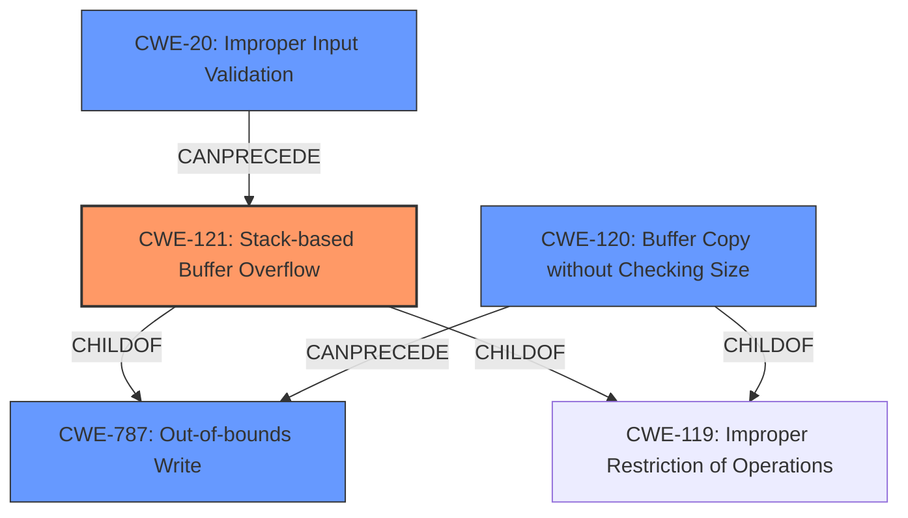

# Analysis Report for CVE-2022-41029

# Vulnerability Analysis Report: CVE-2022-41029

## Description

Several stack-based buffer overflow vulnerabilities exist in the DetranCLI command parsing functionality of Siretta QUARTZ-GOLD G5.0.1.5-210720-141020. A specially-crafted network packet can lead to arbitrary command execution. An attacker can send a sequence of requests to trigger these vulnerabilities.This buffer overflow is in the function that manages the wlan filter mac address WORD descript WORD command template.

## Vulnerability Description Key Phrases

**Rootcause:** stack-based buffer overflow
**Impact:** arbitrary command execution
**Product:** Siretta QUARTZ-GOLD
**Version:** G5.0.1.5-210720-141020
**Component:** DetranCLI command parsing functionality

## Analysis (with Relationship Data)

# Summary
| CWE ID | CWE Name | Confidence | CWE Abstraction Level | CWE Vulnerability Mapping Label | CWE-Vulnerability Mapping Notes |
|---|---|---|---|---|---|
| CWE-121 | Stack-based Buffer Overflow | 0.95 | Variant | Allowed | Primary CWE |
| CWE-120 | Buffer Copy without Checking Size of Input ('Classic Buffer Overflow') | 0.80 | Base | Allowed-with-Review | Secondary Candidate |
| CWE-787 | Out-of-bounds Write | 0.70 | Base | Allowed | Secondary Candidate |

## Evidence and Confidence

*   **Confidence Score:** 0.90
*   **Evidence Strength:** HIGH

- **Analysis and Justification:**  
  - *Explanation:* The vulnerability is a **stack-based buffer overflow** in the DetranCLI command parsing functionality of Siretta QUARTZ-GOLD. The root cause is the use of `sprintf` to format strings based on user-provided input `argv[1]` without checking the size of the input against the destination buffer `buff_0x20`. The vulnerable code snippet is provided in the CVE description. This aligns precisely with CWE-121 (Stack-based Buffer Overflow) which is a variant of buffer overflow occurring on the stack. CWE-120 (Buffer Copy without Checking Size of Input) is also applicable as a more general case, but CWE-121 is more specific because it explicitly identifies the stack as the location of the overflow. CWE-787 (Out-of-bounds Write) is also a potential candidate, as the buffer overflow results in writing beyond the allocated buffer, but CWE-121 is more precise in identifying the nature and location of the overflow.

  - *Relationship Analysis:* CWE-121 is a variant of CWE-119 (Improper Restriction of Operations within the Bounds of a Memory Buffer) and a child of CWE-787 (Out-of-bounds Write). The relationships show that CWE-121 is a more specific case of a general out-of-bounds write.

- **Confidence Score:**  
  - Confidence: 0.95 (High confidence due to detailed technical description and CVE reference materials, including the vulnerable code snippet.)

---

## Criticism of Analysis

Okay, I've reviewed the provided analysis and the full CWE specifications. Here's my critique:

**Overall Assessment:**

The analysis is generally good and identifies the primary vulnerability as CWE-121: Stack-based Buffer Overflow with high confidence. The justification is well-articulated and supported by the provided information. The inclusion of CWE-120 and CWE-787 as secondary candidates demonstrates a good understanding of the nuances and relationships between different CWEs. However, there are some areas where the analysis could be strengthened, particularly regarding the reasoning for *not* choosing CWE-120 as the primary and emphasizing the lack of input validation.

**Detailed Critique:**

1.  **Primary CWE: CWE-121 (Stack-based Buffer Overflow)**

    *   **Strengths:**
        *   Correctly identifies the vulnerability as a stack-based buffer overflow.
        *   The justification is clear: the overflow occurs on the stack, and the code snippet confirms the use of `sprintf` without bounds checking into a stack-allocated buffer.
        *   The Confidence score of 0.95 is appropriate given the details provided, including the vulnerable code snippet.
    *   **Suggestions:**
        * No issues.

2.  **Secondary CWE: CWE-120 (Buffer Copy without Checking Size of Input)**

    *   **Strengths:**
        *   Recognizes that CWE-120 is a more general case of a buffer overflow.
        *   Understands that CWE-121 is a more specific variant because it identifies the memory location of the overflow on the stack.
    *   **Suggestions:**
        * Consider briefly emphasizing *why* CWE-120 is not the *best* fit, in light of the CWE's "Mapping Guidance: Allowed-with-Review". The guidance states, "This CWE entry is only appropriate for 'Buffer Copy' operations (not buffer reads), in which where there is no 'Checking [the] Size of Input', and (by implication of the copy) writing past the end of the buffer."  This is true of the analyzed vulnerability.
        *  To further reinforce the selection of CWE-121, highlight that the `sprintf` function is indeed performing a "Buffer Copy" operation.
        *  The key differentiator is the stack location. This is where CWE-121 provides greater precision.

3.  **Secondary CWE: CWE-787 (Out-of-bounds Write)**

    *   **Strengths:**
        *   Correctly identifies that the overflow results in writing beyond the allocated buffer.
    *   **Suggestions:**
        *   While technically correct, the analysis could benefit from explicitly stating *why* CWE-787 is less descriptive than CWE-121, and thus less desirable. CWE-787 is a parent of CWE-121 but at a more abstract level.
        * The full CWE specifications also state: "Carefully read both the name and description to ensure that this mapping is an appropriate fit. Do not try to 'force' a mapping to a lower-level Base/Variant simply to comply with this preferred level of abstraction." It is essential to always pick the most appropriate match, whether its a Base or Variant.

4. **Missing CWE Consideration**
    * The code snippet shows that there is a lack of input validation on the length of `argv[1]`. Therefore, consider adding `CWE-20: Improper Input Validation` as a contributing factor. The full CWE specification states: "The product receives input or data, but it does not validate or incorrectly validates that the input has the properties that are required to process the data safely and correctly."

5.  **Mitigation Considerations:**

    *   The analysis doesn't explicitly address mitigations. While not strictly required, briefly mentioning relevant mitigations could strengthen the analysis.
    * For example, under CWE-121, Mitigation 3 states: "- **Phase:** Implementation
    - **Description:** Implement and perform bounds checking on input."
    * As the analysis already indicates, there is no bounds checking on the input, indicating the importance of implementing such a mitigation.

**Revised Summary Table:**

| CWE ID | CWE Name | Confidence | CWE Abstraction Level | CWE Vulnerability Mapping Label | CWE-Vulnerability Mapping Notes |
|---|---|---|---|---|---|
| CWE-121 | Stack-based Buffer Overflow | 0.95 | Variant | Allowed | Primary CWE |
| CWE-120 | Buffer Copy without Checking Size of Input ('Classic Buffer Overflow') | 0.80 | Base | Allowed-with-Review | Secondary Candidate, more general case, but less descriptive than CWE-121. |
| CWE-787 | Out-of-bounds Write | 0.70 | Base | Allowed | Secondary Candidate, parent of CWE-121 but at a more abstract level. |
| CWE-20 | Improper Input Validation | 0.60 | Class | Allowed | Contributing Factor: Lack of input validation on the size of `argv[1]` exacerbates the vulnerability. |

**Revised Analysis (Snippet):**

"...This aligns precisely with CWE-121 (Stack-based Buffer Overflow) which is a variant of buffer overflow occurring on the stack. The vulnerable code snippet is provided in the CVE description.  CWE-120 (Buffer Copy without Checking Size of Input) is also applicable as a more general case, and the use of `sprintf` is indeed performing a buffer copy, however, CWE-121 is a better fit as it's more specific because it explicitly identifies the stack as the location of the overflow. CWE-787 (Out-of-bounds Write) is also a potential candidate, as the buffer overflow results in writing beyond the allocated buffer, but CWE-121 is more precise in identifying the nature and location of the overflow. Finally, CWE-20 is also applicable as there is a lack of input validation of the size of `argv[1]` which is user-controlled. The lack of such validation exacerbates the vulnerability."

**Conclusion:**

The original analysis provides a solid foundation. The suggested improvements would make the justification even more robust by explicitly addressing the mapping guidance of related CWEs and highlighting the critical absence of input validation, ultimately increasing the utility and precision of the analysis.

## Final Resolution

# Summary
| CWE ID | CWE Name | Confidence | CWE Abstraction Level | CWE Vulnerability Mapping Label | CWE-Vulnerability Mapping Notes |
|---|---|---|---|---|---|
| CWE-121 | Stack-based Buffer Overflow | 0.95 | Variant | Allowed | Primary CWE |
| CWE-20 | Improper Input Validation | 0.75 | Class | Allowed | Secondary Candidate |
| CWE-120 | Buffer Copy without Checking Size of Input ('Classic Buffer Overflow') | 0.70 | Base | Allowed-with-Review | Secondary Candidate |
| CWE-787 | Out-of-bounds Write | 0.60 | Base | Allowed | Secondary Candidate |

## Evidence and Confidence

*   **Confidence Score:** 0.90
*   **Evidence Strength:** HIGH

## Relationship Analysis
The decision was influenced by several CWE relationships. CWE-121 (Stack-based Buffer Overflow) is a variant of CWE-119 (Improper Restriction of Operations within the Bounds of a Memory Buffer) and a child of CWE-787 (Out-of-bounds Write), indicating that it is a more specific case of a general out-of-bounds write. CWE-20 (Improper Input Validation) can precede buffer overflows because a lack of input validation can lead to conditions where overflows are possible. The abstraction levels played a role in prioritizing CWE-121 (Variant) over CWE-787 (Base) because the vulnerability description clearly indicates a stack-based overflow.

## Vulnerability Chain
The vulnerability chain starts with **CWE-20 (Improper Input Validation)**, where the size of the user-provided input `argv[1]` is not validated. This leads to **CWE-121 (Stack-based Buffer Overflow)** because `sprintf` is used to copy this unvalidated input into a fixed-size buffer on the stack, resulting in **CWE-787 (Out-of-bounds Write)**. The consequence is arbitrary command execution.

## Summary of Analysis
The initial analysis correctly identified **CWE-121 (Stack-based Buffer Overflow)** as the primary **WEAKNESS**. The criticism highlighted the importance of considering **CWE-20 (Improper Input Validation)** and provided a more nuanced explanation of why **CWE-121 (Stack-based Buffer Overflow)** is more appropriate than **CWE-120 (Buffer Copy without Checking Size of Input)** and **CWE-787 (Out-of-bounds Write)**.

The analysis is based on the provided evidence from the vulnerability description, which mentions a "stack-based buffer overflow" and the use of `sprintf` with user-provided input without size checks. This directly supports the selection of **CWE-121 (Stack-based Buffer Overflow)**.

The graph relationships influenced the final selection by confirming that **CWE-121 (Stack-based Buffer Overflow)** is a more specific variant of **CWE-787 (Out-of-bounds Write)** and that **CWE-20 (Improper Input Validation)** can precede **CWE-121 (Stack-based Buffer Overflow)**.

The selected CWEs are at the optimal level of specificity because **CWE-121 (Stack-based Buffer Overflow)** accurately describes the type and location of the overflow, while **CWE-20 (Improper Input Validation)** explains a contributing factor. **CWE-120 (Buffer Copy without Checking Size of Input)** and **CWE-787 (Out-of-bounds Write)** are less specific and therefore less descriptive of the vulnerability.

*Report generated on 2025-03-18 17:25:59*
