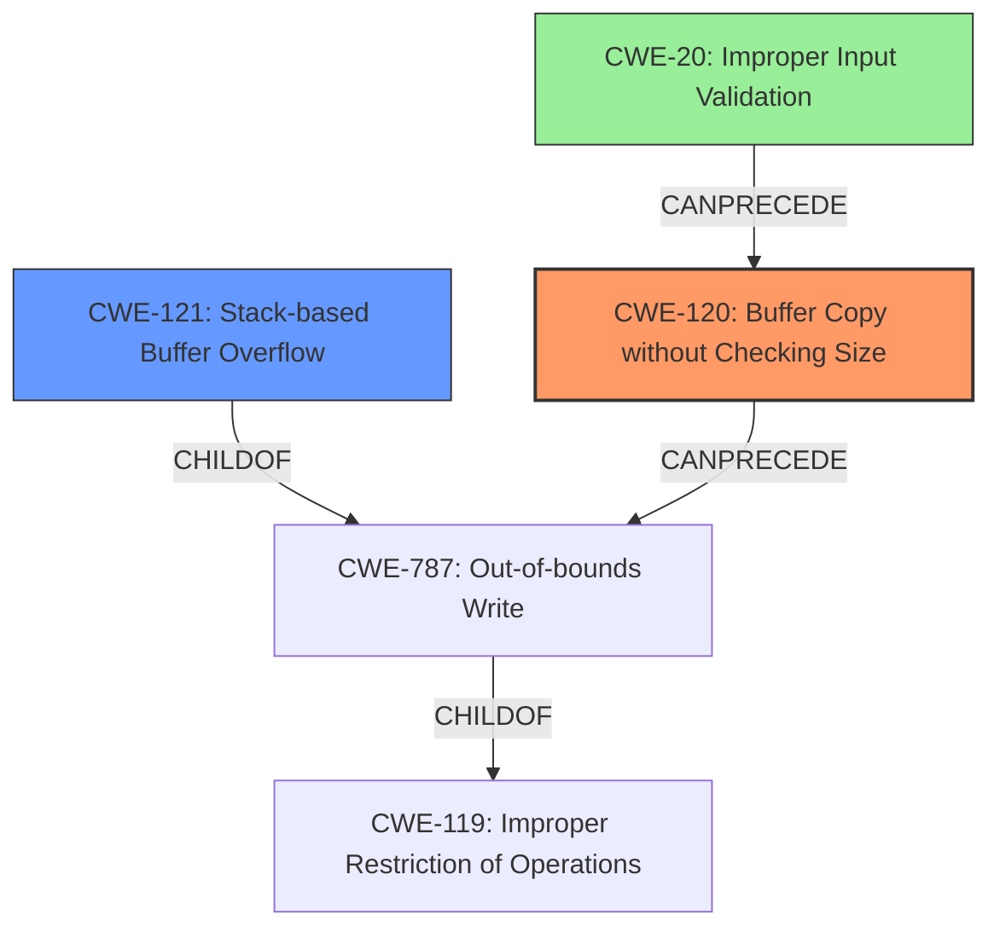

# Analysis Report for CVE-2022-41030

# Vulnerability Analysis Report: CVE-2022-41030

## Description

Several stack-based buffer overflow vulnerabilities exist in the DetranCLI command parsing functionality of Siretta QUARTZ-GOLD G5.0.1.5-210720-141020. A specially-crafted network packet can lead to arbitrary command execution. An attacker can send a sequence of requests to trigger these vulnerabilities.This buffer overflow is in the function that manages the no wlan filter mac address WORD descript WORD command template.

## Vulnerability Description Key Phrases

**Rootcause:** stack-based buffer overflow
**Impact:** arbitrary command execution
**Vector:** specially-crafted network packet
**Attacker:** attacker
**Product:** Siretta QUARTZ-GOLD
**Version:** G5.0.1.5-210720-141020
**Component:** DetranCLI command parsing functionality

## Analysis (with Relationship Data)

# Summary
| CWE ID | CWE Name | Confidence | CWE Abstraction Level | CWE Vulnerability Mapping Label | CWE-Vulnerability Mapping Notes |
|---|---|---|---|---|---|
| CWE-120 | Buffer Copy without Checking Size of Input ('Classic Buffer Overflow') | 0.9 | Base | Allowed-with-Review | Primary CWE. The vulnerability involves copying data to a buffer without checking the size of the input, leading to a buffer overflow. |
| CWE-121 | Stack-based Buffer Overflow | 0.7 | Variant | Allowed | Secondary candidate. The vulnerability specifically mentions a stack-based buffer overflow. |

## Evidence and Confidence

*   **Confidence Score:** 0.8
*   **Evidence Strength:** HIGH

- **Analysis and Justification:**  
  - *Explanation:* The vulnerability description explicitly states a "**stack-based buffer overflow**" in the DetranCLI command parsing of Siretta QUARTZ-GOLD devices. The "CVE Reference Links Content Summary" confirms that the **root cause of the vulnerability** is the use of `sprintf` to format command parameters into a stack buffer without proper size checks, leading to **stack-based buffer overflows** (CWE-120). CWE-120 (Buffer Copy without Checking Size of Input) is a fitting primary mapping because the vulnerability involves copying data into a buffer without validating the size, which aligns with the CWE description. The retriever results list CWE-120 as the top match. Although CWE-121 (Stack-based Buffer Overflow) is more specific, the root cause is the missing size check (CWE-120), which leads to the stack overflow, so CWE-120 is the primary.

  - *Relationship Analysis:* CWE-120 is a Base-level CWE, while CWE-121 is a Variant of buffer overflows that occur specifically on the stack. CWE-121 is a child of CWE-787 (Out-of-bounds Write) and CWE-119 (Improper Restriction of Operations within the Bounds of a Memory Buffer). CWE-120 does not have any direct relationships.

- **Confidence Score:**  
  - Confidence: 0.9 (High evidence from technical description, CVE reference materials, and retriever results)

## Criticism of Analysis

Okay, I've reviewed the analysis provided, including the complete CWE specifications for the referenced weaknesses. Here's a breakdown of my critique:

**Overall Assessment:**

The analysis is generally good and correctly identifies the primary CWE.  The justification is well-reasoned, and the use of supporting evidence (vulnerability description, CVE summary, and retriever results) is appropriate.  The confidence level is also justified.

**Detailed Critique:**

*   **CWE-120: Buffer Copy without Checking Size of Input ('Classic Buffer Overflow') - Primary CWE:**
    *   **Strengths:** This is a strong candidate for the primary CWE. The CVE summary explicitly states that the `DetranCLI` binary uses `sprintf` without proper size checks.  This aligns perfectly with the description of CWE-120. The analysis correctly points out that the vulnerability stems from a lack of size validation during the copy operation.
    *   **Mapping Guidance Considerations:** The analysis correctly acknowledges the "Allowed-with-Review" usage of CWE-120 and addresses the potential for misuse. It clarifies that this CWE is appropriate because it involves a buffer copy operation *without* size checking, leading to writing past the end of the buffer.
    *   **Mitigation Applicability:** The mitigations listed for CWE-120 are relevant.  Using safer string handling functions (e.g., `snprintf` instead of `sprintf`), or employing buffer overflow detection mechanisms would be effective in preventing this vulnerability.
*   **CWE-121: Stack-based Buffer Overflow - Secondary CWE:**
    *   **Strengths:** It's good that the analysis includes this as a secondary candidate. The initial vulnerability description specifically mentions a "stack-based buffer overflow."
    *   **Justification for Secondary Status:** The analysis is correct in stating that CWE-121 is a *result* of the missing size check (CWE-120). CWE-120 is the underlying cause.  CWE-121 describes *where* the overflow occurs, but not *why*.
    *   **Mapping Guidance Considerations:** The analysis correctly recognizes the Rationale: This CWE entry is at the Variant level of abstraction, which is a preferred level of abstraction for mapping to the root causes of vulnerabilities.
    *   **Mitigation Applicability:** The mitigations listed for CWE-121 are also relevant. The Visual Studio /GS flag, StackGuard, and ProPolice, which provide various mechanisms including canary-based detection and range/index checking are examples of mitigation that would help.
*   **Confidence Score:**
    *   The Confidence Score of 0.9 is justified given the explicit mention of a stack-based buffer overflow, the confirmation from CVE reference materials, and the retriever results.
*   **CWE Specification Incorporation:**
    *   The inclusion of relevant portions of the CWE specifications strengthens the analysis by providing a clear definition and context for each CWE.
*   **Relationship Analysis:**
    *   The analysis correctly identifies the relationship between CWE-120 (Base) and CWE-121 (Variant). Also, the specification for CWE-119 is very useful.
*   **Examples from Database:** The analysis provides useful examples for the primary CWE, and those examples are well-chosen.

**Suggestions for Improvement:**

*   **Chain Analysis:** While the analysis notes the relationship between CWE-120 and CWE-121, it could be strengthened by explicitly stating that the vulnerability can be viewed as a chain: `Improper Input Validation (lack of size check) -> Buffer Copy without Checking Size of Input (CWE-120) -> Stack-based Buffer Overflow (CWE-121)`.
* **CWE-787 Out-of-bounds Write:** While not a primary mapping, it might be worth mentioning CWE-787, as it represents the direct effect of the vulnerability - the writing of data outside the boundaries of the buffer. However, since CWE-120 and CWE-121 are more descriptive of the root cause and location, keeping 787 out is fine.
* **CWE-20, Improper Input Validation:** Consider adding CWE-20 as a contributing factor. While CWE-120 directly addresses the lack of size checking during the *copy* operation, the ultimate source of the vulnerability is the lack of *validation* of the input data's length *before* the copy takes place.

**Revised Summary Table:**

| CWE ID | CWE Name | Confidence | CWE Abstraction Level | CWE Vulnerability Mapping Label | CWE-Vulnerability Mapping Notes |
|---|---|---|---|---|---|
| CWE-120 | Buffer Copy without Checking Size of Input ('Classic Buffer Overflow') | 0.9 | Base | Allowed-with-Review | Primary CWE. The vulnerability involves copying data to a buffer without checking the size of the input, leading to a buffer overflow. |
| CWE-121 | Stack-based Buffer Overflow | 0.7 | Variant | Allowed | Secondary candidate. The vulnerability specifically mentions a stack-based buffer overflow. |
| CWE-20 | Improper Input Validation | 0.3 | Class | Allowed | Contributing factor. The root cause includes the lack of validating the size of the input before it is copied to a buffer. |

**Conclusion:**

The analysis is well-structured and accurate. The suggestions above are minor enhancements that could provide a more comprehensive understanding of the vulnerability.

## Final Resolution

# Summary
| CWE ID | CWE Name | Confidence | CWE Abstraction Level | CWE Vulnerability Mapping Label | CWE-Vulnerability Mapping Notes |
|---|---|---|---|---|---|
| CWE-120 | Buffer Copy without Checking Size of Input ('Classic Buffer Overflow') | 0.9 | Base | Allowed-with-Review | Primary CWE. The vulnerability involves copying data to a buffer without checking the size of the input, leading to a buffer overflow. |
| CWE-121 | Stack-based Buffer Overflow | 0.7 | Variant | Allowed | Secondary candidate. The vulnerability specifically mentions a stack-based buffer overflow. |
| CWE-20 | Improper Input Validation | 0.3 | Class | Allowed | Contributing factor. The root cause includes the lack of validating the size of the input before it is copied to a buffer. |

## Evidence and Confidence

*   **Confidence Score:** 0.9
*   **Evidence Strength:** HIGH

## Relationship Analysis
The primary relationship is that CWE-121 (Stack-based Buffer Overflow) is a variant of CWE-787 (Out-of-bounds Write), which in turn is a child of CWE-119 (Improper Restriction of Operations within the Bounds of a Memory Buffer). CWE-120 (Buffer Copy without Checking Size of Input) can precede CWE-787. CWE-20 (Improper Input Validation) can also precede CWE-120, representing a broader class of input handling issues that can lead to buffer overflows. The abstraction levels influenced the selection by prioritizing the more specific Base CWE-120 as the primary cause, with the Variant CWE-121 providing context on where the overflow occurs.

## Vulnerability Chain
The vulnerability chain starts with **CWE-20 (Improper Input Validation)**, where the size of the input is not validated. This leads to **CWE-120 (Buffer Copy without Checking Size of Input)**, where the unchecked input is copied to a buffer. The consequence of this unchecked copy is **CWE-121 (Stack-based Buffer Overflow)**, as the buffer is located on the stack and the copied data exceeds the buffer's boundaries. The final impact is arbitrary command execution due to the overflow.

## Summary of Analysis
The initial analysis and criticism correctly identified CWE-120 as the primary weakness due to the use of `sprintf` without proper size checks, as stated in the CVE summary. The criticism's suggestion to include CWE-20 is valid, as the lack of input validation is a contributing factor.

The graph relationships confirm that CWE-120 is a more direct cause than CWE-119, as CWE-120 specifically addresses the buffer copy operation without size checking. CWE-121 is a variant describing the location of the overflow. Adding CWE-20 provides a more complete picture of the vulnerability chain, starting from the initial lack of input validation.

The selected CWEs are at the optimal level of specificity. CWE-120 is a Base CWE that directly addresses the buffer copy issue. CWE-121 is a Variant that specifies the location of the overflow. CWE-20 is a Class CWE that highlights the lack of input validation as a contributing factor.

The evidence from the vulnerability description ("**stack-based buffer overflow**") and the CVE summary (use of `sprintf` without proper size checks) supports this classification. The relationship analysis and mapping guidance further strengthen the decision.

*Report generated on 2025-03-18 17:26:43*
