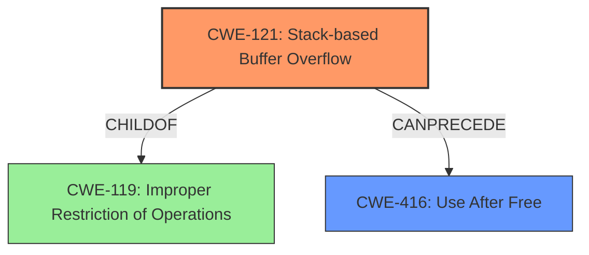

# Final Resolution for CVE-2022-41170

# Summary
| CWE ID | CWE Name | Confidence | CWE Abstraction Level | CWE Vulnerability Mapping Label | CWE-Vulnerability Mapping Notes |
|---|---|---|---|---|---|
| CWE-121 | Stack-based Buffer Overflow | 0.90 | Variant | Allowed | Primary CWE. The vulnerability involves a stack-based buffer overflow leading to memory corruption. |
| CWE-416 | Use After Free | 0.70 | Base | Allowed | Secondary CWE. The vulnerability description mentions a "re-use of dangling pointer" which aligns with a use-after-free condition after the memory has been freed. This is a consequence of memory corruption. |

## Evidence and Confidence

*   **Confidence Score:** 0.85
*   **Evidence Strength:** MEDIUM

## Relationship Analysis
The primary relationship impacting the decision is the hierarchical relationship between CWE-121 (Stack-based Buffer Overflow) and its parent, CWE-119 (Improper Restriction of Operations within the Bounds of a Memory Buffer). However, since CWE-121 is more specific and the vulnerability description explicitly mentions a stack-based overflow, it is the more appropriate choice. CWE-416 (Use After Free) is considered a consequence of the memory corruption caused by the overflow. CWE-416 can follow CWE-121 because the overflow can overwrite memory containing pointers, leading to a use-after-free condition when those overwritten pointers are later dereferenced. The abstraction levels influenced the decision by favoring the more specific Variant (CWE-121) and Base (CWE-416) levels over the Class level (CWE-119).

## Vulnerability Chain
The vulnerability chain starts with a **lack of proper memory management** in the application. This leads to a **CWE-121 (Stack-based Buffer Overflow)** when a manipulated CATIA4 Part file is opened. The overflow corrupts memory on the stack. This can lead to a **CWE-416 (Use After Free)** if a dangling pointer is created due to the memory corruption, and subsequently dereferenced. The final impact is a Remote Code Execution (RCE).

## Summary of Analysis
The initial analysis and the criticism both correctly identified CWE-121 as the primary weakness due to the explicit mention of a "stack-based overflow" in the vulnerability description. The criticism suggested considering CWE-416 (Use After Free) instead of CWE-824 (Access of Uninitialized Pointer) as the secondary weakness, and I agree with this assessment. The phrase "re-use of dangling pointer" implies that the memory was freed and then reused, which aligns better with CWE-416.

The graph relationships influenced the final selection by highlighting the connection between CWE-121 and its parent CWE-119, and showing how CWE-121 can lead to CWE-416. The mapping guidance also supports the selection of CWE-121 as a Variant level CWE and CWE-416 as a Base level CWE.

The selected CWEs are at the optimal level of specificity because they accurately represent the root cause (stack-based buffer overflow) and a likely consequence (use-after-free) of the vulnerability. The evidence from the vulnerability description ("stack-based overflow" and "re-use of dangling pointer") directly supports these choices.