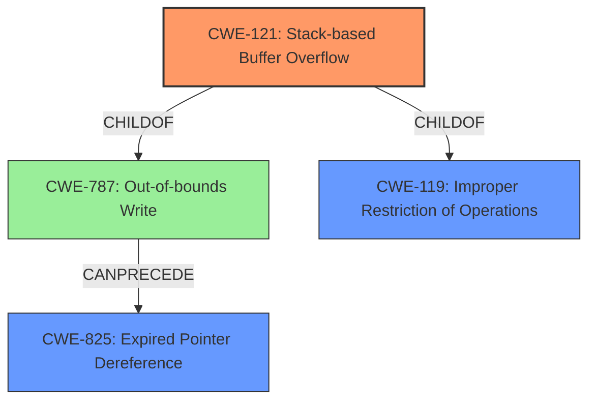

# Final Resolution for CVE-2022-41172

# Summary

| CWE ID | CWE Name | Confidence | CWE Abstraction Level | CWE Vulnerability Mapping Label | CWE-Vulnerability Mapping Notes |
|---|---|---|---|---|---|
| CWE-121 | Stack-based Buffer Overflow | 0.9 | Variant | Allowed | Primary CWE |
| CWE-825 | Expired Pointer Dereference | 0.7 | Base | Allowed | Secondary CWE |
| CWE-787 | Out-of-bounds Write | 0.5 | Base | Allowed | Tertiary CWE |

## Evidence and Confidence

*   **Confidence Score:** 0.8
*   **Evidence Strength:** MEDIUM

## Relationship Analysis
The primary CWE is **CWE-121 (Stack-based Buffer Overflow)**, which is a variant of **CWE-119 (Improper Restriction of Operations within the Bounds of a Memory Buffer)** and **CWE-787 (Out-of-bounds Write)**. **CWE-825 (Expired Pointer Dereference)** can result from **CWE-787 (Out-of-bounds Write)**, forming a chain where the out-of-bounds write corrupts a pointer, leading to its later dereference. The abstraction levels guided the selection, favoring the more specific variant (CWE-121) over the class (CWE-119).

## Vulnerability Chain
The vulnerability chain starts with a manipulated AutoCAD file. This file, when opened in SAP 3D Visual Enterprise Author, triggers a **CWE-121 (Stack-based Buffer Overflow)** due to improper memory management. The **ROOTCAUSE** is the lack of proper bounds checking when processing the file. The **CWE-121 (Stack-based Buffer Overflow)** leads to memory corruption, which can be represented by **CWE-787 (Out-of-bounds Write)**. A potential exploit is the **stack-based overflow** overwriting a pointer with an address that was previously valid but is now freed; dereferencing it would trigger **CWE-825 (Expired Pointer Dereference)**. The final impact is potential Remote Code Execution.

## Summary of Analysis
The initial analysis and criticism were both considered, with the final assessment incorporating the suggestion to include **CWE-787 (Out-of-bounds Write)** as a tertiary CWE. This decision was based on the vulnerability description's mention of memory corruption due to the stack-based buffer overflow, which can be represented by an out-of-bounds write. The graph relationships highlight the connection between **CWE-121 (Stack-based Buffer Overflow)**, **CWE-787 (Out-of-bounds Write)**, and **CWE-825 (Expired Pointer Dereference)**, forming a chain. The selected CWEs are at the optimal level of specificity, with **CWE-121 (Stack-based Buffer Overflow)** being a variant and **CWE-825 (Expired Pointer Dereference)** and **CWE-787 (Out-of-bounds Write)** being base level CWEs.

The evidence for **CWE-121 (Stack-based Buffer Overflow)** is strong: "Due to lack of proper memory management, when a victim opens a manipulated AutoCAD (.dxf, TeighaTranslator.exe) file received from untrusted sources in SAP 3D Visual Enterprise Author - version 9, it is possible that a Remote Code Execution can be triggered when payload forces a stack-based overflow".
The evidence for **CWE-825 (Expired Pointer Dereference)** is: "or a re-use of dangling pointer which refers to overwritten space in memory."
The evidence for **CWE-787 (Out-of-bounds Write)** is the fact that the overflow causes memory corruption.