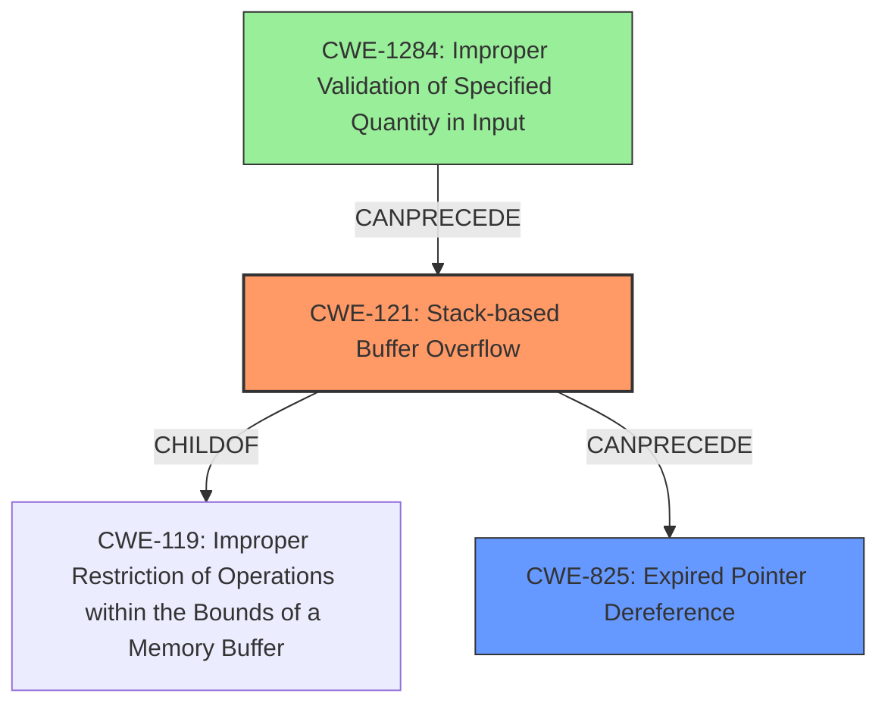

# Final Resolution for CVE-2022-41177

# Summary
| CWE ID | CWE Name | Confidence | CWE Abstraction Level | CWE Vulnerability Mapping Label | CWE-Vulnerability Mapping Notes |
|---|---|---|---|---|---|
| CWE-121 | Stack-based Buffer Overflow | 0.85 | Variant | Primary | Allowed |
| CWE-825 | Expired Pointer Dereference | 0.75 | Base | Secondary | Allowed |
| CWE-1284 | Improper Validation of Specified Quantity in Input | 0.60 | Base | Contributing Factor | Allowed |

## Evidence and Confidence

*   **Confidence Score:** 0.80
*   **Evidence Strength:** MEDIUM

## Relationship Analysis
The primary relationship is that **CWE-121 (Stack-based Buffer Overflow)** is a variant of **CWE-119 (Improper Restriction of Operations within the Bounds of a Memory Buffer)**, indicating a more specific type of buffer overflow occurring on the stack. **CWE-825 (Expired Pointer Dereference)** represents a potential consequence of memory mismanagement that could arise from a stack overflow or other memory corruption issues. The analysis also considers **CWE-1284 (Improper Validation of Specified Quantity in Input)** as a potential root cause contributing to the vulnerability chain, where a missing or incorrect validation of input size could lead to a buffer overflow. The abstraction levels are appropriate: CWE-121 is a Variant, CWE-825 is a Base, and CWE-1284 is a Base.

## Vulnerability Chain
The vulnerability chain starts with **CWE-1284 (Improper Validation of Specified Quantity in Input)**, where the application fails to validate the size of data read from the Iges file. This leads to **CWE-121 (Stack-based Buffer Overflow)** because the unchecked size is used to copy data into a stack buffer that is too small. As a result of the overflow or other memory mismanagement, a pointer can become invalid, leading to **CWE-825 (Expired Pointer Dereference)** when the application attempts to use the pointer. The final impact is Remote Code Execution (RCE).

## Summary of Analysis
The initial analysis correctly identifies **CWE-121 (Stack-based Buffer Overflow)** and **CWE-825 (Expired Pointer Dereference)** as potential vulnerabilities. The criticism highlights that the connection between "**lack of proper memory management**" and the specific overflow mechanism is weak. It suggests considering other related CWEs, such as **CWE-131 (Incorrect Calculation of Buffer Size)**, and emphasizing input validation.

Based on the criticism and the provided CWE specifications, I agree that the description points strongly towards a **CWE-121 (Stack-based Buffer Overflow)**. The vulnerability description explicitly mentions a "**stack-based overflow**." The re-use of a dangling pointer also aligns with **CWE-825 (Expired Pointer Dereference)**. However, it's also plausible that the root cause stems from a failure to validate the input size, hence including **CWE-1284 (Improper Validation of Specified Quantity in Input)** in the chain. The evidence provided does not definitively pinpoint the lack of input validation, so the confidence remains moderate. The chain shows how a failure to validate input can lead to a buffer overflow and subsequent dangling pointer issues, potentially resulting in remote code execution.

The selected CWEs are at the optimal level of specificity. **CWE-121 (Stack-based Buffer Overflow)** is a Variant, which is a preferred level. **CWE-825 (Expired Pointer Dereference)** and **CWE-1284 (Improper Validation of Specified Quantity in Input)** are at the Base level, which are also preferred.