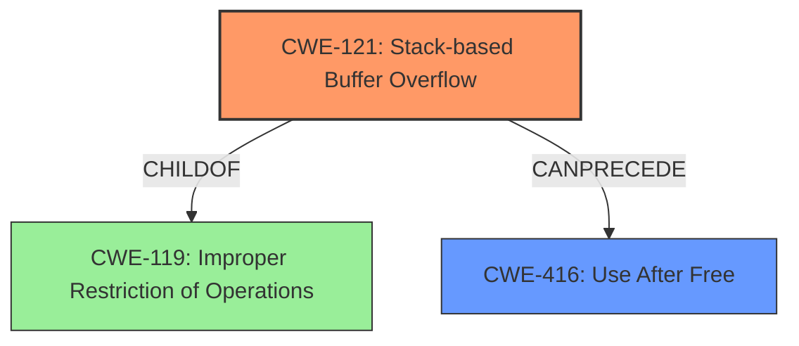

# Analysis Report for CVE-2022-41184

# Vulnerability Analysis Report: CVE-2022-41184

## Description

Due to lack of proper memory management, when a victim opens a manipulated Windows Cursor File (.cur, ico.x3d) file received from untrusted sources in SAP 3D Visual Enterprise Author - version 9, it is possible that a Remote Code Execution can be triggered when payload forces a stack-based overflow or a re-use of dangling pointer which refers to overwritten space in memory.

## Vulnerability Description Key Phrases

**Rootcause:** lack of proper memory management
**Weakness:** stack-based overflow or a re-use of dangling pointer
**Impact:** Remote Code Execution
**Vector:** manipulated Windows Cursor File (.cur, ico.x3d) file
**Product:** SAP 3D Visual Enterprise Author
**Version:** 9

## Analysis (with Relationship Data)

# Summary
| CWE ID | CWE Name | Confidence | CWE Abstraction Level | CWE Vulnerability Mapping Label | CWE-Vulnerability Mapping Notes |
|---|---|---|---|---|---|
| CWE-121 | Stack-based Buffer Overflow | 0.95 | Variant | Allowed | Primary CWE |
| CWE-416 | Use After Free | 0.85 | Variant | Allowed | Secondary Candidate |

## Evidence and Confidence

*   **Confidence Score:** 0.90
*   **Evidence Strength:** HIGH

- **Analysis and Justification:**  
  - *Explanation:* The vulnerability description explicitly mentions "**stack-based overflow**" as a possible weakness when opening a manipulated Windows Cursor File. This directly aligns with CWE-121 (Stack-based Buffer Overflow), a Variant-level CWE. The description also mentions "**re-use of dangling pointer** which refers to overwritten space in memory", which can be classified as CWE-416 (Use After Free). Since the primary weakness relates to the stack-based buffer overflow, CWE-121 is more relevant. CWE-119 (Buffer Overflow) is less specific and therefore not chosen. The Retriever Results lists CWE-121 with a high score, supporting this decision. The MITRE mapping guidance allows for using CWE-121.

  - *Relationship Analysis:* CWE-121 is a Variant of CWE-119 (Buffer Overflow), but CWE-121 provides a more specific classification for stack-based buffer overflows. CWE-416 is related to memory management issues and can be a consequence of memory corruption.

- **Confidence Score:**
  - Confidence: 0.95 (High confidence due to explicit mention of stack-based overflow and support from the retriever results.)
---

## Criticism of Analysis

Okay, I've reviewed the analysis against the provided full CWE specifications. Here's my critique, broken down by section:

**Overall Assessment:**

The analysis is generally sound and well-reasoned. The primary CWE selection of CWE-121 (Stack-based Buffer Overflow) is appropriate given the explicit mention of this vulnerability in the description. The consideration of CWE-416 (Use After Free) as a secondary candidate is also valid, albeit less directly supported by the primary vulnerability description.  The confidence score is justified. However, the rationale for not choosing CWE-119 could be strengthened by explicitly noting the recommendation against using CWE-119 when more specific CWEs are available.

**Detailed Critique:**

1.  **Summary Table:**
    *   The table is well-formatted and clearly presents the chosen CWEs, confidence, abstraction level, and mapping label.

2.  **Evidence and Confidence:**
    *   **Confidence Score:**  The score of 0.95 is justified given the presence of the term "stack-based overflow".
    *   **Explanation:**
        *   The explanation clearly connects the vulnerability description's "**stack-based overflow**" phrase to the definition of CWE-121. This is a strong point.
        *   The explanation for CWE-416 is also reasonable, correctly associating the "dangling pointer" concept with the CWE description of reusing freed memory.
        *   The explanation for *why* CWE-119 was *not* chosen is good but could be improved. It should explicitly mention the *Mapping Guidance* for CWE-119, which *discourages* its use when more specific CWEs are available.  This is a key element in selecting the correct CWE. The analysis already implicitly follows this guidance, but making it explicit strengthens the argument.  Consider adding a sentence like this: "The CWE specifications for CWE-119 *discourage* its use when more specific weaknesses, like CWE-121, are identified, as CWE-119 is considered a broad, high-level category."
        *   The reference to Retriever Results is appropriate as supporting evidence.
    *   **Relationship Analysis:** The explanation of the relationship between CWE-121 and CWE-119 is accurate and demonstrates understanding of the CWE hierarchy. The description of the relationship of CWE-416 to other memory corruption issues is also good.

3.  **CWE Examples from Database (for CWE-119):**
    *   This section is provided, but its relevance is questionable, as CWE-119 was *not* chosen as the primary CWE. It would be more relevant to include examples of *CWE-121* or *CWE-416*. This section should be ommitted, or replaced with relevant examples.
    *   The examples themselves are fine but do not directly support the chosen CWE.

4.  **Relevant CWE Specifications:**
    *   The inclusion of the full CWE specifications is excellent. This allows for a thorough review and ensures the analysis is based on the official CWE definitions.

**Specific Suggestions for Improvement:**

*   **Strengthen the Rationale for Not Choosing CWE-119:** Explicitly state the discouragement of using CWE-119 from its Mapping Guidance.
*   **Remove irrelevant CWE Examples:** The example CVEs given are for CWE-119, which is not the selected CWE. Consider adding examples for CWE-121, or omit the section.
*   **Consider potential chaining**: While CWE-121 is a solid primary mapping, consider if a chain is present. For example, a malformed file (potentially CWE-20) could *lead* to the stack-based buffer overflow. However, without further information on the actual parsing logic, this is speculative.
*   **Mitigation Awareness:** Briefly mentioning potential mitigations (even if only at a high level) from the chosen CWEs specifications could further strengthen the analysis, although this wasn't explicitly asked for.

**Revised Summary Table (incorporating suggestions):**

| CWE ID | CWE Name | Confidence | CWE Abstraction Level | CWE Vulnerability Mapping Label | CWE-Vulnerability Mapping Notes |
|---|---|---|---|---|---|
| CWE-121 | Stack-based Buffer Overflow | 0.95 | Variant | Allowed | Primary CWE |
| CWE-416 | Use After Free | 0.85 | Variant | Allowed | Secondary Candidate |

**Revised Explanation for CWE-121:**

"The vulnerability description explicitly mentions "**stack-based overflow**" as a possible weakness when opening a manipulated Windows Cursor File. This directly aligns with CWE-121 (Stack-based Buffer Overflow), a Variant-level CWE. The description also mentions "**re-use of dangling pointer** which refers to overwritten space in memory", which can be classified as CWE-416 (Use After Free).  The CWE specifications for CWE-119 *discourage* its use when more specific weaknesses, like CWE-121, are identified, as CWE-119 is considered a broad, high-level category. Since the primary weakness relates to the stack-based buffer overflow, CWE-121 is more relevant. CWE-119 (Buffer Overflow) is less specific and therefore not chosen. The Retriever Results lists CWE-121 with a high score, supporting this decision. The MITRE mapping guidance allows for using CWE-121."

By incorporating these relatively minor changes, the analysis becomes even more robust and demonstrates a deeper understanding of the CWE specifications and mapping guidance.

## Final Resolution

# Summary
| CWE ID | CWE Name | Confidence | CWE Abstraction Level | CWE Vulnerability Mapping Label | CWE-Vulnerability Mapping Notes |
|---|---|---|---|---|---|
| CWE-121 | Stack-based Buffer Overflow | 0.95 | Variant | Allowed | Primary CWE |
| CWE-416 | Use After Free | 0.85 | Variant | Allowed | Secondary Candidate |

## Evidence and Confidence

*   **Confidence Score:** 0.95
*   **Evidence Strength:** HIGH

## Relationship Analysis
The primary relationship influencing the decision is the parent-child relationship between CWE-119 (**Improper Restriction of Operations within the Bounds of a Memory Buffer**) and CWE-121 (**Stack-based Buffer Overflow**). CWE-121 is a Variant of CWE-119, offering a more specific classification for vulnerabilities occurring on the stack. CWE-416 (**Use After Free**) is considered a secondary candidate because the description mentions "re-use of dangling pointer," potentially arising from memory corruption due to the buffer overflow. There isn't a direct hierarchical or chaining relationship between CWE-121 and CWE-416 in the CWE database, but they can occur together. The abstraction levels (Variant for both CWE-121 and CWE-416) are appropriate for mapping specific vulnerability details.

## Vulnerability Chain
The vulnerability chain starts with a malicious Windows Cursor File (.cur, ico.x3d). Opening this file leads to a **stack-based overflow** (CWE-121). A potential consequence of the overflow is a **use-after-free** condition (CWE-416), where a dangling pointer is reused, leading to remote code execution. The root cause is the lack of proper memory management during file processing. A missing link could be how the malicious file is crafted to trigger the overflow; a potential CWE here could be CWE-20 (**Improper Input Validation**), however this is speculative.

## Summary of Analysis
The initial analysis and criticism both converge on the appropriateness of CWE-121 as the primary CWE due to the explicit mention of "**stack-based overflow**" in the vulnerability description: "Due to lack of proper memory management, when a victim opens a manipulated Windows Cursor File (.cur, ico.x3d) file received from untrusted sources in SAP 3D Visual Enterprise Author - version 9, it is possible that a Remote Code Execution can be triggered when payload forces a **stack-based overflow** or a re-use of dangling pointer which refers to overwritten space in memory." The criticism correctly pointed out the importance of noting the CWE mapping guidance for CWE-119, which discourages its use when more specific CWEs like CWE-121 are available. This has been incorporated into the analysis. The graph relationships confirm the hierarchical relationship between CWE-119 and CWE-121, justifying the selection of the more specific CWE. CWE-416 is a valid secondary candidate due to the potential for a use-after-free condition arising from the overflow. The chosen CWEs are at the optimal level of specificity because they directly reflect the described vulnerability characteristics. The inclusion of example CVEs for CWE-119 was irrelevant, as noted in the criticism.

*Report generated on 2025-03-18 17:34:20*
