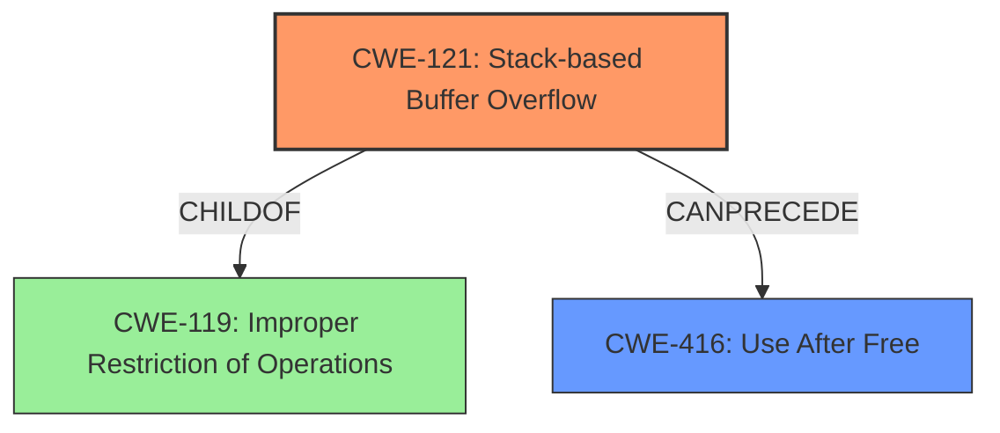

# Final Resolution for CVE-2022-41184

# Summary
| CWE ID | CWE Name | Confidence | CWE Abstraction Level | CWE Vulnerability Mapping Label | CWE-Vulnerability Mapping Notes |
|---|---|---|---|---|---|
| CWE-121 | Stack-based Buffer Overflow | 0.95 | Variant | Allowed | Primary CWE |
| CWE-416 | Use After Free | 0.85 | Variant | Allowed | Secondary Candidate |

## Evidence and Confidence

*   **Confidence Score:** 0.95
*   **Evidence Strength:** HIGH

## Relationship Analysis
The primary relationship influencing the decision is the parent-child relationship between CWE-119 (**Improper Restriction of Operations within the Bounds of a Memory Buffer**) and CWE-121 (**Stack-based Buffer Overflow**). CWE-121 is a Variant of CWE-119, offering a more specific classification for vulnerabilities occurring on the stack. CWE-416 (**Use After Free**) is considered a secondary candidate because the description mentions "re-use of dangling pointer," potentially arising from memory corruption due to the buffer overflow. There isn't a direct hierarchical or chaining relationship between CWE-121 and CWE-416 in the CWE database, but they can occur together. The abstraction levels (Variant for both CWE-121 and CWE-416) are appropriate for mapping specific vulnerability details.

## Vulnerability Chain
The vulnerability chain starts with a malicious Windows Cursor File (.cur, ico.x3d). Opening this file leads to a **stack-based overflow** (CWE-121). A potential consequence of the overflow is a **use-after-free** condition (CWE-416), where a dangling pointer is reused, leading to remote code execution. The root cause is the lack of proper memory management during file processing. A missing link could be how the malicious file is crafted to trigger the overflow; a potential CWE here could be CWE-20 (**Improper Input Validation**), however this is speculative.

## Summary of Analysis
The initial analysis and criticism both converge on the appropriateness of CWE-121 as the primary CWE due to the explicit mention of "**stack-based overflow**" in the vulnerability description: "Due to lack of proper memory management, when a victim opens a manipulated Windows Cursor File (.cur, ico.x3d) file received from untrusted sources in SAP 3D Visual Enterprise Author - version 9, it is possible that a Remote Code Execution can be triggered when payload forces a **stack-based overflow** or a re-use of dangling pointer which refers to overwritten space in memory." The criticism correctly pointed out the importance of noting the CWE mapping guidance for CWE-119, which discourages its use when more specific CWEs like CWE-121 are available. This has been incorporated into the analysis. The graph relationships confirm the hierarchical relationship between CWE-119 and CWE-121, justifying the selection of the more specific CWE. CWE-416 is a valid secondary candidate due to the potential for a use-after-free condition arising from the overflow. The chosen CWEs are at the optimal level of specificity because they directly reflect the described vulnerability characteristics. The inclusion of example CVEs for CWE-119 was irrelevant, as noted in the criticism.