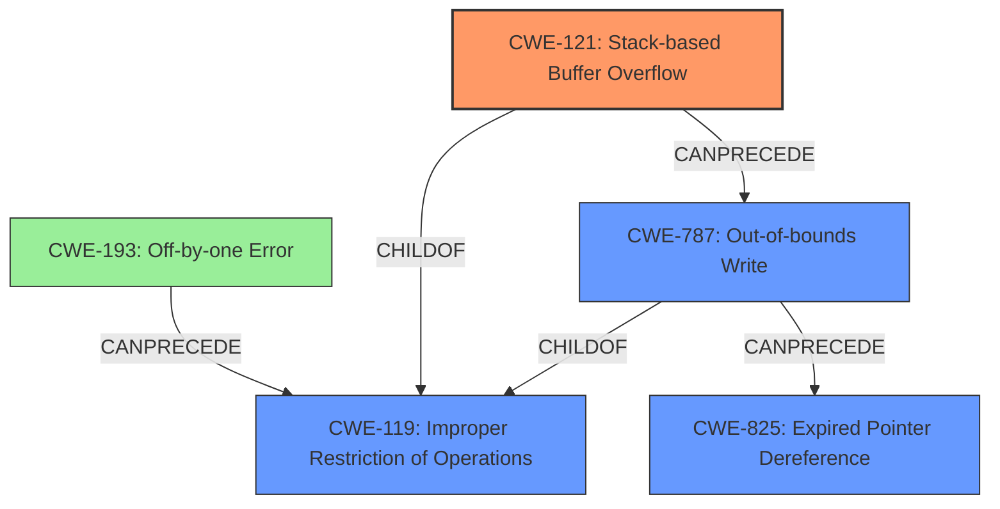

# Final Resolution for CVE-2022-41186

# Summary
| CWE ID | CWE Name | Confidence | CWE Abstraction Level | CWE Vulnerability Mapping Label | CWE-Vulnerability Mapping Notes |
|---|---|---|---|---|---|
| **CWE-121** | **CWE-121: Stack-based Buffer Overflow** | 0.9 | Variant | Allowed | Primary CWE: The vulnerability description explicitly mentions a stack-based overflow. |
| **CWE-825** | **CWE-825: Expired Pointer Dereference** | 0.7 | Base | Allowed | Secondary CWE: The vulnerability description also mentions a re-use of a dangling pointer. |
| **CWE-193** | **CWE-193: Off-by-one Error** | 0.3 | Base | Allowed | Acknowledged CWE: Could be a contributing factor in the **improper memory management**. |

## Evidence and Confidence

*   **Confidence Score:** 0.8
*   **Evidence Strength:** HIGH

## Relationship Analysis
The primary weakness is a **CWE-121 (CWE-121: Stack-based Buffer Overflow)**, which is a variant of **CWE-119 (CWE-119: Improper Restriction of Operations within the Bounds of a Memory Buffer)**. **CWE-825 (CWE-825: Expired Pointer Dereference)** can follow **CWE-787 (CWE-787: Out-of-bounds Write)**, which in turn can be caused by **CWE-121**. Also, **CWE-193 (CWE-193: Off-by-one Error)** can precede **CWE-119** and be a contributing factor to **improper memory management**.

## Vulnerability Chain
The vulnerability chain starts with **improper memory management**, which leads to a **CWE-121 (CWE-121: Stack-based Buffer Overflow)**. The stack-based buffer overflow can result in an **CWE-787 (CWE-787: Out-of-bounds Write)**, overwriting memory and potentially leading to an **CWE-825 (CWE-825: Expired Pointer Dereference)** if a dangling pointer is created and later dereferenced. **CWE-193 (CWE-193: Off-by-one Error)** could contribute to the **improper memory management** leading to the overflow.

## Summary of Analysis
The initial analysis and criticism both accurately identified the primary and secondary CWEs based on the vulnerability description. The core of the vulnerability lies in the **improper memory management** that leads to a stack-based buffer overflow (**CWE-121**) and the re-use of a dangling pointer (**CWE-825**).

The vulnerability description explicitly mentions "stack-based overflow" and "re-use of dangling pointer," providing strong evidence for **CWE-121** and **CWE-825**, respectively.

The analysis also correctly considered and dismissed other potential CWEs, such as **CWE-789 (CWE-789: Memory Allocation with Excessive Size Value)**, **CWE-787 (CWE-787: Out-of-bounds Write)**, **CWE-1284 (CWE-1284: Improper Validation of Specified Quantity in Input)** and **CWE-770 (CWE-770: Allocation of Resources Without Limits or Throttling)**, as being less directly relevant to the described vulnerability. However, it's important to acknowledge that some of these could be consequences or contributing factors. **CWE-193** was added as a tertiary concern, as it could contribute to the **improper memory management**.

The graph relationships reinforce the understanding of how these CWEs can interact. **CWE-121** is a specific type of buffer overflow (**CWE-119**), and an out-of-bounds write (**CWE-787**) caused by the overflow can lead to a dangling pointer (**CWE-825**). **CWE-193** can precede **CWE-119**.

The selected CWEs are at the optimal level of specificity, as they directly address the described vulnerability (stack-based overflow and dangling pointer). More general CWEs would not capture the specific nature of the flaw.