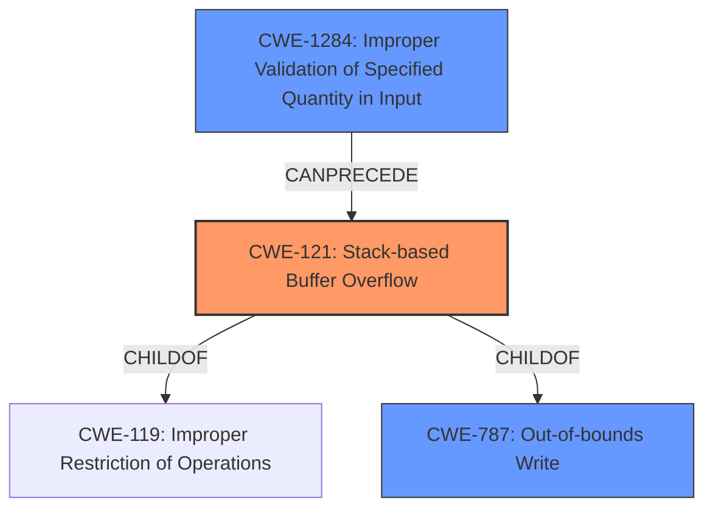

# Final Resolution for CVE-2022-41190

# Summary
| CWE ID | CWE Name | Confidence | CWE Abstraction Level | CWE Vulnerability Mapping Label | CWE-Vulnerability Mapping Notes |
|---|---|---|---|---|---|
| CWE-121 | Stack-based Buffer Overflow | 0.9 | Variant | Allowed | Primary CWE |
| CWE-787 | Out-of-bounds Write | 0.7 | Base | Allowed | Secondary Candidate, General class of write out-of-bounds |
| CWE-1284 | Improper Validation of Specified Quantity in Input | 0.6 | Base | Allowed | Secondary Candidate, Missing input validation allows overflow to occur |

## Evidence and Confidence

*   **Confidence Score:** 0.8
*   **Evidence Strength:** HIGH

## Relationship Analysis
The primary CWE is CWE-121 (Stack-based Buffer Overflow), a variant of CWE-119 (Improper Restriction of Operations within the Bounds of a Memory Buffer). CWE-787 (Out-of-bounds Write) is a parent of CWE-121 and represents the more general case of writing beyond buffer boundaries. The analysis introduces CWE-1284 (Improper Validation of Specified Quantity in Input) to represent the lack of input validation, which is a key factor enabling the overflow.

## Vulnerability Chain
The vulnerability chain starts with **CWE-1284 (Improper Validation of Specified Quantity in Input)**, where the application fails to properly validate the size or structure of the input file. This allows a malformed AutoCAD file to be processed. This leads to **CWE-121 (Stack-based Buffer Overflow)**, where the malformed input causes data to be written beyond the boundaries of a stack-allocated buffer. Finally, this **overflow** can result in remote code execution due to the overwritten memory.

## Summary of Analysis
The initial analysis and criticism provided a strong foundation for CWE classification. The vulnerability description clearly states "stack-based overflow," which directly maps to CWE-121. The criticism highlighted the importance of input validation, leading to the inclusion of CWE-1284.
  - The primary assessment is based on the vulnerability description: *"Due to lack of proper memory management, when a victim opens a manipulated AutoCAD (.dxf, TeighaTranslator.exe) file received from untrusted sources in SAP 3D Visual Enterprise Viewer - version 9, it is possible that a Remote Code Execution can be triggered when payload forces a **stack-based overflow** or a re-use of dangling pointer which refers to overwritten space in memory."*
  - The graph relationships influenced the selection by confirming that CWE-121 is the most specific and appropriate choice, given its relationship as a child of CWE-119 and CWE-787.
  - The selected CWEs are at the optimal level of specificity because CWE-121 is a variant that clearly describes the stack-based nature of the overflow, while CWE-787 captures the general out-of-bounds write aspect. CWE-1284 highlights the critical missing input validation.
  - The alternative candidate of CWE-824 was not appropriate, but CWE-1284 was more appropriately added.