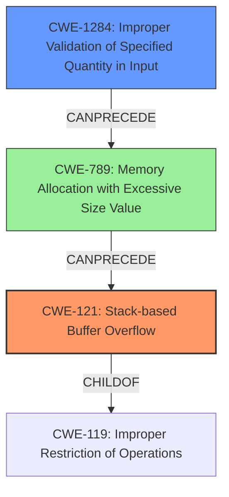

# Analysis Report for CVE-2022-41191

# Vulnerability Analysis Report: CVE-2022-41191

## Description

Due to lack of proper memory management, when a victim opens a manipulated Jupiter Tesselation (.jt, JTReader.x3d) file received from untrusted sources in SAP 3D Visual Enterprise Viewer - version 9, it is possible that a Remote Code Execution can be triggered when payload forces a stack-based overflow or a re-use of dangling pointer which refers to overwritten space in memory.

## Vulnerability Description Key Phrases

**Rootcause:** lack of proper memory management
**Weakness:** stack-based overflow or a re-use of dangling pointer
**Impact:** Remote Code Execution
**Vector:** manipulated Jupiter Tesselation file
**Product:** SAP 3D Visual Enterprise Viewer
**Version:** 9

## Analysis (with Relationship Data)

# Summary
| CWE ID | CWE Name | Confidence | CWE Abstraction Level | CWE Vulnerability Mapping Label | CWE-Vulnerability Mapping Notes |
|---|---|---|---|---|---|
| CWE-121 | Stack-based Buffer Overflow | 0.9 | Variant | Allowed | Primary CWE |
| CWE-825 | Expired Pointer Dereference | 0.7 | Base | Allowed | Secondary Candidate |
| CWE-770 | Allocation of Resources Without Limits or Throttling | 0.6 | Base | Allowed | Secondary Candidate |

## Evidence and Confidence

*   **Confidence Score:** 0.8
*   **Evidence Strength:** MEDIUM

- **Analysis and Justification:**  
  - *Explanation:* The vulnerability description explicitly states "**stack-based overflow or a re-use of dangling pointer**" caused by "**lack of proper memory management**". This directly aligns with CWE-121 (Stack-based Buffer Overflow) because the overflow occurs on the stack. CWE-825 (Expired Pointer Dereference) is a possible secondary issue because the description indicates the reuse of a "dangling pointer," which refers to overwritten memory. This dangling pointer usage could lead to exploitable conditions. While CWE-119 (Improper Restriction of Operations within the Bounds of a Memory Buffer) is a parent class, CWE-121 is more specific and therefore more appropriate as a primary mapping. CWE-770 (Allocation of Resources Without Limits or Throttling) is also a candidate because the **lack of proper memory management** can be related to allocation issues. MITRE mapping guidance allows the use of CWE-121 and CWE-825. The CVE reference provides "NOINFO", so that lowers the evidence level to medium.

  - *Relationship Analysis:* CWE-121 is a variant of CWE-119 (Improper Restriction of Operations within the Bounds of a Memory Buffer). CWE-825 is a base level weakness related to the dereferencing of expired pointers, often linked to memory management issues. CWE-770 can lead to resource exhaustion which can be related to improper memory management and the overflow.

- **Confidence Score:**  
  - Confidence: 0.8 (Strong evidence from vulnerability description for CWE-121; weaker evidence for CWE-825 and CWE-770)
---

## Criticism of Analysis

Okay, let's review the CWE analysis provided, using the full CWE specifications as a guide.

**Overall Assessment:**

The analysis is well-structured and provides a good justification for the primary and secondary CWE mappings. The evidence strength is reasonably assessed as "MEDIUM" due to the "NOINFO" CVE reference. However, there's room for improvement in the confidence scores and justification for the secondary mappings. Also, the analysis focuses too heavily on the *consequences* of the root cause rather than the root cause itself.

**Detailed Review:**

**1. CWE-121: Stack-based Buffer Overflow (Confidence: 0.9, Primary)**

*   **Assessment:**  Good choice as the primary CWE. The vulnerability description explicitly mentions "stack-based overflow," making this a direct match.
*   **Justification:** The explanation clearly states the direct alignment of "stack-based overflow" in the description with CWE-121.
*   **CWE Specification Alignment:** The description of CWE-121 perfectly matches.
*   **Potential Mitigations:** The mitigations listed in CWE-121's specifications (compiler-based overflow detection, using abstraction libraries, input bounds checking) are all applicable to this scenario.
*   **Critique:** Confidence of 0.9 is justified given the explicit mention of "stack-based overflow" in the initial description. No major issues here.

**2. CWE-825: Expired Pointer Dereference (Confidence: 0.7, Secondary Candidate)**

*   **Assessment:** Reasonable, but could be strengthened. The mention of "dangling pointer" supports this mapping.  However, the analysis needs to explain *why* the dangling pointer exists and how it's being reused.
*   **Justification:** The analysis states the "reuse of a 'dangling pointer,' which refers to overwritten memory." This is a bit vague. More detail is needed. Is the pointer being freed and then reused? Is it pointing to a stack location that's been popped?  The "*lack of proper memory management*" explanation could be refined into "*lack of clearing pointers after free() or lack of proper lifetime management of objects*". The reference in the original description "*refers to overwritten space in memory*" hints more at a use-after-free.
*   **CWE Specification Alignment:**  The description of CWE-825 aligns well *if* the pointer has been freed and the memory reallocated. If it points to overwritten memory *without* a free operation, this is less direct.
*   **Potential Mitigations:** Mitigation 2 - Setting pointers to NULL after freeing - from CWE-825's specification is relevant.
*   **Critique:** This is the weakest mapping. The confidence could be improved by linking the *reason* for the dangling pointer's existence more clearly to the "lack of proper memory management." If the root cause is a memory corruption due to the stack buffer overflow, this mapping might be better served by selecting a different CWE that is not so coupled to *dangling* pointers.

**3. CWE-770: Allocation of Resources Without Limits or Throttling (Confidence: 0.6, Secondary Candidate)**

*   **Assessment:** This is a less direct mapping and could be replaced by a more relevant candidate. The "lack of proper memory management" is a very high-level cause, and doesn't necessarily translate to a *lack of limits on resource allocation*.
*   **Justification:** The analysis vaguely connects "lack of proper memory management" to allocation issues. While possible, this is stretching the connection. It is possible that the root cause is a lack of *de*allocation which is more closely tied with memory leaks.
*   **CWE Specification Alignment:**  The specification of CWE-770 is about *not imposing restrictions on the size or number of resources that can be allocated*. It is a good fit if the root cause is uncontrolled size of the allocated buffer.
*   **Potential Mitigations:** The mitigations in CWE-770's specification (resource limits, throttling) are less directly applicable than the mitigations for CWE-121.
*   **Critique:** This is the weakest candidate, especially given that the other candidate CWEs from the Retriever Results. For example, **CWE-789: Memory Allocation with Excessive Size Value** would be a more appropriate secondary mapping to CWE-121 if the stack-based overflow occurs because of a large memory allocation on the stack. Another alternative is **CWE-1284: Improper Validation of Specified Quantity in Input** if the size of a data structure is taken directly from a file without validation.

**Recommendations for Improvement:**

1.  **Strengthen Justifications:**  For CWE-825, explicitly state the assumed scenario (e.g., pointer freed, memory reallocated, pointer reused). If this scenario doesn't hold, reconsider the mapping. For CWE-770, strengthen connection by stating whether there is uncontrolled size of allocated buffer.
2.  **Increase Specificity:** Move away from the general "lack of proper memory management" explanation. Focus on the *specific* memory management error (e.g., incorrect size calculations, failure to clear pointers, missing bounds checks, etc.).
3.  **Review Retriever Results:** Re-examine the top CWEs from the Retriever Results (especially CWE-787, CWE-1284, CWE-789) to see if any of these are a better fit than CWE-770 or CWE-825, particularly in explaining *how* the stack-based buffer overflow is triggered.
4.  **Consider Chains:** Explicitly analyze the potential chains of weaknesses. For example:
    *   Improper input validation (CWE-20) -> Out-of-bounds Write (CWE-787) -> Stack-based Buffer Overflow (CWE-121)
    *   Improper Input Validation of Size Parameter (CWE-1284) -> Memory Allocation with Excessive Size Value (CWE-789) -> Stack-Based Buffer Overflow (CWE-121)
5.  **Revise Confidence Scores:** Adjust confidence scores based on the strength of the evidence and the directness of the mapping. For example, If you switch from CWE-770 to CWE-1284, increase the confidence of that one to 0.7 or higher.

By focusing on the specific root causes and potential chains of weaknesses, the analysis will become more accurate and useful for remediation efforts.

## Final Resolution

# Summary
| CWE ID | CWE Name | Confidence | CWE Abstraction Level | CWE Vulnerability Mapping Label | CWE-Vulnerability Mapping Notes |
|---|---|---|---|---|---|
| CWE-121 | Stack-based Buffer Overflow | 0.9 | Variant | Allowed | Primary CWE |
| CWE-1284 | Improper Validation of Specified Quantity in Input | 0.7 | Base | Allowed | Secondary Candidate |

## Evidence and Confidence

*   **Confidence Score:** 0.85
*   **Evidence Strength:** MEDIUM

## Relationship Analysis
The primary weakness is **CWE-121 (Stack-based Buffer Overflow)**, a variant of **CWE-119 (Improper Restriction of Operations within the Bounds of a Memory Buffer)**. The secondary weakness, **CWE-1284 (Improper Validation of Specified Quantity in Input)**, can precede **CWE-789 (Memory Allocation with Excessive Size Value)**, potentially leading to **CWE-121**. The choice of **CWE-1284** over **CWE-770** is based on the assumption that the size of the buffer is derived from user-controlled input without proper validation, which is a more direct relationship than a general lack of resource limits.

## Vulnerability Chain
The vulnerability chain begins with **CWE-1284 (Improper Validation of Specified Quantity in Input)**, where the size of the buffer or data structure is read from the malicious `.jt` file without proper validation. This leads to a large, untrusted size value being used in a memory allocation, potentially triggering **CWE-789 (Memory Allocation with Excessive Size Value)**. Finally, this excessive allocation results in **CWE-121 (Stack-based Buffer Overflow)** when data is written to the overly large buffer on the stack, exceeding its boundaries.

## Summary of Analysis
The initial analysis correctly identified **CWE-121 (Stack-based Buffer Overflow)** as the primary **WEAKNESS**, which aligns with the vulnerability description explicitly mentioning "stack-based overflow." However, the criticism pointed out that the secondary candidates were less directly related to the root cause. Specifically, **CWE-770 (Allocation of Resources Without Limits or Throttling)** was deemed too general.

Based on the Retriever results and the analysis of potential vulnerability chains, **CWE-1284 (Improper Validation of Specified Quantity in Input)** was chosen as a more appropriate secondary CWE. This is because the vulnerability involves parsing a `.jt` file, which likely contains size parameters for data structures. If these size parameters are not validated, it can lead to a large memory allocation and subsequently a stack-based buffer overflow. This aligns with the description: "Due to lack of proper memory management, when a victim opens a manipulated Jupiter Tesselation (.jt, JTReader.x3d) file received from untrusted sources in SAP 3D Visual Enterprise Viewer - version 9, it is possible that a Remote Code Execution can be triggered when payload forces a stack-based overflow or a re-use of dangling pointer which refers to overwritten space in memory."

The graph relationships influenced the selection by highlighting the potential chain of weaknesses: **CWE-1284** -> **CWE-789** -> **CWE-121**. This chain provides a clearer picture of how the vulnerability occurs, starting from the initial flaw of improper input validation.

The selected CWEs are at the optimal level of specificity. **CWE-121** is a variant that accurately describes the type of buffer overflow (stack-based). **CWE-1284** is a base CWE that identifies the root cause: the lack of proper validation of input quantities.

The evidence primarily comes from the vulnerability description, which mentions "stack-based overflow" and "manipulated Jupiter Tesselation (.jt, JTReader.x3d) file received from untrusted sources." The assumption is that the `.jt` file contains size parameters that are not validated, leading to the overflow.

*Report generated on 2025-03-18 17:39:26*
