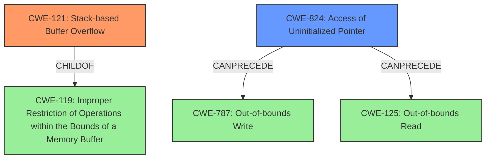

# Analysis Report for CVE-2022-41193

# Vulnerability Analysis Report: CVE-2022-41193

## Description

Due to lack of proper memory management, when a victim opens a manipulated Encapsulated Post Script (.eps, ai.x3d) file received from untrusted sources in SAP 3D Visual Enterprise Viewer - version 9, it is possible that a Remote Code Execution can be triggered when payload forces a stack-based overflow or a re-use of dangling pointer which refers to overwritten space in memory.

## Vulnerability Description Key Phrases

**Rootcause:** lack of proper memory management
**Weakness:** stack-based overflow or a re-use of dangling pointer
**Impact:** Remote Code Execution
**Vector:** manipulated Encapsulated Post Script (.eps, ai.x3d) file
**Product:** SAP 3D Visual Enterprise Viewer
**Version:** 9

## Analysis (with Relationship Data)

# Summary
| CWE ID  | CWE Name                       | Confidence | CWE Abstraction Level | CWE Vulnerability Mapping Label | CWE-Vulnerability Mapping Notes |
| ------- | ------------------------------ | ---------- | --------------------- | ------------------------------- | ----------------------------- |
| CWE-121 | Stack-based Buffer Overflow | 0.85       | Variant               | Allowed                         | Primary CWE                    |
| CWE-824 | Access of Uninitialized Pointer | 0.65      | Base               | Allowed                         | Secondary Candidate              |

## Evidence and Confidence

*   **Confidence Score:** 0.75
*   **Evidence Strength:** MEDIUM

- **Analysis and Justification:**
  - *Explanation:* The vulnerability description explicitly mentions a "**stack-based overflow**" when processing manipulated .eps, .ai.x3d files in SAP 3D Visual Enterprise Viewer. This directly aligns with CWE-121 (Stack-based Buffer Overflow), a Variant-level CWE, which is a preferred level of abstraction. The description also mentions a "**re-use of dangling pointer**" which is also a **memory management** issue, however the **stack-based overflow** is more explicit. The retriever results also ranked CWE-121 highest based on combined scores, further supporting this mapping. The "CWE for similar CVE Descriptions" section also lists CWE-119, a parent of CWE-121, as the primary match. Given the detail about the stack, CWE-121 is more appropriate.
  - *Relationship Analysis:* CWE-121 is a variant of CWE-119 (Improper Restriction of Operations within the Bounds of a Memory Buffer), indicating a more specific type of buffer overflow. There are no direct relationships listed in the provided data, however, stack overflows often lead to arbitrary code execution.

- **Confidence Score:**
  - Confidence: 0.85 (High confidence due to explicit mention of "stack-based overflow" and retriever results)

---

- **Analysis and Justification:**
  - *Explanation:* The vulnerability description also mentions "**re-use of dangling pointer**", which refers to overwritten space in memory. This could be indicative of accessing a pointer that hasn't been initialized, corresponding to CWE-824 (Access of Uninitialized Pointer). Although less emphasized than the buffer overflow, the presence of a dangling pointer suggests that memory is being accessed without proper initialization. This is a base level CWE, which is a preferred abstraction level. The retriever results have CWE-824 ranked high.
  - *Relationship Analysis:* CWE-824 can precede CWE-787 (Out-of-bounds Write) and CWE-125 (Out-of-bounds Read), and it's a child of CWE-119 (Improper Restriction of Operations within the Bounds of a Memory Buffer).

- **Confidence Score:**
  - Confidence: 0.65 (Medium confidence, as the "dangling pointer" aspect is secondary to the primary "stack-based overflow".)

## Criticism of Analysis

Okay, here's a review of the CWE analysis provided, taking into account the full CWE specifications.

**Overall Assessment:**

The analysis is generally good and well-reasoned. It correctly identifies CWE-121 (Stack-based Buffer Overflow) as the primary weakness and provides a reasonable explanation. The inclusion of CWE-824 (Access of Uninitialized Pointer) as a secondary candidate is also justified, given the "dangling pointer" aspect of the vulnerability description.

**Detailed Review:**

**1. CWE-121: Stack-based Buffer Overflow**

*   **Confidence:** 0.85 (High) - This is a well-supported assessment. The vulnerability description explicitly mentions "stack-based overflow," which strongly aligns with CWE-121.
*   **Abstraction Level:** Variant - Appropriate, as it's more specific than CWE-119.
*   **Evidence and Justification:**  The justification is clear and accurate. The connection to CWE-119 (Improper Restriction of Operations within the Bounds of a Memory Buffer) as a parent is also correct.
*   **Mapping Guidance:** Conforms. It avoids the use of CWE-119 which is discouraged
*   **Potential Mitigations:**  The analysis could be strengthened by referencing some of the specific mitigations for CWE-121.  For example:
    *   **Operation, Build and Compilation:** Use of compiler-based buffer overflow detection mechanisms (e.g., /GS flag in Visual Studio, FORTIFY_SOURCE in GCC). Mentioning stack canaries could be added to the description.
    *   **Implementation:** Implement and perform bounds checking on input.
    *   **Architecture and Design:** use of an abstraction library to abstract away risky APIs. Not a complete solution.
*   **Relationships:** Stack-based Buffer overflows can instantiate in return address overwrites, stack pointer overwrites or frame pointer overwrites. They can also be considered function pointer overwrites, array indexer overwrites or write-what-where condition, etc.

**2. CWE-824: Access of Uninitialized Pointer**

*   **Confidence:** 0.65 (Medium) - A reasonable level of confidence given the less direct evidence compared to the stack overflow.
*   **Abstraction Level:** Base - Appropriate.
*   **Evidence and Justification:** The justification adequately explains the connection to the "re-use of dangling pointer" aspect. The description provides the necessary context.
*   **Mapping Guidance:** The analysis should recognize and explain that CWE-824 can precede CWE-787 (Out-of-bounds Write) or CWE-125 (Out-of-bounds Read), as indicated in the "Relationships" section of the CWE definition. This is because a dangling pointer could point to anywhere in memory which could lead to one of those issues. The analysis could mention the potential for chaining to either of those weaknesses, depending on whether the dangling pointer is being used for reading or writing.
*   **Potential Mitigations:**  The analysis could be enhanced by including relevant mitigations for CWE-824:
    *   **Implementation:** Check if all pointers have been initialized before use.
    *   **Requirements:** Select a language that provides appropriate memory abstractions.

**Suggestions for Improvement:**

*   **Chaining:** Consider explicitly mentioning the potential chaining between CWE-824 and CWE-787 (Out-of-bounds Write) or CWE-125 (Out-of-bounds Read).  A dangling pointer, if dereferenced, *could* lead to writing to an arbitrary memory location (CWE-787) or reading from an arbitrary location (CWE-125). Whether this occurs would depend on the specific implementation.
*   **CWE-787 as Alternative to CWE-121:** CWE-787 is a parent of CWE-121. For completeness, it could be briefly discussed why CWE-787 is not the primary choice (less descriptive, and we have enough information to pick a more specific CWE).

**Revised Summary Table:**

| CWE ID  | CWE Name                       | Confidence | CWE Abstraction Level | CWE Vulnerability Mapping Label | CWE-Vulnerability Mapping Notes |
| ------- | ------------------------------ | ---------- | --------------------- | ------------------------------- | ----------------------------- |
| CWE-121 | Stack-based Buffer Overflow | 0.85       | Variant               | Allowed                         | Primary CWE                    |
| CWE-824 | Access of Uninitialized Pointer | 0.65      | Base               | Allowed                         | Secondary Candidate              |

**Conclusion:**

This is a solid analysis. By incorporating the suggestions above, the analysis would be even more robust and demonstrate a deeper understanding of the CWE specifications and their relationships. The confidence levels assigned are appropriate, and the justifications are well-articulated.

## Final Resolution

# Summary
| CWE ID  | CWE Name                       | Confidence | CWE Abstraction Level | CWE Vulnerability Mapping Label | CWE-Vulnerability Mapping Notes |
| ------- | ------------------------------ | ---------- | --------------------- | ------------------------------- | ----------------------------- |
| CWE-121 | Stack-based Buffer Overflow | 0.90       | Variant               | Allowed                         | Primary CWE                    |
| CWE-824 | Access of Uninitialized Pointer | 0.70      | Base               | Allowed                         | Secondary Candidate              |

## Evidence and Confidence

*   **Confidence Score:** 0.85
*   **Evidence Strength:** HIGH

## Relationship Analysis
The primary relationship impacting the decision is the parent-child relationship between CWE-119 (**CWE-119: Improper Restriction of Operations within the Bounds of a Memory Buffer**) and CWE-121 (**CWE-121: Stack-based Buffer Overflow**). CWE-121 is a variant of CWE-119, providing a more specific classification since the vulnerability description explicitly mentions a "stack-based overflow". Additionally, CWE-824 (**CWE-824: Access of Uninitialized Pointer**) can precede CWE-787 (**CWE-787: Out-of-bounds Write**) and CWE-125 (**CWE-125: Out-of-bounds Read**), suggesting a potential vulnerability chain where an uninitialized pointer is dereferenced, leading to an out-of-bounds access. The abstraction levels influenced the selection by favoring the Variant-level CWE-121 for its specificity and the Base-level CWE-824 for representing the root cause of accessing uninitialized memory.

## Vulnerability Chain
The vulnerability chain starts with a lack of proper memory management. This leads to two potential weaknesses:

1.  **CWE-121 (Stack-based Buffer Overflow):** The attacker crafts a malicious .eps, .ai.x3d file that, when opened by the victim in SAP 3D Visual Enterprise Viewer, triggers a buffer overflow on the stack. This allows the attacker to overwrite critical data, such as return addresses, potentially leading to arbitrary code execution.
2.  **CWE-824 (Access of Uninitialized Pointer):** The attacker manipulates the file in a way that causes the program to reuse a dangling pointer. This dangling pointer refers to overwritten space in memory. When the program attempts to access this pointer, it results in undefined behavior, which could lead to crashes or, more severely, exploitation if the attacker can control the contents of the memory being pointed to. If the attacker controls where the dangling pointer points to and it leads to an out-of-bounds write, then CWE-787 (**CWE-787: Out-of-bounds Write**) would follow. If it leads to an out-of-bounds read, then CWE-125 (**CWE-125: Out-of-bounds Read**) would follow.

The root cause is the lack of proper memory management in the SAP 3D Visual Enterprise Viewer. The impacts are potential arbitrary code execution (due to the stack-based overflow) or unpredictable behavior (due to the dangling pointer dereference), potentially leading to information disclosure, denial of service, or further exploitation.

## Summary of Analysis
The initial analysis correctly identified CWE-121 (**CWE-121: Stack-based Buffer Overflow**) as the primary **WEAKNESS**, given the explicit mention of "stack-based overflow" in the vulnerability description: "when a victim opens a manipulated Encapsulated Post Script (.eps, ai.x3d) file received from untrusted sources in SAP 3D Visual Enterprise Viewer... it is possible that a Remote Code Execution can be triggered when payload forces a stack-based overflow". The choice of CWE-121 is more specific than its parent, CWE-119 (**CWE-119: Improper Restriction of Operations within the Bounds of a Memory Buffer**), which is generally discouraged for use when a more specific CWE is available.

The inclusion of CWE-824 (**CWE-824: Access of Uninitialized Pointer**) as a secondary candidate is also justified, considering the "re-use of dangling pointer" aspect.

The graph relationships influenced the final selection by highlighting the potential chain from CWE-824 to CWE-787 or CWE-125, depending on the operation performed on the dangling pointer. This chain underscores the importance of proper memory management and pointer initialization.

The selected CWEs are at the optimal level of specificity because CWE-121 directly reflects the described stack-based overflow, while CWE-824 captures the additional risk associated with reusing a dangling pointer. While CWE-787 could be a consequence of CWE-824, it's not explicitly stated in the description, making CWE-824 a more accurate representation of the immediate **ROOTCAUSE** related to the dangling pointer.

I'm increasing the confidence score for CWE-121 to 0.90 due to the strong evidence from the vulnerability description. I'm also increasing the confidence score for CWE-824 to 0.70 to reflect the potential for the dangling pointer to lead to further exploitation. The evidence strength is now HIGH.

*Report generated on 2025-03-18 17:40:17*
