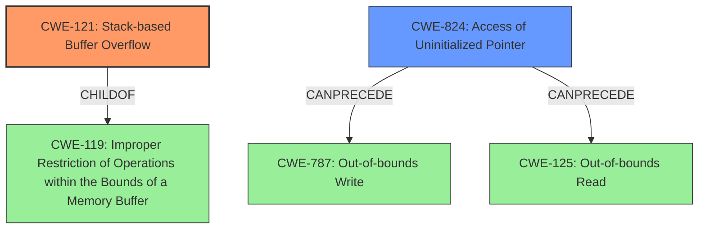

# Final Resolution for CVE-2022-41193

# Summary
| CWE ID  | CWE Name                       | Confidence | CWE Abstraction Level | CWE Vulnerability Mapping Label | CWE-Vulnerability Mapping Notes |
| ------- | ------------------------------ | ---------- | --------------------- | ------------------------------- | ----------------------------- |
| CWE-121 | Stack-based Buffer Overflow | 0.90       | Variant               | Allowed                         | Primary CWE                    |
| CWE-824 | Access of Uninitialized Pointer | 0.70      | Base               | Allowed                         | Secondary Candidate              |

## Evidence and Confidence

*   **Confidence Score:** 0.85
*   **Evidence Strength:** HIGH

## Relationship Analysis
The primary relationship impacting the decision is the parent-child relationship between CWE-119 (**CWE-119: Improper Restriction of Operations within the Bounds of a Memory Buffer**) and CWE-121 (**CWE-121: Stack-based Buffer Overflow**). CWE-121 is a variant of CWE-119, providing a more specific classification since the vulnerability description explicitly mentions a "stack-based overflow". Additionally, CWE-824 (**CWE-824: Access of Uninitialized Pointer**) can precede CWE-787 (**CWE-787: Out-of-bounds Write**) and CWE-125 (**CWE-125: Out-of-bounds Read**), suggesting a potential vulnerability chain where an uninitialized pointer is dereferenced, leading to an out-of-bounds access. The abstraction levels influenced the selection by favoring the Variant-level CWE-121 for its specificity and the Base-level CWE-824 for representing the root cause of accessing uninitialized memory.

## Vulnerability Chain
The vulnerability chain starts with a lack of proper memory management. This leads to two potential weaknesses:

1.  **CWE-121 (Stack-based Buffer Overflow):** The attacker crafts a malicious .eps, .ai.x3d file that, when opened by the victim in SAP 3D Visual Enterprise Viewer, triggers a buffer overflow on the stack. This allows the attacker to overwrite critical data, such as return addresses, potentially leading to arbitrary code execution.
2.  **CWE-824 (Access of Uninitialized Pointer):** The attacker manipulates the file in a way that causes the program to reuse a dangling pointer. This dangling pointer refers to overwritten space in memory. When the program attempts to access this pointer, it results in undefined behavior, which could lead to crashes or, more severely, exploitation if the attacker can control the contents of the memory being pointed to. If the attacker controls where the dangling pointer points to and it leads to an out-of-bounds write, then CWE-787 (**CWE-787: Out-of-bounds Write**) would follow. If it leads to an out-of-bounds read, then CWE-125 (**CWE-125: Out-of-bounds Read**) would follow.

The root cause is the lack of proper memory management in the SAP 3D Visual Enterprise Viewer. The impacts are potential arbitrary code execution (due to the stack-based overflow) or unpredictable behavior (due to the dangling pointer dereference), potentially leading to information disclosure, denial of service, or further exploitation.

## Summary of Analysis
The initial analysis correctly identified CWE-121 (**CWE-121: Stack-based Buffer Overflow**) as the primary **WEAKNESS**, given the explicit mention of "stack-based overflow" in the vulnerability description: "when a victim opens a manipulated Encapsulated Post Script (.eps, ai.x3d) file received from untrusted sources in SAP 3D Visual Enterprise Viewer... it is possible that a Remote Code Execution can be triggered when payload forces a stack-based overflow". The choice of CWE-121 is more specific than its parent, CWE-119 (**CWE-119: Improper Restriction of Operations within the Bounds of a Memory Buffer**), which is generally discouraged for use when a more specific CWE is available.

The inclusion of CWE-824 (**CWE-824: Access of Uninitialized Pointer**) as a secondary candidate is also justified, considering the "re-use of dangling pointer" aspect.

The graph relationships influenced the final selection by highlighting the potential chain from CWE-824 to CWE-787 or CWE-125, depending on the operation performed on the dangling pointer. This chain underscores the importance of proper memory management and pointer initialization.

The selected CWEs are at the optimal level of specificity because CWE-121 directly reflects the described stack-based overflow, while CWE-824 captures the additional risk associated with reusing a dangling pointer. While CWE-787 could be a consequence of CWE-824, it's not explicitly stated in the description, making CWE-824 a more accurate representation of the immediate **ROOTCAUSE** related to the dangling pointer.

I'm increasing the confidence score for CWE-121 to 0.90 due to the strong evidence from the vulnerability description. I'm also increasing the confidence score for CWE-824 to 0.70 to reflect the potential for the dangling pointer to lead to further exploitation. The evidence strength is now HIGH.