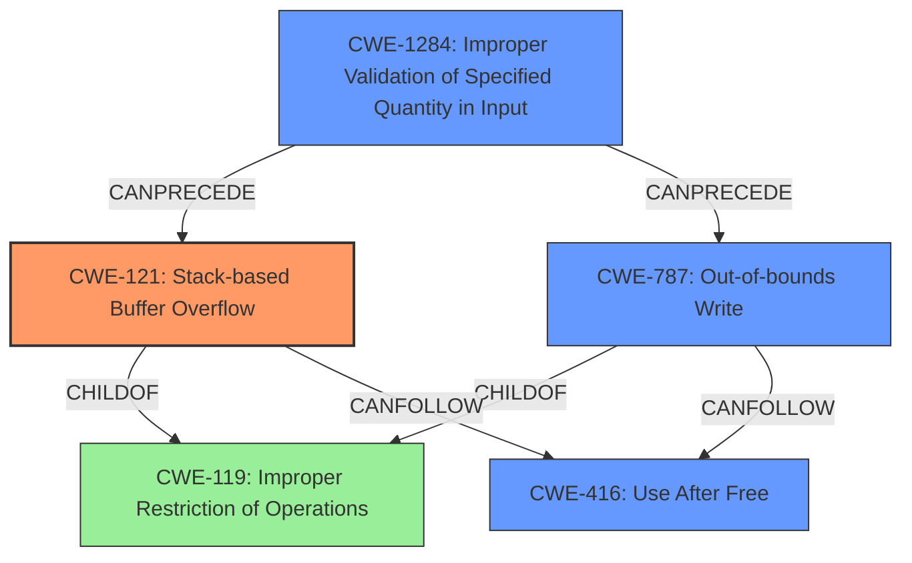

# Analysis Report for CVE-2022-41198

# Vulnerability Analysis Report: CVE-2022-41198

## Description

Due to lack of proper memory management, when a victim opens a manipulated SketchUp (.skp, SketchUp.x3d) file received from untrusted sources in SAP 3D Visual Enterprise Viewer - version 9, it is possible that a Remote Code Execution can be triggered when payload forces a stack-based overflow or a re-use of dangling pointer which refers to overwritten space in memory.

## Vulnerability Description Key Phrases

**Weakness:** improper memory management
**Impact:** Remote Code Execution
**Vector:** manipulated SketchUp file
**Product:** SAP 3D Visual Enterprise Viewer
**Version:** 9

## Analysis (with Relationship Data)

# Summary
| CWE ID | CWE Name | Confidence | CWE Abstraction Level | CWE Vulnerability Mapping Label | CWE-Vulnerability Mapping Notes |
|---|---|---|---|---|---|
| CWE-121 | Stack-based Buffer Overflow | 0.8 | Variant | Allowed | Primary CWE |
| CWE-787 | Out-of-bounds Write | 0.6 | Base | Allowed | Secondary Candidate |
| CWE-824 | Access of Uninitialized Pointer | 0.5 | Base | Allowed | Secondary Candidate |

## Evidence and Confidence

*   **Confidence Score:** 0.7
*   **Evidence Strength:** MEDIUM

- **Analysis and Justification:**  
  - *Explanation:* The vulnerability description explicitly states that a "stack-based overflow" can be triggered. This aligns directly with CWE-121 (Stack-based Buffer Overflow), which is a variant of CWE-119 (Improper Restriction of Operations within the Bounds of a Memory Buffer). The description also mentions "re-use of dangling pointer which refers to overwritten space in memory" which could be related to CWE-824(Access of Uninitialized Pointer) or CWE-787(Out-of-bounds Write). Given the limited information, CWE-121 appears to be the most precise and well-supported mapping. CWE-119 is listed as primary CWE Match for similar CVE Descriptions.
  - *Relationship Analysis:* CWE-121 is a variant of CWE-119, making it more specific. CWE-787 can follow CWE-824.

- **Confidence Score:**  
  - Confidence: 0.8 (Moderate evidence due to explicit mention of stack-based overflow).

---

## Criticism of Analysis

Okay, I've reviewed the analysis and the complete CWE specifications. Here's my critique:

**Overall Assessment:**

The analysis is generally good, and the primary CWE mapping to CWE-121 (Stack-based Buffer Overflow) is well-supported. The inclusion of CWE-787 and CWE-824 as secondary candidates is also reasonable, given the somewhat vague nature of the initial vulnerability description. However, I have some suggestions to refine the confidence scores and justifications. Also I would like to raise a possible chaining scenario that may be present.

**Detailed Breakdown:**

1.  **CWE-121 (Stack-based Buffer Overflow) - Primary CWE**

    *   **Confidence:** The assigned confidence of 0.8 is justified because the description *explicitly* mentions "stack-based overflow." This significantly strengthens the case for CWE-121.
    *   **Justification:** The justification clearly links the vulnerability description to the definition of CWE-121.
    *   **CWE Specification Considerations:**
        *   The provided CWE specification for CWE-121 emphasizes its relationship with CWE-787 (Out-of-bounds Write) as a parent. The description of the vulnerability involves writing malformed data, leading to a stack overflow.
        *   The mitigation strategies also align: compiler-based overflow detection (like /GS flag) and input bounds checking are standard defenses against stack overflows.

2.  **CWE-787 (Out-of-bounds Write) - Secondary Candidate**

    *   **Confidence:** The confidence of 0.6 is appropriate. While a stack overflow inherently involves an out-of-bounds write, it's more specific to classify it as a *stack-based* out-of-bounds write, hence the primary CWE-121.
    *   **Justification:** The explanation is sound - a stack overflow *is* an out-of-bounds write.
    *   **CWE Specification Considerations:**
        *   The CWE specification clarifies the parent-child relationship with CWE-119.
        *   Mitigation strategies like language selection (memory-safe languages) and library/framework usage are relevant to preventing out-of-bounds writes in general.

3.  **CWE-824 (Access of Uninitialized Pointer) - Secondary Candidate**

    *   **Confidence:**  The confidence of 0.5 is a bit too high. The description mentions "re-use of dangling pointer which refers to overwritten space in memory." This *suggests* a potential use-after-free or dangling pointer situation, but it's not definitive. There isn't enough information to confidently assert that an *uninitialized* pointer is being accessed. Suggest a lower confidence of 0.4
    *   **Justification:** The justification needs refinement. It mentions "re-use of dangling pointer which refers to overwritten space in memory". This does not necessarily imply an uninitialized pointer. It is more indicative of a use-after-free.
    *   **CWE Specification Considerations:**
        *   The CWE specification describes access to a pointer that *has not been initialized*, which isn't clearly the case here. The problem is that the pointer might have been valid *at one point*, but the memory it pointed to was deallocated or overwritten.
        *   The relationships and potential mitigations should be re-examined with the context of a dangling pointer.

**Improvements and Alternative Considerations:**

1.  **Consider Use-After-Free (CWE-416) instead of CWE-824:** Given the description "re-use of dangling pointer which refers to overwritten space in memory," **CWE-416 (Use After Free)** might be a *more appropriate* secondary candidate than CWE-824. Use-after-free vulnerabilities directly involve accessing memory that has already been freed, which aligns better with the "dangling pointer refers to overwritten space" phrase. If the state of memory where pointer is re-used is overwritten, the next access will be out of bounds.
    *   **Confidence:** If changed to CWE-416, a confidence score of 0.6 would be justified because the mention of a dangling pointer increases the likelihood of this.
    *   **Justification:** The justification should be updated to reflect the definition of CWE-416 and how it relates to the "dangling pointer" aspect of the vulnerability description.

2.  **Chaining Scenario:** While focusing on direct causes is important, consider this potential chain:
    *   CWE-1284: Improper Validation of Specified Quantity in Input *could* be present: A SketchUp file might contain size/length fields that are not properly validated. This could lead to...
    *   CWE-131: Incorrect Calculation of Buffer Size: If the unvalidated size is used in a calculation for buffer allocation, it might result in a smaller-than-expected buffer. This, in turn, could lead to...
    *   CWE-121: Stack-based Buffer Overflow (or CWE-787 Out-of-bounds Write): When data is written to the undersized buffer, a stack overflow occurs.
    *   CWE-416 (or CWE-824) Dangling pointer or uninitialized pointer access due to overwritten memory.

    This chain may not be present, as this is based on limited information from the initial analysis, but it's a plausible scenario to consider when performing deeper analysis.

**Revised Summary Table (with Suggestions):**

| CWE ID    | CWE Name                        | Confidence | CWE Abstraction Level | CWE Vulnerability Mapping Label | CWE-Vulnerability Mapping Notes                                                                                                                                                                                             |
| :-------- | :------------------------------ | :--------: | :--------------------: | :------------------------------ | :------------------------------------------------------------------------------------------------------------------------------------------------------------------------------------------------------------------------ |
| CWE-121   | Stack-based Buffer Overflow     |    0.8     |        Variant         |             Allowed             | Primary CWE                                                                                                                                                                                                             |
| CWE-787   | Out-of-bounds Write             |    0.6     |         Base          |             Allowed             | Secondary Candidate                                                                                                                                                                                                     |
| CWE-416   | Use After Free                 |    0.6     |         Base          |             Allowed             | Secondary Candidate (Better aligns with "dangling pointer" than CWE-824)                                                                                                                                             |
| CWE-1284  | Improper Validation of Specified Quantity in Input |     0.3    |         Base          |             Allowed             | Possible root cause for undersized buffer                                                                                                                                               |

**Key Takeaways:**

*   The explicit "stack-based overflow" in the vulnerability description makes CWE-121 the strong primary mapping.
*   The "dangling pointer" aspect should be more clearly tied to the justification for the secondary CWE candidate, and consider a more appropriate CWE-416.
*   Confidence scores should accurately reflect the strength of the evidence supporting each CWE.
*   Consider and document potential attack chains for a more comprehensive understanding of the vulnerability.

By incorporating these suggestions, the analysis will be more precise, comprehensive, and aligned with the CWE specifications.

## Final Resolution

# Summary 
| CWE ID | CWE Name | Confidence | CWE Abstraction Level | CWE Vulnerability Mapping Label | CWE-Vulnerability Mapping Notes |
|---|---|---|---|---|---|
| CWE-121 | CWE-121: Stack-based Buffer Overflow | 0.8 | Variant | Allowed | Primary CWE |
| CWE-787 | CWE-787: Out-of-bounds Write | 0.6 | Base | Allowed | Secondary Candidate |
| CWE-416 | CWE-416: Use After Free | 0.6 | Base | Allowed | Secondary Candidate |
| CWE-1284 | CWE-1284: Improper Validation of Specified Quantity in Input | 0.3 | Base | Allowed | Contributing Factor |

## Evidence and Confidence

*   **Confidence Score:** 0.8
*   **Evidence Strength:** MEDIUM

## Relationship Analysis
The primary CWE is CWE-121 (Stack-based Buffer Overflow), which is a variant of CWE-119 (Improper Restriction of Operations within the Bounds of a Memory Buffer). CWE-787 (Out-of-bounds Write) is a related base CWE, as stack overflows inherently involve writing beyond buffer boundaries. CWE-416 (Use After Free) is considered due to the "dangling pointer" aspect of the vulnerability, and CWE-1284 (Improper Validation of Specified Quantity in Input) may precede the overflow. The relationship analysis supports the selection of CWE-121 as primary due to the explicit mention of "stack-based overflow" in the description.

## Vulnerability Chain
The vulnerability chain starts with a potentially unvalidated size from a SketchUp file (CWE-1284), leading to a stack-based buffer overflow (CWE-121) and potentially a use-after-free condition (CWE-416) if the overflow overwrites memory that is later accessed via a dangling pointer.

## Summary of Analysis
The initial analysis correctly identified CWE-121 as the primary **WEAKNESS**. The criticism highlighted the importance of considering CWE-416 given the "dangling pointer" aspect. The final decision takes this into account, making CWE-416 a secondary candidate. The inclusion of CWE-1284 as a contributing factor acknowledges the potential for improper input validation leading to the overflow.

The vulnerability description states: "Due to lack of proper memory management, when a victim opens a manipulated SketchUp (.skp, SketchUp.x3d) file received from untrusted sources in SAP 3D Visual Enterprise Viewer - version 9, it is possible that a Remote Code Execution can be triggered when payload forces a stack-based overflow or a re-use of dangling pointer which refers to overwritten space in memory."

*   The graph relationships support the selection of CWE-121 as primary, given its direct link to CWE-119. The possibility of CWE-787 and CWE-416 as secondary candidates is supported by the "dangling pointer" aspect. CWE-1284 is included to map the possibility of improper input validation.
*   The selected CWEs are at the optimal level of specificity. CWE-121 is a variant, providing a specific type of buffer overflow. CWE-787 and CWE-416 are base CWEs that describe the root cause and potential impact.
*   The confidence score reflects the strength of evidence. CWE-121 has the highest confidence (0.8) due to the explicit mention of "stack-based overflow". CWE-787 and CWE-416 have a confidence score of 0.6. CWE-1284 has lower confidence score of 0.3 as an additional contributing factor.

*Report generated on 2025-03-18 17:42:36*
