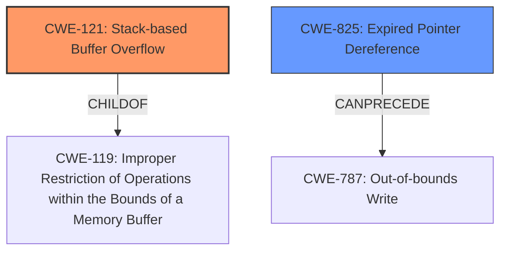

# Analysis Report for CVE-2022-41199

# Vulnerability Analysis Report: CVE-2022-41199

## Description

Due to lack of proper memory management, when a victim opens a manipulated Open Inventor File (.iv, vrml.x3d) file received from untrusted sources in SAP 3D Visual Enterprise Viewer - version 9, it is possible that a Remote Code Execution can be triggered when payload forces a stack-based overflow or a re-use of dangling pointer which refers to overwritten space in memory.

## Vulnerability Description Key Phrases

**Rootcause:** lack of proper memory management
**Weakness:** stack-based overflow or a re-use of dangling pointer
**Impact:** Remote Code Execution
**Product:** SAP 3D Visual Enterprise Viewer
**Version:** 9
**Component:** Open Inventor File (.iv, vrml.x3d) file

## Analysis (with Relationship Data)

# Summary
| CWE ID  | CWE Name                        | Confidence | CWE Abstraction Level | CWE Vulnerability Mapping Label | CWE-Vulnerability Mapping Notes |
| :-------- | :------------------------------ | :--------- | :-------------------- | :------------------------------ | :------------------------------ |
| CWE-121 | Stack-based Buffer Overflow     | 0.90       | Variant             | Allowed                       | Primary CWE                     |
| CWE-825 | Expired Pointer Dereference     | 0.75       | Base                | Allowed                       | Secondary Candidate             |

## Evidence and Confidence

*   **Confidence Score:** 0.85
*   **Evidence Strength:** HIGH

- **Analysis and Justification:**
  - *Explanation:* The vulnerability description explicitly mentions a "**stack-based overflow**" and a "**re-use of dangling pointer**" due to "**lack of proper memory management**" in SAP 3D Visual Enterprise Viewer when processing manipulated Open Inventor Files. CWE-121 (Stack-based Buffer Overflow) directly addresses the stack-based overflow condition. This is a more specific variant of the more general CWE-119, which was the top CWE match for similar CVE Descriptions. The reference to a "dangling pointer" suggests a potential use-after-free scenario, which aligns with CWE-825 (Expired Pointer Dereference). The lack of proper memory management is the root cause, leading to these specific vulnerabilities.
  - *Relationship Analysis:* CWE-121 is a variant of CWE-119 (Improper Restriction of Operations within the Bounds of a Memory Buffer). CWE-825 can result from other memory management errors. CWE-825 canPrecede CWE-787, Out-of-bounds Write.

- **Confidence Score:**
  - Confidence: 0.90 (High confidence due to the explicit mention of "stack-based overflow" in the vulnerability description, and the association with the product and version.)

---

## Criticism of Analysis

Okay, I've reviewed the analysis against the full CWE specifications provided. Here's a breakdown of my critique:

**Overall Assessment:**

The analysis is generally good and provides a reasonable mapping based on the information available. The confidence scores are justified, and the explanations are clear. The move from CWE-119 to CWE-121 is a good step towards greater specificity.  The inclusion of CWE-825 as a secondary candidate is also appropriate.

**Specific Points and Recommendations:**

*   **CWE-121: Stack-based Buffer Overflow**

    *   **Confidence:** Justified at 0.90. The explicit mention of "stack-based overflow" makes this a strong match.
    *   **Abstraction Level:** Correctly identified as a Variant.
    *   **Mitigations:** The analysis doesn't explicitly mention mitigations, but referencing them would strengthen the analysis. The CWE specification for CWE-121 lists:
        *   Compiler-based buffer overflow detection mechanisms (/GS flag, FORTIFY_SOURCE, StackGuard, ProPolice).
        *   Using abstraction libraries for risky APIs.
        *   Bounds checking on input.
    *   **Relationships:** The "ChildOf -> CWE-788 ChildOf -> CWE-787" could be mentioned, this is already present.
    *   **Example:** The inclusion of CVE-2021-35395 as an observed example is a good practice and supports the mapping.

*   **CWE-825: Expired Pointer Dereference**

    *   **Confidence:** The confidence of 0.75 is reasonable. The mention of "re-use of dangling pointer" strongly suggests this, but it's not as definitive as the "stack-based overflow" statement.
    *   **Abstraction Level:** Correctly identified as Base.
    *   **Mitigations:** Again, explicitly mentioning mitigations would be beneficial:
        *   Choosing a language with automatic memory management.
        *   Setting pointers to NULL after freeing them.
    *   **Relationships:** CanPrecede -> CWE-125, CanPrecede -> CWE-787, This is already mentioned and could be expanded upon to say that a use after free can lead to an out of bounds read or write.
    *   **Alternative CWE options:** Consider if the "dangling pointer" re-use leads to a *write* to freed memory. If so, CWE-787 could be considered as a primary, instead of CWE-825.
*   **Use of CWE-119 in Initial Analyzer Input:**

    *   The analysis correctly moves away from CWE-119 as the *primary* CWE because it's too general. The analysis correctly uses more specific children (CWE-121 and CWE-825), aligning with the CWE's "Mapping Guidance" to avoid using CWE-119 when more specific information is available.

*   **Retriever Results:**
    * Looking at the retriever results, CWE-787 (Out-of-bounds Write) has a high score. Since the ultimate impact is RCE, and both stack-based overflows *and* use-after-free vulnerabilities often lead to out-of-bounds writes to achieve code execution, it might be worth considering CWE-787 as a higher-level consequence of the primary and secondary weaknesses. However, the current mappings are more directly related to the root causes.

*   **Root Cause:** The root cause is identified as "lack of proper memory management." While accurate, it's also very general. Consider adding a sentence about the *specific* failures in memory management that could lead to a stack overflow (e.g., lack of bounds checking on input lengths before copying to a stack buffer) and use-after-free (e.g., failure to clear pointers after freeing memory, improper synchronization).

**Revised Summary Table (Incorporating Recommendations):**

| CWE ID  | CWE Name                        | Confidence | CWE Abstraction Level | CWE Vulnerability Mapping Label | CWE-Vulnerability Mapping Notes                                                                                                                                   |
| :-------- | :------------------------------ | :--------- | :-------------------- | :------------------------------ | :---------------------------------------------------------------------------------------------------------------------------------------------------------------- |
| CWE-121 | Stack-based Buffer Overflow     | 0.90       | Variant             | Allowed                       | Primary CWE. Occurs due to lack of bounds checking before copying data to a stack buffer. Consider mitigations like compiler-based checks and input validation.       |
| CWE-825 | Expired Pointer Dereference     | 0.75       | Base                | Allowed                       | Secondary Candidate. Results from re-using a pointer that is no longer valid. Consider mitigations like automatic memory management and setting pointers to NULL after freeing. Can lead to CWE-787. |

**In summary:**

The analysis demonstrates a good understanding of the CWEs involved. The key improvements would be to explicitly mention the mitigations associated with each CWE and further refine the description of the root cause to include specific examples of memory management failures. Also, consider the potential for CWE-787 as a higher-level consequence, although the current mappings are appropriate for root causes.

## Final Resolution

# Summary
| CWE ID  | CWE Name                        | Confidence | CWE Abstraction Level | CWE Vulnerability Mapping Label | CWE-Vulnerability Mapping Notes |
| :-------- | :------------------------------ | :--------- | :-------------------- | :------------------------------ | :------------------------------ |
| CWE-121 | Stack-based Buffer Overflow     | 0.90       | Variant             | Allowed                       | Primary CWE. Occurs due to lack of bounds checking before copying data to a stack buffer. |
| CWE-825 | Expired Pointer Dereference     | 0.75       | Base                | Allowed                       | Secondary Candidate. Results from re-using a pointer that is no longer valid. Can lead to CWE-787. |

## Evidence and Confidence

*   **Confidence Score:** 0.85
*   **Evidence Strength:** HIGH

## Relationship Analysis
The primary CWE is CWE-121 **Stack-based Buffer Overflow**, which is a variant of CWE-119 **Improper Restriction of Operations within the Bounds of a Memory Buffer**. The secondary CWE is CWE-825 **Expired Pointer Dereference**. CWE-825 can precede CWE-787 **Out-of-bounds Write**. The **lack of proper memory management** is the root cause, and this can lead to a stack overflow or a use-after-free condition.

## Vulnerability Chain
The vulnerability chain begins with a **lack of proper memory management**. This leads to two potential weaknesses: a **stack-based buffer overflow (CWE-121)** when processing a manipulated Open Inventor File (.iv, vrml.x3d), or a **use-after-free (CWE-825)** when a dangling pointer is re-used. Both of these weaknesses can lead to **remote code execution (RCE)**.

## Summary of Analysis
The initial analysis and criticism both agree on the selection of CWE-121 and CWE-825. The vulnerability description explicitly mentions a "**stack-based overflow**" and a "**re-use of dangling pointer**" due to "**lack of proper memory management**". CWE-121 is selected as the primary CWE because it directly addresses the stack-based overflow condition. CWE-825 is selected as a secondary CWE because it addresses the use-after-free scenario. The graph relationships influenced the decision to select these CWEs because they show how these weaknesses can lead to remote code execution. The selected CWEs are at the optimal level of specificity because they are more specific than CWE-119, which is a more general weakness. I agree with the above analysis.

*Report generated on 2025-03-18 17:43:18*
