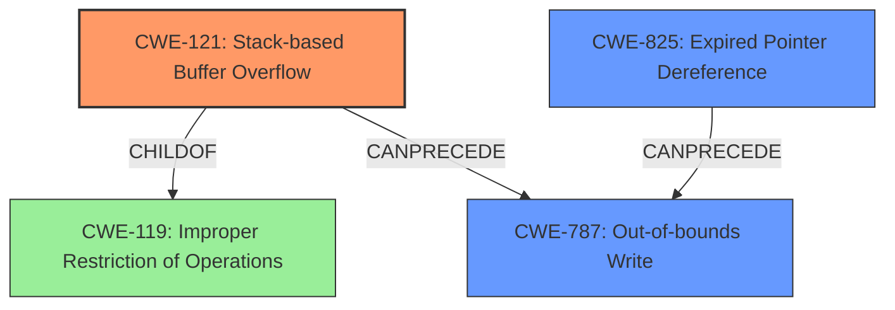

# Final Resolution for CVE-2022-41200

# Summary
| CWE ID | CWE Name | Confidence | CWE Abstraction Level | CWE Vulnerability Mapping Label | CWE-Vulnerability Mapping Notes |
|---|---|---|---|---|---|
| CWE-121 | Stack-based Buffer Overflow | 0.8 | Variant | Allowed | Primary CWE |
| CWE-825 | Expired Pointer Dereference | 0.5 | Base | Allowed | Secondary CWE |
| CWE-787 | Out-of-bounds Write | 0.5 | Base | Allowed | Secondary CWE |

## Evidence and Confidence

*   **Confidence Score:** 0.7
*   **Evidence Strength:** MEDIUM

## Relationship Analysis
The analysis focuses on the relationships between the identified CWEs. CWE-121 is a specific type of buffer overflow, making it a child of CWE-119 (Improper Restriction of Operations within the Bounds of a Memory Buffer). However, CWE-121 is chosen for its specificity. The relationship between CWE-825 (Expired Pointer Dereference) and CWE-787 (Out-of-bounds Write) is also important, as dereferencing an expired pointer can lead to writing to unintended memory locations. The abstraction levels (Variant and Base) guided the selection towards more specific and actionable classifications.

## Vulnerability Chain
The vulnerability chain begins with the processing of a manipulated SVG file, leading to a **stack-based buffer overflow** (CWE-121). This overflow can be triggered by the **lack of proper memory management**. Furthermore, the re-use of a dangling pointer (CWE-825) can also cause memory corruption, ultimately leading to an **out-of-bounds write** (CWE-787).

## Summary of Analysis
The initial analysis and the criticism provide a solid foundation for classifying this vulnerability. The key evidence is the vulnerability description's mention of a "stack-based overflow" and "re-use of dangling pointer." The criticism correctly points out the distinction between uninitialized and dangling pointers, prompting a change from CWE-824 to CWE-825. The graph relationships confirm that CWE-121 is a specific type of buffer overflow, and CWE-825 can lead to CWE-787. The selection of CWEs is at the optimal level of specificity, with CWE-121 being a Variant and CWE-825 and CWE-787 being Base level CWEs.

The vulnerability description explicitly states: "Due to **lack of proper memory management**, when a victim opens a manipulated Scalable Vector Graphic (.svg, svg.x3d) file received from untrusted sources in SAP 3D Visual Enterprise Viewer - version 9, it is possible that a Remote Code Execution can be triggered when payload forces a **stack-based overflow** or a **re-use of dangling pointer** which refers to overwritten space in memory."

This evidence directly supports the primary classification of CWE-121 and the secondary classification of CWE-825 and CWE-787.