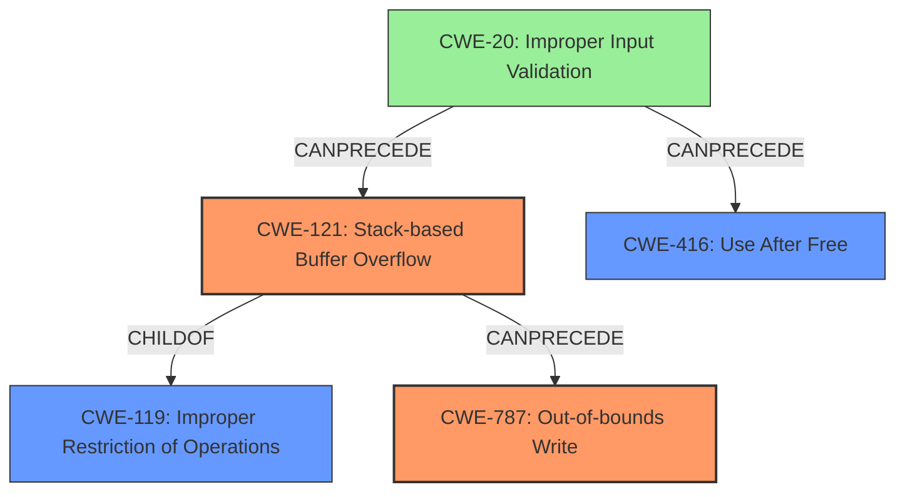

# Final Resolution for CVE-2022-41202

# Summary
| CWE ID | CWE Name | Confidence | CWE Abstraction Level | CWE Vulnerability Mapping Label | CWE-Vulnerability Mapping Notes |
|---|---|---|---|---|---|
| CWE-121 | Stack-based Buffer Overflow | 0.9 | Variant |  Primary | Allowed |
| CWE-787 | Out-of-bounds Write | 0.9 | Base | Primary | Allowed |
| CWE-416 | Use After Free | 0.7 | Base | Secondary | Allowed |
| CWE-20 | Improper Input Validation | 0.5 | Class | Contributing | Allowed |

## Evidence and Confidence

*   **Confidence Score:** 0.9
*   **Evidence Strength:** HIGH

## Relationship Analysis
The analysis leverages parent-child relationships to refine CWE selection, opting for the more specific CWE-121 (Stack-based Buffer Overflow) over its parent CWE-119 (Improper Restriction of Operations within the Bounds of a Memory Buffer). The inclusion of CWE-787 (Out-of-bounds Write) is supported by the relationship where a buffer overflow (CWE-121) can lead to an out-of-bounds write (CWE-787). CWE-416 (Use After Free) is included based on the dangling pointer weakness. CWE-20 (Improper Input Validation) is a high-level cause. The abstraction levels are appropriate, with Variant and Base levels being preferred.

## Vulnerability Chain
The vulnerability chain starts with **CWE-20** (Improper Input Validation), where a manipulated file is not properly validated. This leads to **CWE-121** (Stack-based Buffer Overflow) due to the overflow on the stack when processing the file. The overflow results in **CWE-787** (Out-of-bounds Write), where data is written beyond the buffer's boundaries, potentially overwriting critical data or code. Simultaneously, the manipulated file can trigger **CWE-416** (Use After Free) by causing a dangling pointer to be dereferenced after the memory has been freed. Both **CWE-787** and **CWE-416** can lead to remote code execution.

## Summary of Analysis
The analysis has been refined based on the criticism. The initial selection of CWE-121 was correct and has been retained. The incorrect selection of CWE-824 has been replaced with CWE-416 which is more appropriate given the "re-use of dangling pointer" description from the vulnerability. Also, CWE-787 was added to clarify the nature of the out-of-bounds write that enables code execution. CWE-20 was added as a contributing factor.

The vulnerability description explicitly states: "Due to lack of proper memory management, when a victim opens a manipulated Visual Design Stream (.vds, vds.x3d) file received from untrusted sources in SAP 3D Visual Enterprise Viewer - version 9, it is possible that a Remote Code Execution can be triggered when payload forces a **stack-based overflow** or a **re-use of dangling pointer** which refers to overwritten space in memory."

This statement directly supports the selection of CWE-121, CWE-416, and CWE-787. The relationships between these CWEs, along with CWE-20, form a clear vulnerability chain. The selected CWEs are at the optimal level of specificity.