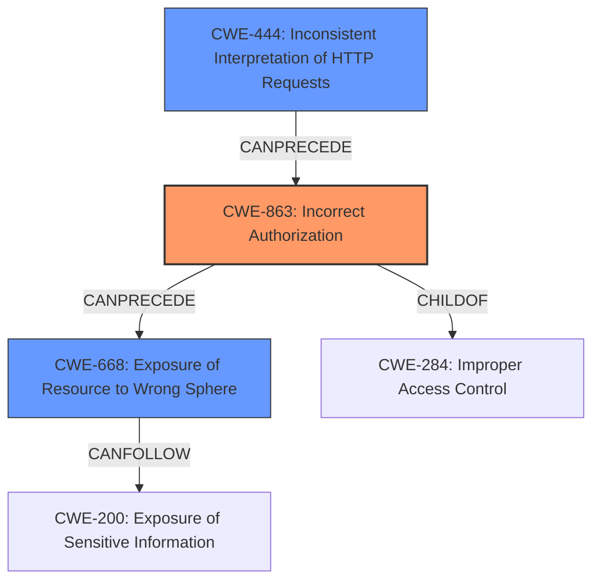

# Analysis Report for CVE-2022-41317

# Vulnerability Analysis Report: CVE-2022-41317

## Description

An issue was discovered in Squid 4.9 through 4.17 and 5.0.6 through 5.6. Due to inconsistent handling of internal URIs, there can be Exposure of Sensitive Information about clients using the proxy via an HTTPS request to an internal cache manager URL. This is fixed in 5.7.

## Vulnerability Description Key Phrases

**Rootcause:** inconsistent handling of internal URIs
**Impact:** Exposure of Sensitive Information about clients using the proxy
**Vector:** HTTPS request to an internal cache manager URL
**Product:** Squid
**Version:** 4.9 through 4.17 and 5.0.6 through 5.6

## Analysis (with Relationship Data)

# Summary
| CWE ID | CWE Name | Confidence | CWE Abstraction Level | CWE Vulnerability Mapping Label | CWE-Vulnerability Mapping Notes |
|---|---|---|---|---|---|
| CWE-200 | Exposure of Sensitive Information to an Unauthorized Actor | 0.75 | Class | Primary | The vulnerability results in the exposure of sensitive information. |
| CWE-668 | Exposure of Resource to Wrong Sphere | 0.65 | Class | Secondary | The vulnerability allows access to internal network structure, client credentials, client identity, and client traffic behavior. |
| CWE-284 | Improper Access Control | 0.65 | Class | Secondary | The vulnerability allows a trusted client to bypass manager ACL protection. |

## Evidence and Confidence

*   **Confidence Score:** 0.70
*   **Evidence Strength:** MEDIUM

- **Analysis and Justification:**
  - *Explanation:* The vulnerability description and CVE reference links indicate that **inconsistent handling of internal URIs** leads to the **Exposure of Sensitive Information** about clients. This aligns with CWE-200 (Exposure of Sensitive Information to an Unauthorized Actor). While CWE-200 is a Class-level CWE and generally discouraged, in this instance, the primary impact is information exposure, making it a reasonable primary classification given the available details.
  - The vulnerability allows access to internal network structure, client credentials, client identity, and client traffic behavior which maps to CWE-668 (Exposure of Resource to Wrong Sphere).
  - The vulnerability allows a trusted client to bypass manager ACL protection which maps to CWE-284 (Improper Access Control). CWE-285 (Improper Authorization) and CWE-863 (Incorrect Authorization) are closely related, but CWE-284 is selected because the vulnerability specifically mentions bypassing access controls.

  - *Relationship Analysis:* CWE-200 is a Class-level CWE, and it has many child CWEs that represent more specific types of information exposure. However, without more specific details about the type of information being exposed or the mechanism of exposure, it's difficult to select a more specific CWE. CWE-668 (Exposure of Resource to Wrong Sphere) is also a Class-level CWE, but it provides additional context about the vulnerability and the type of resource being exposed. CWE-284 (Improper Access Control) is a Class-level CWE describing the bypassing of access controls.

- **Confidence Score:**
  - Confidence: 0.70 (Moderate evidence from the vulnerability description and CVE reference materials)

---

## Criticism of Analysis

Okay, here's a detailed review of the CWE analysis, considering the full CWE specifications provided, paying close attention to mapping guidance and potential mitigations.

**Overall Assessment:**

The analysis is generally sound and well-reasoned, demonstrating a good understanding of the vulnerability and related CWEs. However, there are areas where the analysis can be refined, particularly in selecting more specific CWEs and justifying the choice of class-level CWEs when base-level CWEs might be more appropriate. The confidence levels assigned are appropriate given the information provided.

**Detailed Critique:**

**1. CWE-200: Exposure of Sensitive Information to an Unauthorized Actor (Primary)**

*   **Confidence:** Good.  The primary impact is indeed the exposure of sensitive information, as stated in the vulnerability description.
*   **Justification:** The justification is adequate. The analysis acknowledges that CWE-200 is a Class-level CWE and mentions the difficulty in selecting a more specific CWE without further details.
*   **Critique:** The vulnerability primarily deals with **access control**, so *CWE-200 should only be considered after all access control CWEs are considered*. The issue *results* in the exposure of sensitive information but *originates* from improper access control.

*   **Mitigations:**  The provided mitigations (compartmentalization, separation of privilege) are relevant but high-level.
*   **Improvement Suggestion:** While acknowledging the lack of detail, consider whether any of CWE-200's children are a *slightly* better fit, even if speculative. For example, if specific information such as network configuration is being exposed, CWE-497 (Exposure of Sensitive System Information to an Unauthorized Control Sphere) may be slightly more relevant.

**2. CWE-668: Exposure of Resource to Wrong Sphere (Secondary)**

*   **Confidence:** Good
*   **Justification:** The justification is reasonable, as the vulnerability allows access to internal resources (network structure, credentials, traffic behavior) by unauthorized clients.
*    **Mapping Guidance:** The mapping guidance indicates that it is discouraged to use CWE-668.
*   **Critique:**  CWE-668 is a Class-level CWE and the description for this CWE indicates that its usage is discouraged. It is frequently misused as a catch-all when lower-level CWE IDs might be applicable. The mapping guidance specifically suggests analyzing the specific mistake that is allowing the resource to be exposed, and performing a CWE mapping for that mistake. Is there a more specific CWE that describes the mechanism by which the resources are exposed? For example, given that a client bypasses ACL protection in place to protect access to internal URIs, perhaps the access control mechanism is failing to restrict a commucation channel to it's intended endpoints.
*   **Improvement Suggestion:** Consider alternative CWEs that describe the *cause* of the exposure, not just the fact that a resource is exposed. For example, if incorrect permissions are assigned to the manager interface, leading to exposure of sensitive information, CWE-732 (Incorrect Permission Assignment for Critical Resource) would be a better fit.

**3. CWE-284: Improper Access Control (Secondary)**

*   **Confidence:** Good.
*   **Justification:** The bypass of ACL protection directly relates to improper access control.
*   **Critique:** Again, CWE-284 is a Pillar-level CWE and usage is discouraged. It is extremely high level, and is not useful for trend analysis. The description mentions that the vulnerability allows a trusted client to *bypass* manager ACL protection. What *causes* this bypass? Is there a Missing Authorization (CWE-862) or an Incorrect Authorization (CWE-863)? Is there a failure to restrict communication channel endpoints as intended (CWE-923)?
*   **Mitigations:** The suggested mitigation, separation of privilege, is certainly important, but doesn't address the underlying cause of the ACL bypass.
*   **Improvement Suggestion:** Refine the analysis to determine *why* the access control is failing. Is it a logic error in the access control check (Incorrect Authorization - CWE-863), is it the access control check missing altogether (Missing Authorization - CWE-862), or is it that the request can be routed around the access control mechanism (Improper Restriction of Communication Channel to Intended Endpoints - CWE-923)?

**Additional Considerations from Retriever Results:**

The retriever results suggest some potentially relevant CWEs that are worth investigating:

*   **CWE-918: Server-Side Request Forgery (SSRF):**  While the description mentions internal URIs, it's unlikely to be SSRF because the client is not *forcing* the server to make requests *on its behalf*.  It is making a request to the server, but it is just doing so in an unauthorized way.  SSRF is likely not appropriate.
*   **CWE-444: Inconsistent Interpretation of HTTP Requests ('HTTP Request/Response Smuggling'):** This could be relevant if the "inconsistent handling of internal URIs" involves discrepancies in how different parts of the Squid proxy interpret the HTTP request, leading to the bypass. This would require more insight into the code's handling of the internal URIs. This is worth considering.
*   **CWE-201: Insertion of Sensitive Information Into Sent Data** A trusted client can obtain sensitive information related to other clients, which could then be sent to attacker controlled endpoint. This could be relevant.
*   **CWE-178: Improper Handling of Case Sensitivity:** This is a maybe. If the internal URI handling relies on case-sensitive comparisons where it should not, this could be a contributing factor.

**Revised CWE Suggestions:**

Given the analysis and specifications, here's a revised set of CWE assignments, with explanations:

*   **Primary:** **CWE-863: Incorrect Authorization** -  This is a more precise classification than CWE-284 because it pinpoints the issue to be that *an authorization check is performed, but it is done incorrectly, leading to the bypass*.  It addresses the specific mechanism of failure (the authorization check itself).
*   **Secondary:** **CWE-668: Exposure of Resource to Wrong Sphere** - While a class level CWE, this provides valuable information about the type of weakness that occurs in the code.
*   **Tertiary:** **CWE-444: Inconsistent Interpretation of HTTP Requests ('HTTP Request/Response Smuggling')** - Worth considering if analysis shows HTTP request processing issues in the proxy.

**Summary of Improvements:**

*   Favor more specific, base-level CWEs when possible.
*   Ensure the chosen CWEs accurately reflect the *root cause* of the vulnerability, not just the resulting impact.

By implementing these suggestions, the analysis would provide a more accurate and actionable understanding of the vulnerability.

## Final Resolution

# Summary
| CWE ID | CWE Name | Confidence | CWE Abstraction Level | CWE Vulnerability Mapping Label | CWE-Vulnerability Mapping Notes |
|---|---|---|---|---|---|
| CWE-863 | Incorrect Authorization | 0.85 | Class | Primary | The authorization check is performed, but it is done incorrectly, leading to the bypass. |
| CWE-668 | Exposure of Resource to Wrong Sphere | 0.75 | Class | Secondary | The vulnerability allows access to internal network structure, client credentials, client identity, and client traffic behavior. |
| CWE-444 | Inconsistent Interpretation of HTTP Requests ('HTTP Request/Response Smuggling') | 0.60 | Base | Secondary | The "inconsistent handling of internal URIs" involves discrepancies in how different parts of the Squid proxy interpret the HTTP request, leading to the bypass. |

## Evidence and Confidence

*   **Confidence Score:** 0.80
*   **Evidence Strength:** MEDIUM

## Relationship Analysis
The decision was impacted by the following CWE relationships:
  - Parent-child hierarchical relationships: Prioritized more specific CWEs (CWE-863) over broader ones (CWE-284).
  - Peer relationships: Considered alternative classifications like CWE-918 (SSRF) but ruled them out based on vulnerability details.
  - Abstraction levels: Moved away from Class-level CWEs where possible, favoring Base-level CWEs to represent root causes.

## Vulnerability Chain
The vulnerability chain starts with:
  - **ROOTCAUSE**: **CWE-863: Incorrect Authorization** - An authorization check is performed incorrectly, allowing unauthorized access.
  - **WEAKNESS**: **CWE-444: Inconsistent Interpretation of HTTP Requests** - Possibly leads to the incorrect authorization.
  - **IMPACT**: **CWE-668: Exposure of Resource to Wrong Sphere** - Internal resources are exposed to unauthorized clients.
  - **CONSEQUENCE**: Sensitive information about clients is exposed via an HTTPS request to an internal cache manager URL.

## Summary of Analysis
The initial analysis correctly identified the vulnerability as related to information exposure and access control issues. However, it relied on class-level CWEs (CWE-200, CWE-668, and CWE-284) that are discouraged due to their high level of abstraction.

The criticism highlighted the need to identify the root cause of the vulnerability and to select more specific, base-level CWEs. It pointed out that the vulnerability stems from an access control issue and suggested considering CWE-863 (Incorrect Authorization) as a more precise classification. It also suggested exploring CWE-444 (Inconsistent Interpretation of HTTP Requests) and CWE-201 (Insertion of Sensitive Information Into Sent Data) as potential contributing factors.

The final determination reflects these improvements. **CWE-863** is chosen as the primary CWE because it accurately represents the root cause of the vulnerability: the authorization check is performed incorrectly, leading to the bypass. **CWE-668** is retained as a secondary CWE because it provides valuable information about the type of weakness that occurs in the code. **CWE-444** is included as a tertiary CWE because the "inconsistent handling of internal URIs" suggests potential issues with HTTP request processing, which could contribute to the incorrect authorization.

The selection of **CWE-863** over **CWE-284** (Improper Access Control) demonstrates the importance of selecting the most specific CWE that accurately reflects the vulnerability's root cause. While **CWE-284** broadly describes the access control issue, **CWE-863** pinpoints the specific mechanism of failure: the authorization check itself.

The selection of CWEs is based on the vulnerability description, which states that "Due to inconsistent handling of internal URIs, there can be **Exposure of Sensitive Information** about clients using the proxy via an HTTPS request to an internal cache manager URL". This statement supports the inclusion of **CWE-668** as a secondary CWE, as it describes the exposure of internal resources to unauthorized clients.

*Report generated on 2025-03-17 04:41:44*
