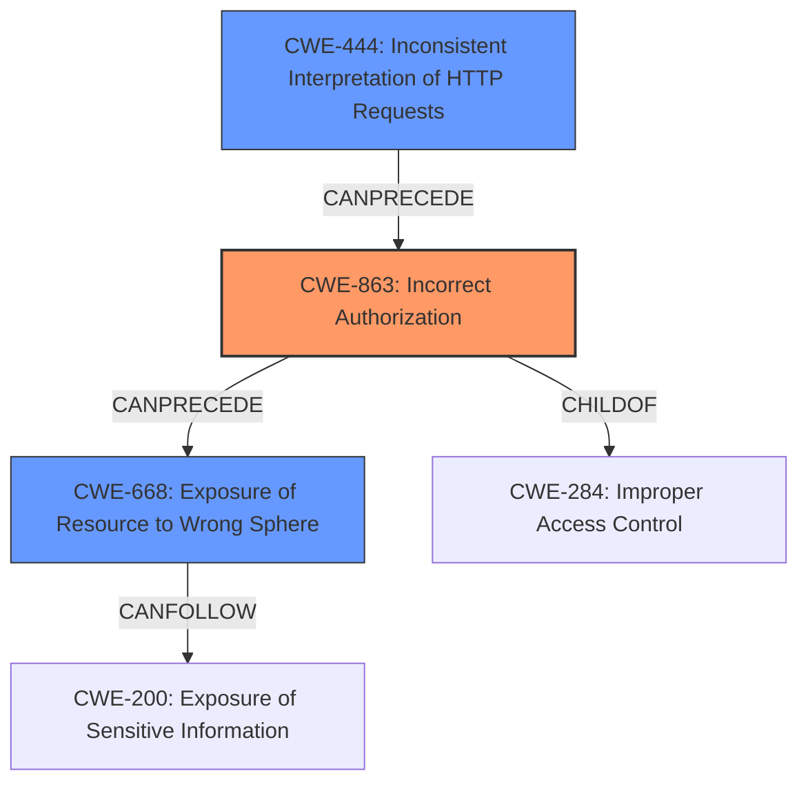

# Final Resolution for CVE-2022-41317

# Summary
| CWE ID | CWE Name | Confidence | CWE Abstraction Level | CWE Vulnerability Mapping Label | CWE-Vulnerability Mapping Notes |
|---|---|---|---|---|---|
| CWE-863 | Incorrect Authorization | 0.85 | Class | Primary | The authorization check is performed, but it is done incorrectly, leading to the bypass. |
| CWE-668 | Exposure of Resource to Wrong Sphere | 0.75 | Class | Secondary | The vulnerability allows access to internal network structure, client credentials, client identity, and client traffic behavior. |
| CWE-444 | Inconsistent Interpretation of HTTP Requests ('HTTP Request/Response Smuggling') | 0.60 | Base | Secondary | The "inconsistent handling of internal URIs" involves discrepancies in how different parts of the Squid proxy interpret the HTTP request, leading to the bypass. |

## Evidence and Confidence

*   **Confidence Score:** 0.80
*   **Evidence Strength:** MEDIUM

## Relationship Analysis
The decision was impacted by the following CWE relationships:
  - Parent-child hierarchical relationships: Prioritized more specific CWEs (CWE-863) over broader ones (CWE-284).
  - Peer relationships: Considered alternative classifications like CWE-918 (SSRF) but ruled them out based on vulnerability details.
  - Abstraction levels: Moved away from Class-level CWEs where possible, favoring Base-level CWEs to represent root causes.

## Vulnerability Chain
The vulnerability chain starts with:
  - **ROOTCAUSE**: **CWE-863: Incorrect Authorization** - An authorization check is performed incorrectly, allowing unauthorized access.
  - **WEAKNESS**: **CWE-444: Inconsistent Interpretation of HTTP Requests** - Possibly leads to the incorrect authorization.
  - **IMPACT**: **CWE-668: Exposure of Resource to Wrong Sphere** - Internal resources are exposed to unauthorized clients.
  - **CONSEQUENCE**: Sensitive information about clients is exposed via an HTTPS request to an internal cache manager URL.

## Summary of Analysis
The initial analysis correctly identified the vulnerability as related to information exposure and access control issues. However, it relied on class-level CWEs (CWE-200, CWE-668, and CWE-284) that are discouraged due to their high level of abstraction.

The criticism highlighted the need to identify the root cause of the vulnerability and to select more specific, base-level CWEs. It pointed out that the vulnerability stems from an access control issue and suggested considering CWE-863 (Incorrect Authorization) as a more precise classification. It also suggested exploring CWE-444 (Inconsistent Interpretation of HTTP Requests) and CWE-201 (Insertion of Sensitive Information Into Sent Data) as potential contributing factors.

The final determination reflects these improvements. **CWE-863** is chosen as the primary CWE because it accurately represents the root cause of the vulnerability: the authorization check is performed incorrectly, leading to the bypass. **CWE-668** is retained as a secondary CWE because it provides valuable information about the type of weakness that occurs in the code. **CWE-444** is included as a tertiary CWE because the "inconsistent handling of internal URIs" suggests potential issues with HTTP request processing, which could contribute to the incorrect authorization.

The selection of **CWE-863** over **CWE-284** (Improper Access Control) demonstrates the importance of selecting the most specific CWE that accurately reflects the vulnerability's root cause. While **CWE-284** broadly describes the access control issue, **CWE-863** pinpoints the specific mechanism of failure: the authorization check itself.

The selection of CWEs is based on the vulnerability description, which states that "Due to inconsistent handling of internal URIs, there can be **Exposure of Sensitive Information** about clients using the proxy via an HTTPS request to an internal cache manager URL". This statement supports the inclusion of **CWE-668** as a secondary CWE, as it describes the exposure of internal resources to unauthorized clients.