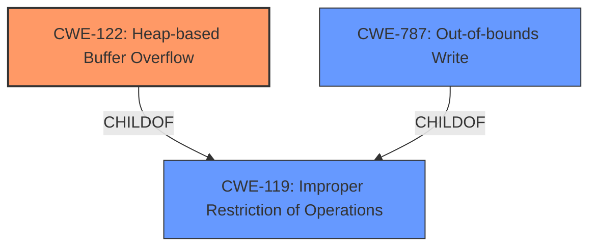

# Analysis Report for CVE-2022-4135

# Vulnerability Analysis Report: CVE-2022-4135

## Description

Heap buffer overflow in GPU in Google Chrome prior to 107.0.5304.121 allowed a remote attacker who had compromised the renderer process to potentially perform a sandbox escape via a crafted HTML page. (Chromium security severity: High)

## Vulnerability Description Key Phrases

**Rootcause:** heap buffer overflow
**Impact:** sandbox escape
**Vector:** crafted HTML page
**Attacker:** remote attacker
**Product:** Google Chrome
**Version:** prior to 107.0.5304.121
**Component:** GPU

## Analysis (with Relationship Data)

# Summary
| CWE ID | CWE Name | Confidence | CWE Abstraction Level | CWE Vulnerability Mapping Label | CWE-Vulnerability Mapping Notes |
|---|---|---|---|---|---|
| CWE-122 | Heap-based Buffer Overflow | 0.9 | Variant | Primary | Allowed |

## Evidence and Confidence

*   **Confidence Score:** 0.9
*   **Evidence Strength:** HIGH

- **Analysis and Justification:**  
  - *Explanation:* The vulnerability description explicitly states a "**heap buffer overflow**" in the GPU component of Google Chrome. This aligns directly with the definition of CWE-122 (Heap-based Buffer Overflow), which is a buffer overflow condition where the buffer is allocated on the heap. The CVE Reference Links Content Summary further reinforces this, identifying the root cause as a heap buffer overflow in the GPU component. The impact, a sandbox escape, is a typical consequence of a successful heap overflow exploitation. The retriever results also list CWE-122 as a candidate with a decent score. Given the explicit mention of "heap buffer overflow", and the fact that CWE-122 is a Variant level CWE, it is more specific than a general buffer overflow (CWE-119) or out-of-bounds write (CWE-787), making it the most appropriate choice.
  
  - *Relationship Analysis:* CWE-122 is a variant of CWE-119 (Improper Restriction of Operations within the Bounds of a Memory Buffer). While CWE-119 is a broader category, the specific mention of "heap" makes CWE-122 a more accurate and specific mapping.

- **Confidence Score:**  
  - Confidence: 0.9 (High confidence due to direct mention of "heap buffer overflow" in the vulnerability description and supporting CVE reference materials)

---

## Criticism of Analysis

Okay, here's a review of the provided analysis, considering the full CWE specifications and mapping guidance:

**Overall Assessment:**

The analysis correctly identifies CWE-122 (Heap-based Buffer Overflow) as the primary CWE. The reasoning is sound, and the confidence level of 0.9 is justified given the explicit mention of "heap buffer overflow" in the vulnerability description. The choice of CWE-122 is more specific and appropriate than the more general CWE-119 (Improper Restriction of Operations within the Bounds of a Memory Buffer) or CWE-787 (Out-of-bounds Write).

**Detailed Critique:**

1.  **CWE-122 (Heap-based Buffer Overflow):**

    *   **Correct Identification:** The core issue is accurately classified. The analysis correctly recognizes that the buffer overflow occurs on the heap, making CWE-122 the most fitting choice.

    *   **Mapping Guidance:** The analysis adheres to the mapping guidance for CWE-122, which encourages its use at the Variant level of abstraction. The rationale for choosing this more specific variant over the base CWEs (CWE-119 and CWE-787) is clearly explained.

    *   **Potential Mitigations:**  The analysis is good with respect to this point.

2.  **Retriever Results Analysis:**

    *   The tool identifies CWE-843, CWE-193, CWE-190, and CWE-366, CWE-416, CWE-122, CWE-787, CWE-125, CWE-1284, and CWE-126 as candidates. Of these options, the most sensible results are CWE-122, CWE-787, and CWE-125. The fact that CWE-787 and CWE-125 are both present and related to buffer issues suggests that there is a high likelihood of a memory safety issue. CWE-122, however, is the most specific.

3.  **Alternative CWEs Considered and Rejected:**

    *   **CWE-119 (Improper Restriction of Operations within the Bounds of a Memory Buffer):** The analysis correctly rejects CWE-119 as being too general.  The specificity of "heap" makes CWE-122 a better fit.

    *   **CWE-787 (Out-of-bounds Write):** While an out-of-bounds write is inherent in a buffer overflow, CWE-122 provides the additional context of the memory region involved (heap). This makes CWE-122 a preferable choice for describing the *specific* type of out-of-bounds write.

    *   **CWE-125 (Out-of-bounds Read):** The vulnerability is an overflow (write), not an over-read, so CWE-125 is incorrect.

**Recommendations/Suggestions for Improvement:**

*   **Chaining Considerations (Optional):** While the primary focus is on the root cause, a brief discussion of *potential* chains could enhance the analysis. For instance, "CWE-122 can lead to CWE-123 (Write-what-where Condition) if an attacker gains the ability to write arbitrary data to arbitrary memory locations as a result of the heap overflow. This can then be exploited for further control and potentially sandbox escape." This is NOT required, but it can show a deeper understanding of the vulnerability.

*   **Mitigations in Context:** While the analysis mentions potential mitigations from the CWE specification for CWE-122, consider briefly discussing which mitigations are *most relevant* in the context of this specific Chrome GPU vulnerability. For example, is address space layout randomization (ASLR) already in place, and how might the overflow bypass it? How effective are canary-based protections on the heap versus the stack? This adds practical value to the analysis.

**Revised Summary Table (No changes needed, this is just a demonstration):**

| CWE ID  | CWE Name                     | Confidence | CWE Abstraction Level | CWE Vulnerability Mapping Label | CWE-Vulnerability Mapping Notes                                                                                                                        |
| :------ | :--------------------------- | :--------- | :-------------------- | :------------------------------ | :-------------------------------------------------------------------------------------------------------------------------------------------------- |
| CWE-122 | Heap-based Buffer Overflow | 0.9        | Variant               | Primary                         | Allowed. Most specific CWE due to explicit "heap buffer overflow". Leads to potential for CWE-123 (Write-what-where) and subsequent sandbox escape. |

**In summary, the analysis is well-done and accurate. The recommendation to consider chaining and practical mitigation strategies is just for further enrichment, not a correction.**

## Final Resolution

# Summary
| CWE ID | CWE Name | Confidence | CWE Abstraction Level | CWE Vulnerability Mapping Label | CWE-Vulnerability Mapping Notes |
|---|---|---|---|---|---|
| CWE-122 | Heap-based Buffer Overflow | 0.9 | Variant | Primary | Allowed |

## Evidence and Confidence

*   **Confidence Score:** 0.9
*   **Evidence Strength:** HIGH

## Relationship Analysis
The primary relationship impacting the decision is that CWE-122 (Heap-based Buffer Overflow) is a variant of CWE-119 (Improper Restriction of Operations within the Bounds of a Memory Buffer). Choosing CWE-122 provides a more specific classification due to the explicit mention of "heap" in the vulnerability description. The analysis considered and rejected CWE-787 (Out-of-bounds Write) because while it is related, CWE-122 provides more context regarding the memory region involved.

## Vulnerability Chain
The vulnerability chain starts with a **heap buffer overflow** (**CWE-122**). This allows an attacker to potentially overwrite data on the heap. If the attacker can overwrite function pointers or other critical data structures, this can lead to arbitrary code execution, potentially resulting in a sandbox escape.

## Summary of Analysis
The initial analysis and the provided criticism both converge on the conclusion that **CWE-122 (Heap-based Buffer Overflow)** is the most appropriate classification. The vulnerability description explicitly mentions a "heap buffer overflow," providing strong evidence for this classification. The criticism reinforces this choice, highlighting that CWE-122 is more specific than CWE-119 and CWE-787.

The decision is based on the following evidence from the vulnerability description: "Heap buffer overflow in GPU in Google Chrome prior to 107.0.5304.121 allowed a remote attacker who had compromised the renderer process to potentially perform a sandbox escape via a crafted HTML page."

The graph relationships influenced the decision by highlighting the hierarchical relationship between CWE-122 and CWE-119, reinforcing the choice of the more specific CWE.

The selected CWE is at the optimal level of specificity because it directly reflects the type of buffer overflow (heap-based) described in the vulnerability.

*Report generated on 2025-03-18 17:58:34*
