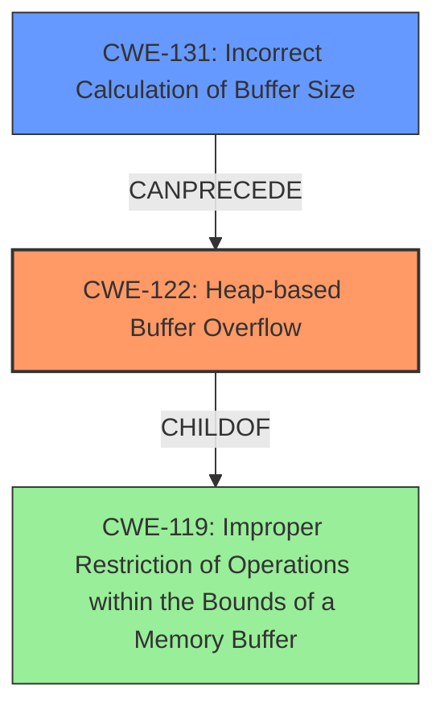

# Final Resolution for CVE-2022-4141

# Summary
| CWE ID | CWE Name | Confidence | CWE Abstraction Level | CWE Vulnerability Mapping Label | CWE-Vulnerability Mapping Notes |
|---|---|---|---|---|---|
| CWE-122 | Heap-based Buffer Overflow | 0.95 | Variant | Allowed | Primary CWE. Occurs due to improper handling of text lock conditions during file navigation within a substitution function. |
| CWE-131 | Incorrect Calculation of Buffer Size | 0.30 | Base | Allowed | Possible contributing factor. Insufficient information to confirm, but should be considered during code review. |

## Evidence and Confidence

*   **Confidence Score:** 0.93
*   **Evidence Strength:** MEDIUM

## Relationship Analysis
The primary relationship considered was the parent-child relationship between CWE-119 (**CWE-119: Improper Restriction of Operations within the Bounds of a Memory Buffer**) and CWE-122 (**CWE-122: Heap-based Buffer Overflow**). CWE-122 is a variant of CWE-119, making it a more specific choice when the overflow occurs on the heap. The potential for CWE-131 (**CWE-131: Incorrect Calculation of Buffer Size**) as a contributing factor was also considered, although the evidence to support this is weak.

## Vulnerability Chain
The vulnerability chain starts with a potential incorrect calculation of buffer size (**CWE-131**), which leads to a heap-based buffer overflow (**CWE-122**) when a large or unbounded copy is performed. The overflow occurs during the execution of a substitute command with `CTRL-W gf`, triggered from an expression used in the RHS of the substitute command due to the improper handling of a text lock condition. This results in an invalid memory access and potential arbitrary code execution.

## Summary of Analysis
The initial analysis correctly identified CWE-122 (**CWE-122: Heap-based Buffer Overflow**) as the primary **WEAKNESS**. The vulnerability description explicitly mentions "Heap based buffer overflow". The criticism suggested considering other CWEs, especially CWE-131 (**CWE-131: Incorrect Calculation of Buffer Size**), as a potential contributing factor.

The decision to include CWE-131 as a secondary candidate is based on the possibility that an incorrect size calculation might have contributed to the overflow. However, the provided evidence is not strong enough to confirm this. Therefore, the confidence in CWE-131 is lower.

The relationship analysis confirms that CWE-122 is a more specific variant of CWE-119 (**CWE-119: Improper Restriction of Operations within the Bounds of a Memory Buffer**), making it a more appropriate choice.

The final classification reflects the optimal level of specificity based on the available evidence, focusing on the heap-based nature of the overflow while acknowledging the potential role of incorrect buffer size calculation. The inclusion of text locking is integrated into the CWE-122 description.