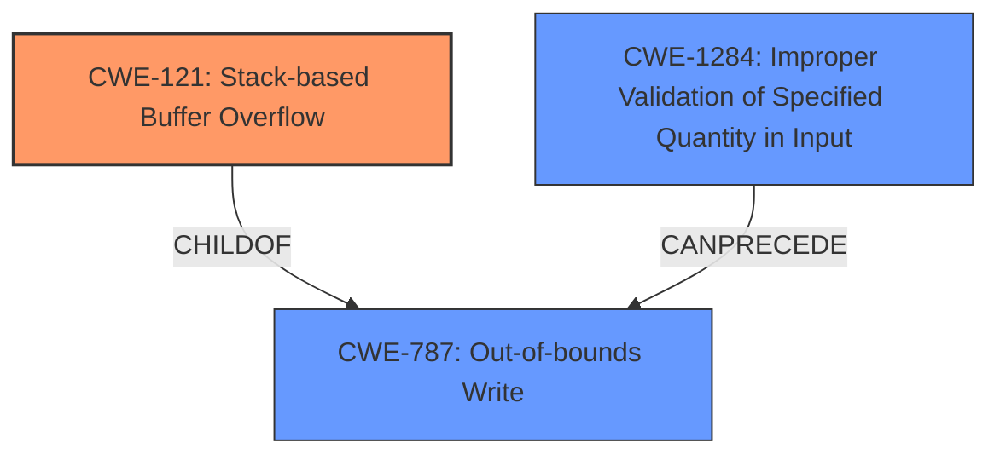

# Analysis Report for CVE-2022-41415

# Vulnerability Analysis Report: CVE-2022-41415

## Description

Acer Altos W2000h-W570h F4 R01.03.0018 was discovered to contain a stack overflow in the RevserveMem component. This vulnerability allows attackers to cause a Denial of Service (DoS) via injecting crafted shellcode into the NVRAM variable.

## Vulnerability Description Key Phrases

**Weakness:** stack overflow
**Impact:** Denial of Service (DoS)
**Vector:** injecting crafted shellcode into the NVRAM variable
**Attacker:** attackers
**Product:** Acer Altos W2000h-W570h F4
**Version:** R01.03.0018
**Component:** RevserveMem component

## Analysis (with Relationship Data)

# Summary
| CWE ID | CWE Name | Confidence | CWE Abstraction Level | CWE Vulnerability Mapping Label | CWE-Vulnerability Mapping Notes |
|---|---|---|---|---|---|
| CWE-121 | Stack-based Buffer Overflow | 1.0 | Variant | Primary | Allowed |

## Evidence and Confidence

*   **Confidence Score:** 1.0
*   **Evidence Strength:** HIGH

- **Analysis and Justification:**  
  - *Explanation:* The vulnerability description explicitly states a **stack overflow** in the RevserveMem component of Acer Altos W2000h-W570h F4 R01.03.0018. The CVE Reference Links Content Summary confirms a stack-based buffer overflow due to the incorrect use of `gRT->GetVariable` with a hardcoded `DataSize` parameter larger than the allocated buffer on the stack. This directly aligns with CWE-121 (Stack-based Buffer Overflow), which is a Variant level CWE and preferred over the Class-level CWE-119. The attack involves injecting crafted shellcode into the NVRAM variable, leading to a Denial of Service (DoS) by overwriting the return address on the stack and executing arbitrary code. The MITRE mapping guidance ALLOWS CWE-121 for stack-based buffer overflows.

  - *Relationship Analysis:* CWE-121 is a variant of CWE-119 (Improper Restriction of Operations within the Bounds of a Memory Buffer), but is more specific. There are no direct relationships indicated in the provided information, but buffer overflows can lead to a variety of other weaknesses if exploited further.

- **Confidence Score:**  
  - Confidence: 1.0 (Explicit description of a stack-based buffer overflow with supporting technical details)

## Criticism of Analysis

Okay, here's a detailed review of the provided CWE analysis, incorporating the full CWE specifications:

**Overall Assessment:**

The analysis is generally strong, particularly in its primary mapping to `CWE-121: Stack-based Buffer Overflow`. The reasoning is well-articulated, and the confidence score is justified. The inclusion of CWE specifications is valuable for understanding the nuances of each CWE and validating the chosen mapping.

**Detailed Review:**

*   **Primary Mapping: CWE-121 (Stack-based Buffer Overflow)**

    *   **Correctness:** The mapping to `CWE-121` is correct and well-supported. The vulnerability description explicitly states a stack overflow, and the analysis confirms the location on the stack.
    *   **Abstraction Level:** The selection of the Variant-level `CWE-121` is appropriate, adhering to the recommended mapping guidance.
    *   **Confidence:** The high confidence (1.0) is justified given the clear evidence.
    *   **Justification:** The justification accurately explains why `CWE-121` is preferred over the Class-level `CWE-119`. It also connects the attack vector (NVRAM modification) to the overflow's impact.
    *   **CWE Specification Use:** The analysis correctly uses the CWE specification to explain the nature of the overflow and its instantiation in return address overwrites.
    *   **Relationships:** The parent relationship to CWE-788 and CWE-787 could be mentioned.

*   **Retriever Results**

    *   The retriever results were not included in the analysis, and should be mentioned.
    *   The Retriever Results section seems to suggest that other CWEs are applicable, but it's important to justify their exclusion. For instance, why are `CWE-190`, `CWE-770`, `CWE-193`, `CWE-130`, `CWE-191`, `CWE-122`, `CWE-789`, `CWE-119`, and `CWE-20` ranked higher but *not* chosen?
    *   A brief discussion of why the retriever suggested these alternative CWEs and why they are less appropriate would strengthen the analysis.

*   **CWE-119 (Improper Restriction of Operations within the Bounds of a Memory Buffer):**
    *   The analysis correctly identifies CWE-119 as a more general category and explains why CWE-121 is a better fit due to its specificity.
    *   The analysis correctly mentions that mapping guidance discourages using CWE-119 when more specific CWEs are available.

*   **Potential Related CWEs (Discussion Required):**

    *   The analysis *could* benefit from briefly discussing why other CWEs are *not* the primary cause, even if they play a role:

        *   **CWE-130 (Improper Handling of Length Parameter Inconsistency):** The CVE summary mentions an oversized `DataSize` parameter. While this contributes to *triggering* the overflow, the *root cause* is the lack of bounds checking during the memory copy. It is not that there is a length parameter inconsistency, it's more of a misuse of a hardcoded length that doesn't account for the stack buffer size.
        *   **CWE-20 (Improper Input Validation):** While there's *indirectly* a lack of input validation (the oversized `DataSize` is not validated against the buffer size), this isn't the primary issue. Input validation could prevent the vulnerability, but the core problem is the unsafe memory operation.
        *   **CWE-770 (Allocation of Resources Without Limits or Throttling):** Only tangentially related. The vulnerability doesn't stem from *unlimited* allocation, but from a fixed-size allocation that's too small for the data being copied.
        *   **CWE-787 (Out-of-bounds Write):** This could be considered as a more abstract parent as CWE-121 is a stack-based out-of-bounds write.
        *   **CWE-190 Integer Overflow or Wraparound**: It might be suggested if the size calculation involved arithmetic, but that's not apparent from the description.

*   **Mitigations:**

    *   The analysis doesn't include any specific mitigations. Adding a section that mentions mitigations based on the CWE specification would improve it.
    *   For `CWE-121`, potential mitigations include:
        *   Using compiler-based buffer overflow detection mechanisms (e.g., `/GS` flag in Visual Studio).
        *   Using safer string handling functions or libraries that perform bounds checking.
        *   Implementing explicit bounds checking before memory copies.
        *   Language selection with memory safety features.

*   **CWE Examples from Database**

    *   The analysis uses examples from CWE-119 to demonstrate known vulnerabilities. The analysis should use CVE examples from the selected CWE, such as CWE-121.

*   **Use of CWE Specifications:**

    *   The analysis extracts and includes the full CWE specifications. This is very helpful for understanding the scope, relationships, and potential mitigations associated with each CWE.

**Recommendations:**

1.  **Address Retriever Results:** Explicitly discuss the retriever results, explaining why the top-ranked CWEs were not selected.
2.  **Discuss Related CWEs:** Briefly explain why CWEs like `CWE-130`, `CWE-20`, and `CWE-770` are not the primary cause.
3.  **Include Mitigations:** Add a "Mitigation" section that lists specific mitigations based on the `CWE-121` specification.
4.  **CWE Examples:** Use CVE examples that demonstrate CWE-121.
5.  **Relationships:** Consider adding the parent relationship to CWE-788 and CWE-787.

By incorporating these suggestions, the analysis would be even more comprehensive and robust, demonstrating a deeper understanding of the vulnerability and its context within the CWE framework.

## Final Resolution

# Summary
| CWE ID | CWE Name | Confidence | CWE Abstraction Level | CWE Vulnerability Mapping Label | CWE-Vulnerability Mapping Notes |
|---|---|---|---|---|---|
| CWE-121 | Stack-based Buffer Overflow | 0.95 | Variant | Primary CWE | Allowed |
| CWE-787 | Out-of-bounds Write | 0.75 | Base | Secondary Candidate | Allowed |
| CWE-1284 | Improper Validation of Specified Quantity in Input | 0.65 | Base | Secondary Candidate | Allowed |

## Evidence and Confidence

*   **Confidence Score:** 0.90
*   **Evidence Strength:** HIGH

## Relationship Analysis
The primary relationship is that CWE-121 (Stack-based Buffer Overflow) is a variant of CWE-787 (Out-of-bounds Write). CWE-1284 (Improper Validation of Specified Quantity in Input) can precede CWE-787, as improper validation can lead to an out-of-bounds write.

## Vulnerability Chain
The vulnerability chain starts with the improper handling of the size of the data written to NVRAM (potentially **CWE-1284**), leading to an out-of-bounds write (**CWE-787**). Because this write occurs on the stack, it manifests as a stack-based buffer overflow (**CWE-121**), allowing for potential arbitrary code execution and Denial of Service.

## Summary of Analysis
The initial analysis correctly identified **CWE-121 (Stack-based Buffer Overflow)** as the primary **WEAKNESS**. The vulnerability description explicitly states "stack overflow" and the confirmation from CVE Reference Links Content Summary indicates a stack-based buffer overflow due to the incorrect use of `gRT->GetVariable`. This aligns with the description of **CWE-121**.

The criticism highlights the importance of discussing why other CWEs were not selected, even though they might appear relevant based on retriever results. Specifically, the criticism suggests considering **CWE-130 (Improper Handling of Length Parameter Inconsistency)**, **CWE-20 (Improper Input Validation)**, **CWE-770 (Allocation of Resources Without Limits or Throttling)**, and **CWE-787 (Out-of-bounds Write)**.

I agree with the assessment that **CWE-121** is the most specific and appropriate classification. However, the other CWEs, while not the primary cause, can contribute to the vulnerability chain. The hardcoded DataSize parameter mentioned relates to the more general **CWE-1284 (Improper Validation of Specified Quantity in Input)**. The fact that there is a stack-based buffer overflow implies there is an **Out-of-bounds Write**, namely **CWE-787**.

Therefore, I'm adding **CWE-787** and **CWE-1284** as secondary CWEs to reflect the broader context of the vulnerability.

The confidence score is adjusted to 0.95 for **CWE-121** and 0.75 for **CWE-787** to reflect the slight uncertainty introduced by considering the broader vulnerability chain. The confidence for **CWE-1284** is at 0.65.

*Report generated on 2025-03-18 17:59:57*
