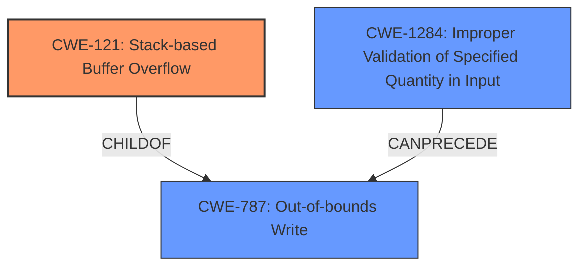

# Final Resolution for CVE-2022-41415

# Summary
| CWE ID | CWE Name | Confidence | CWE Abstraction Level | CWE Vulnerability Mapping Label | CWE-Vulnerability Mapping Notes |
|---|---|---|---|---|---|
| CWE-121 | Stack-based Buffer Overflow | 0.95 | Variant | Primary CWE | Allowed |
| CWE-787 | Out-of-bounds Write | 0.75 | Base | Secondary Candidate | Allowed |
| CWE-1284 | Improper Validation of Specified Quantity in Input | 0.65 | Base | Secondary Candidate | Allowed |

## Evidence and Confidence

*   **Confidence Score:** 0.90
*   **Evidence Strength:** HIGH

## Relationship Analysis
The primary relationship is that CWE-121 (Stack-based Buffer Overflow) is a variant of CWE-787 (Out-of-bounds Write). CWE-1284 (Improper Validation of Specified Quantity in Input) can precede CWE-787, as improper validation can lead to an out-of-bounds write.

## Vulnerability Chain
The vulnerability chain starts with the improper handling of the size of the data written to NVRAM (potentially **CWE-1284**), leading to an out-of-bounds write (**CWE-787**). Because this write occurs on the stack, it manifests as a stack-based buffer overflow (**CWE-121**), allowing for potential arbitrary code execution and Denial of Service.

## Summary of Analysis
The initial analysis correctly identified **CWE-121 (Stack-based Buffer Overflow)** as the primary **WEAKNESS**. The vulnerability description explicitly states "stack overflow" and the confirmation from CVE Reference Links Content Summary indicates a stack-based buffer overflow due to the incorrect use of `gRT->GetVariable`. This aligns with the description of **CWE-121**.

The criticism highlights the importance of discussing why other CWEs were not selected, even though they might appear relevant based on retriever results. Specifically, the criticism suggests considering **CWE-130 (Improper Handling of Length Parameter Inconsistency)**, **CWE-20 (Improper Input Validation)**, **CWE-770 (Allocation of Resources Without Limits or Throttling)**, and **CWE-787 (Out-of-bounds Write)**.

I agree with the assessment that **CWE-121** is the most specific and appropriate classification. However, the other CWEs, while not the primary cause, can contribute to the vulnerability chain. The hardcoded DataSize parameter mentioned relates to the more general **CWE-1284 (Improper Validation of Specified Quantity in Input)**. The fact that there is a stack-based buffer overflow implies there is an **Out-of-bounds Write**, namely **CWE-787**.

Therefore, I'm adding **CWE-787** and **CWE-1284** as secondary CWEs to reflect the broader context of the vulnerability.

The confidence score is adjusted to 0.95 for **CWE-121** and 0.75 for **CWE-787** to reflect the slight uncertainty introduced by considering the broader vulnerability chain. The confidence for **CWE-1284** is at 0.65.