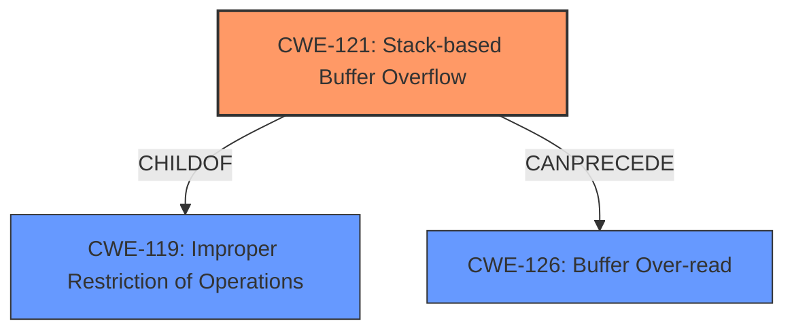

# Analysis Report for CVE-2022-41420

# Vulnerability Analysis Report: CVE-2022-41420

## Description

nasm v2.16 was discovered to contain a stack overflow in the Ndisasm component

## Vulnerability Description Key Phrases

**Weakness:** stack overflow
**Product:** nasm
**Version:** v2.16
**Component:** Ndisasm component

## Analysis (with Relationship Data)

# Summary
| CWE ID | CWE Name | Confidence | CWE Abstraction Level | CWE Vulnerability Mapping Label | CWE-Vulnerability Mapping Notes |
|---|---|---|---|---|---|
| CWE-121 | Stack-based Buffer Overflow | 0.9 | Variant | Allowed | Primary CWE |
| CWE-126 | Buffer Over-read | 0.6 | Variant | Allowed | Secondary Candidate |

## Evidence and Confidence

*   **Confidence Score:** 0.9
*   **Evidence Strength:** HIGH

- **Analysis and Justification:**  
  - *Explanation:* The vulnerability description explicitly states a "**stack overflow**" in the Ndisasm component of nasm v2.16. The "CVE Reference Links Content Summary" confirms this, stating "A **stack buffer overflow** occurs in the `do_ea` function... when processing a crafted input file." This aligns directly with CWE-121, Stack-based Buffer Overflow, which is a variant of a buffer overflow occurring specifically on the stack. CWE-121 is a more specific child of CWE-119 (Improper Restriction of Operations within the Bounds of a Memory Buffer), making it a more accurate choice. The retriever results also list CWE-121, although with a lower score than some other CWEs. Given the explicit mention of a "stack overflow," CWE-121 is the most appropriate primary mapping.
  CWE-126 (Buffer Over-read) is a secondary candidate, as the description mentions a crash due to memory corruption caused by the disassembler attempting to read beyond the allocated buffer on the stack.

  - *Relationship Analysis:* CWE-121 is a variant (child) of CWE-119 (Improper Restriction of Operations within the Bounds of a Memory Buffer), providing a more specific classification than its parent.

- **Confidence Score:**
  - Confidence: 0.9 (High confidence due to explicit mention of "stack overflow" in the description and CVE summary.)
---

## Criticism of Analysis

Okay, here's a detailed review of the provided CWE analysis, incorporating the full CWE specifications you've included.

**Overall Assessment:**

The analysis is generally sound and well-reasoned. The primary mapping to CWE-121 (Stack-based Buffer Overflow) is strongly supported by the evidence. The inclusion of CWE-126 (Buffer Over-read) as a secondary candidate is also reasonable, though it's less directly supported than the primary CWE. The confidence score of 0.9 for CWE-121 is justified.

**Detailed Review:**

**1. CWE-121: Stack-based Buffer Overflow**

*   **Confidence:** 0.9
*   **Justification:** The analysis correctly identifies the explicit mention of "stack overflow" in both the vulnerability description and the CVE summary as strong evidence for CWE-121. It correctly explains that CWE-121 is a *variant* of CWE-119 and therefore more specific.

*   **CWE Specification Alignment:** The analysis aligns well with the CWE-121 specification:
    *   **Description:**  "A stack-based buffer overflow condition is a condition where the buffer being overwritten is allocated on the stack (i.e., is a local variable or, rarely, a parameter to a function)."  The provided information directly suggests a stack allocation.
    *   **Mapping Guidance:** `Usage: Allowed`:  The analysis is using the CWE at the recommended Variant level.

*   **Mitigations:** The analysis could be strengthened by mentioning potential mitigations. Referring to the CWE-121 specifications, consider adding something like:

    "Mitigation strategies for CWE-121 include using compiler extensions that provide automatic buffer overflow detection mechanisms like the Microsoft Visual Studio /GS flag, Fedora/Red Hat FORTIFY_SOURCE GCC flag, StackGuard, and ProPolice. Implement bounds checking on input or utilizing abstraction libraries."

**2. CWE-126: Buffer Over-read**

*   **Confidence:** 0.6
*   **Justification:** The analysis suggests CWE-126 as a secondary candidate because the "CVE Reference Links Content Summary" mentions a crash "due to memory corruption caused by the disassembler attempting to read beyond the allocated buffer on the stack." This is a plausible consequence of a stack overflow. However, it's a *consequence*, not the direct root cause.  It is a secondary effect related to the primary vulnerability.

*   **CWE Specification Alignment:**
    *   **Description:** "The product reads from a buffer using buffer access mechanisms such as indexes or pointers that reference memory locations *after* the targeted buffer."  The provided vulnerability details don't directly say the *root cause* is reading from beyond the buffer, but rather *writing* to it, which *then* leads to memory corruption during a read.
    *   **Mapping Guidance:** `Usage: Allowed`: The analysis is using the CWE at the recommended Variant level.
    *   **Relationships:** It is a ChildOf -> CWE-125 (Out-of-bounds Read). The analysis is correct in identifying a potential relationship.

*   **Enhancement Suggestion:** Rephrase the justification to explicitly acknowledge that the buffer over-read is a *consequence* of the stack overflow (CWE-121) and not the primary vulnerability itself.  Also, slightly lower the confidence to 0.5.

*   **Mitigations:** The analysis could be strengthened by mentioning potential mitigations. Referring to the CWE-126 specifications, consider adding something like:

    "Mitigation strategies for CWE-126 include input validation techniques that ensure correct calculations for length arguments, buffer size calculations, or offsets. This is especially important when relying on sentinels in untrusted inputs."

**Other Considerations & Suggestions:**

*   **CWE-120: Buffer Copy without Checking Size of Input ('Classic Buffer Overflow'):** While not selected, the retriever results highlight CWE-120. Because of the detail included on stack overflows, the analysis is correct not to use this CWE because of its discouraged `Usage: Allowed-with-Review` tag because it is often misused when more precise descriptions are available.

*   **CWE-770: Allocation of Resources Without Limits or Throttling:** This is an interesting result from the retriever. While not directly related to the stack overflow itself, it *could* be a contributing factor if the code doesn't properly limit the amount of memory it allocates on the stack. However, without more information, it's difficult to say whether this is relevant.

*   **Chains:** The analysis could be improved by explicitly considering potential chains of weaknesses. For example, an integer overflow (CWE-190) or improper input validation (CWE-20) could lead to the stack-based buffer overflow (CWE-121). While not explicitly stated, the "specially crafted binary file as input" could be caused by CWE-20

*   **CWE-119: Improper Restriction of Operations within the Bounds of a Memory Buffer:** Just to reiterate, the analysis was correct to choose CWE-121 over CWE-119 because of the discouraged usage.

*   **CWE-787: Out-of-bounds Write**: This is more generic than CWE-121, which specifies a *stack-based* overflow. The specification details would imply that CWE-121 is a child of CWE-787. Therefore, the analysis was correct to classify as a stack-based overflow.

**Revised Summary Table:**

| CWE ID | CWE Name | Confidence | CWE Abstraction Level | CWE Vulnerability Mapping Label | CWE-Vulnerability Mapping Notes |
|---|---|---|---|---|---|
| CWE-121 | Stack-based Buffer Overflow | 0.9 | Variant | Allowed | Primary CWE |
| CWE-126 | Buffer Over-read | 0.5 | Variant | Allowed | Secondary Consequence |

**In summary:** The analysis is well-reasoned and accurate. Adding details about mitigations for each CWE and explicitly stating that the over-read is a consequence, not a direct cause would further strengthen it.

## Final Resolution

# Summary
| CWE ID | CWE Name | Confidence | CWE Abstraction Level | CWE Vulnerability Mapping Label | CWE-Vulnerability Mapping Notes |
|---|---|---|---|---|---|
| CWE-121 | Stack-based Buffer Overflow | 0.9 | Variant | Allowed | Primary CWE |
| CWE-126 | Buffer Over-read | 0.5 | Variant | Allowed | Secondary Consequence |

## Evidence and Confidence

*   **Confidence Score:** 0.9
*   **Evidence Strength:** HIGH

## Relationship Analysis
The primary relationship is that CWE-121 (Stack-based Buffer Overflow) is a variant (child) of CWE-119 (Improper Restriction of Operations within the Bounds of a Memory Buffer). This hierarchical relationship guided the decision to choose the more specific CWE-121. CWE-126 (Buffer Over-read) is a potential consequence of the overflow.

## Vulnerability Chain
The vulnerability chain starts with a specially crafted input file, which could stem from improper input validation (**ROOTCAUSE** - potentially CWE-20). This leads to a **WEAKNESS**, a stack-based buffer overflow (CWE-121), where data is written beyond the allocated buffer on the stack. The **IMPACT** of this overflow is memory corruption, which manifests as a buffer over-read (CWE-126) when the disassembler attempts to read beyond the corrupted buffer, leading to a crash.

## Summary of Analysis
The initial analysis correctly identified CWE-121 as the primary **WEAKNESS** due to the explicit mention of a "stack overflow" in the vulnerability description and CVE summary. The criticism suggested lowering the confidence for CWE-126 and clarifying that it's a consequence of CWE-121.

*   **Evidence-Based Justification:** The decision is strongly based on the provided evidence. The vulnerability description states a "stack overflow" and the CVE summary confirms this with "A stack buffer overflow occurs in the `do_ea` function... when processing a crafted input file." This is direct evidence supporting the selection of CWE-121.
*   **Relationship Influence:** The hierarchical relationship between CWE-121 and CWE-119 influenced the decision to choose the more specific CWE-121. The potential chain relationship between CWE-121 and CWE-126 clarified the latter's role as a consequence rather than a root cause.
*   **Optimal Specificity:** CWE-121 is at the optimal level of specificity because it directly addresses the type of buffer overflow (stack-based) described in the vulnerability. CWE-119 is too general, while more specific variants might not be applicable given the available evidence.
*   **Mitigation Strategies:** Mitigation strategies for CWE-121 include using compiler extensions that provide automatic buffer overflow detection mechanisms like the Microsoft Visual Studio /GS flag, Fedora/Red Hat FORTIFY_SOURCE GCC flag, StackGuard, and ProPolice. Implement bounds checking on input or utilizing abstraction libraries.
Mitigation strategies for CWE-126 include input validation techniques that ensure correct calculations for length arguments, buffer size calculations, or offsets. This is especially important when relying on sentinels in untrusted inputs.

The final classification reflects a high confidence in CWE-121 as the primary **ROOTCAUSE** and CWE-126 as a secondary consequence.

*Report generated on 2025-03-18 18:00:41*
