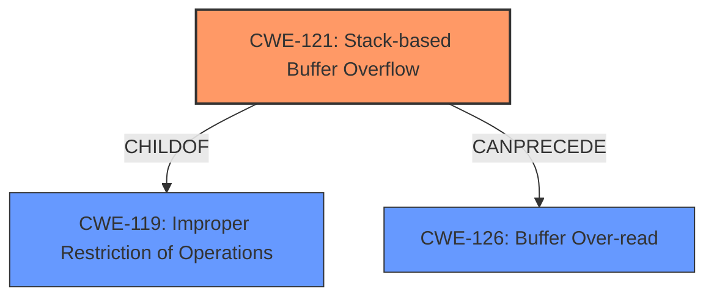

# Final Resolution for CVE-2022-41420

# Summary
| CWE ID | CWE Name | Confidence | CWE Abstraction Level | CWE Vulnerability Mapping Label | CWE-Vulnerability Mapping Notes |
|---|---|---|---|---|---|
| CWE-121 | Stack-based Buffer Overflow | 0.9 | Variant | Allowed | Primary CWE |
| CWE-126 | Buffer Over-read | 0.5 | Variant | Allowed | Secondary Consequence |

## Evidence and Confidence

*   **Confidence Score:** 0.9
*   **Evidence Strength:** HIGH

## Relationship Analysis
The primary relationship is that CWE-121 (Stack-based Buffer Overflow) is a variant (child) of CWE-119 (Improper Restriction of Operations within the Bounds of a Memory Buffer). This hierarchical relationship guided the decision to choose the more specific CWE-121. CWE-126 (Buffer Over-read) is a potential consequence of the overflow.

## Vulnerability Chain
The vulnerability chain starts with a specially crafted input file, which could stem from improper input validation (**ROOTCAUSE** - potentially CWE-20). This leads to a **WEAKNESS**, a stack-based buffer overflow (CWE-121), where data is written beyond the allocated buffer on the stack. The **IMPACT** of this overflow is memory corruption, which manifests as a buffer over-read (CWE-126) when the disassembler attempts to read beyond the corrupted buffer, leading to a crash.

## Summary of Analysis
The initial analysis correctly identified CWE-121 as the primary **WEAKNESS** due to the explicit mention of a "stack overflow" in the vulnerability description and CVE summary. The criticism suggested lowering the confidence for CWE-126 and clarifying that it's a consequence of CWE-121.

*   **Evidence-Based Justification:** The decision is strongly based on the provided evidence. The vulnerability description states a "stack overflow" and the CVE summary confirms this with "A stack buffer overflow occurs in the `do_ea` function... when processing a crafted input file." This is direct evidence supporting the selection of CWE-121.
*   **Relationship Influence:** The hierarchical relationship between CWE-121 and CWE-119 influenced the decision to choose the more specific CWE-121. The potential chain relationship between CWE-121 and CWE-126 clarified the latter's role as a consequence rather than a root cause.
*   **Optimal Specificity:** CWE-121 is at the optimal level of specificity because it directly addresses the type of buffer overflow (stack-based) described in the vulnerability. CWE-119 is too general, while more specific variants might not be applicable given the available evidence.
*   **Mitigation Strategies:** Mitigation strategies for CWE-121 include using compiler extensions that provide automatic buffer overflow detection mechanisms like the Microsoft Visual Studio /GS flag, Fedora/Red Hat FORTIFY_SOURCE GCC flag, StackGuard, and ProPolice. Implement bounds checking on input or utilizing abstraction libraries.
Mitigation strategies for CWE-126 include input validation techniques that ensure correct calculations for length arguments, buffer size calculations, or offsets. This is especially important when relying on sentinels in untrusted inputs.

The final classification reflects a high confidence in CWE-121 as the primary **ROOTCAUSE** and CWE-126 as a secondary consequence.