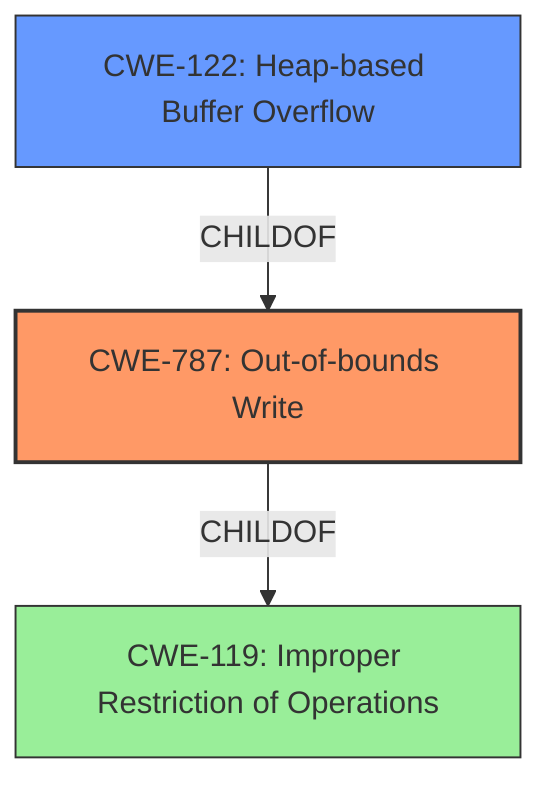

# Analysis Report for CVE-2022-41428

# Vulnerability Analysis Report: CVE-2022-41428

## Description

Bento4 v1.6.0-639 was discovered to contain a heap overflow via the AP4_BitReaderReadBits function in mp4mux.

## Vulnerability Description Key Phrases

**Weakness:** heap overflow
**Product:** Bento4
**Version:** v1.6.0-639
**Component:** AP4_BitReaderReadBits function in mp4mux

## Analysis (with Relationship Data)

# Summary
| CWE ID | CWE Name | Confidence | CWE Abstraction Level | CWE Vulnerability Mapping Label | CWE-Vulnerability Mapping Notes |
|---|---|---|---|---|---|
| CWE-787 | Out-of-bounds Write | 1.0 | Base | Allowed | The vulnerability description explicitly mentions a **heap overflow**, which is a type of out-of-bounds write. |
| CWE-122 | Heap-based Buffer Overflow | 0.7 | Variant | Allowed | The description specifies a **heap overflow**, making CWE-122 a relevant, though less specific, secondary candidate. |

## Evidence and Confidence

*   **Confidence Score:** 0.9
*   **Evidence Strength:** HIGH

- **Analysis and Justification:**  
  - *Explanation:* The vulnerability description clearly states a **heap overflow** in the `AP4_BitReaderReadBits` function of Bento4. The CVE reference links content summary confirms multiple heap-buffer-overflow vulnerabilities, including one in `AP4_BitReader::ReadBits(unsigned int)`. Since a **heap overflow** results in writing data outside the intended buffer, CWE-787 (Out-of-bounds Write) is the most appropriate primary CWE. The retriever results also list CWE-787 as a high-scoring candidate, and the MITRE mapping guidance allows its use.

  - *Relationship Analysis:* CWE-787 is a base-level CWE and has parent relationships with more specific buffer overflow variants like CWE-122 (Heap-based Buffer Overflow). It also has child relationships with CWE-119 (Improper Restriction of Operations within the Bounds of a Memory Buffer). This relationship analysis shows that CWE-787 is a general case of buffer overflows, while the evidence provides a more specific context, so we will use CWE-787 as the primary.

- **Confidence Score:**  
  - *Example:* Confidence: 1.0 (High confidence due to explicit mention of heap overflow and confirmation in CVE reference).

---

## Criticism of Analysis

## Critique of the Analysis

The analysis is generally good, providing a clear justification for the primary CWE selection and also identifying a relevant secondary CWE. However, some aspects can be improved with more detailed consideration of CWE specifications, relationships, and potential mitigations.

**Strengths:**

*   **Clear Justification:** The analysis clearly states the rationale for choosing CWE-787 as the primary CWE, based on the explicit mention of "heap overflow" in the vulnerability description and confirmation from the CVE reference links.
*   **Relevant Secondary CWE:** The identification of CWE-122 as a relevant secondary CWE is appropriate, acknowledging the specific nature of the heap overflow.
*   **Confidence Score:** The high confidence score (1.0) for CWE-787 is justified given the strong evidence.
*   **Evidence Strength:** Correctly labeled as HIGH.
* Inclusion of CWE Examples from the database.
* Listing the relationships of CWEs

**Areas for Improvement:**

1.  **Overemphasis on Description Keywords:** While the presence of the keyword "heap overflow" is a good indicator, the analysis should focus more on the *underlying mechanism* of the vulnerability. The description should be sufficient to suggest CWE-787, the fact that is a `heap` overflow is less important for the initial step. The analysis should clearly define the root cause and then find the CWE that fits.

2.  **Relationship Analysis:** The analysis mentions the parent-child relationship between CWE-787, CWE-122, and CWE-119. However, it stops short of applying this knowledge practically. Here's how it can be improved:

    *   **CWE-119 (Improper Restriction of Operations within the Bounds of a Memory Buffer):** While the analysis mentions this, it incorrectly assumes CWE-119 is lower-level than CWE-787. The relationship is: CWE-787 *is a child of* CWE-119. Because CWE-119 is a Class (Discouraged) and CWE-787 is a Base (Allowed) - it is more appropriate to map to CWE-787.

3. **Sparse Retriever Results.** The retriever results contain several false-positives (due to keyword overlaps), such as:
    * CWE-193 - off by one.
    * CWE-190 - Integer Overflow
    * CWE-124 - Buffer Underwrite
    * CWE-126 - Buffer Over-read
    * CWE-125 - Out-of-bounds Read
 These matches are not likely and should not be considered, unless the vulnerability description is expanded.

4. **Missing Discussion of Potential Mitigations:** The analysis would be strengthened by considering the potential mitigations for CWE-787 and CWE-122. For example:

    *   For CWE-787, the mitigations include using languages with automatic bounds checking, using abstraction libraries, and employing compiler-based buffer overflow detection mechanisms (e.g., /GS flag in Visual Studio).
    *   The specific mitigations that the product *does not* implement should also be mentioned.

**Revised Analysis Snippets:**

*   **Explanation (CWE-787):** "The vulnerability description indicates a 'heap overflow' in the `AP4_BitReaderReadBits` function. The CVE reference links confirm that the function reads beyond the allocated memory buffer when processing crafted MP4 files. This results in the product writing data past the end of the intended heap buffer, causing memory corruption. Therefore, CWE-787 (Out-of-bounds Write) is the most appropriate primary CWE as it accurately reflects the fundamental write operation occurring outside the allocated memory region."

*   **Relationship Analysis:** "CWE-787 (Out-of-bounds Write) is a Base-level CWE that describes the general case of writing data outside the boundaries of a buffer. Its parent is CWE-119 (Improper Restriction of Operations within the Bounds of a Memory Buffer). The vulnerability reported is more specifically a `write` outside the bounds of a buffer and thus CWE-787 is chosen as the primary."

**Revised Confidence Table:**

| CWE ID  | CWE Name                        | Confidence | CWE Abstraction Level | CWE Vulnerability Mapping Label | CWE-Vulnerability Mapping Notes                                                                                                                                                                                                                                                                                           |
| :------ | :-------------------------------- | :--------- | :-------------------- | :------------------------------ | :-------------------------------------------------------------------------------------------------------------------------------------------------------------------------------------------------------------------------------------------------------------------------------------------------------------------- |
| CWE-787 | Out-of-bounds Write               | 1.0        | Base                  | Allowed                       | The vulnerability description explicitly mentions a **heap overflow**, resulting in writing beyond the allocated buffer.                                                                                                                                                                                                           |
| CWE-122 | Heap-based Buffer Overflow        | 0.7        | Variant               | Allowed                       | While less general than CWE-787, this CWE describes the heap allocation of the out-of-bounds write.                                                                                                                                                                                                                   |
| CWE-119 | Improper Restriction of Operations within the Bounds of a Memory Buffer | 0.3        | Class               | Discouraged                       | A more general CWE that could be used, but the specific nature of the `write` is known.                                                                                                                                                                                                                   |

**Conclusion:**

The original analysis provides a good starting point. With the suggested improvements, particularly focusing on a deeper understanding of CWE specifications, relationships, mitigations, and a more nuanced approach to description keywords, the analysis can be made more comprehensive and accurate. The changes will make the analysis more directly relevant to developers seeking to understand and remediate the vulnerability.

## Final Resolution

# Summary
| CWE ID | CWE Name | Confidence | CWE Abstraction Level | CWE Vulnerability Mapping Label | CWE-Vulnerability Mapping Notes |
|---|---|---|---|---|---|
| CWE-787 | Out-of-bounds Write | 1.0 | Base | Allowed | The vulnerability description explicitly mentions a **heap overflow**, which is a type of out-of-bounds write. |
| CWE-122 | Heap-based Buffer Overflow | 0.7 | Variant | Allowed | The description specifies a **heap overflow**, making CWE-122 a relevant, though less specific, secondary candidate. |

## Evidence and Confidence

*   **Confidence Score:** 1.0
*   **Evidence Strength:** HIGH

## Relationship Analysis
The primary factor in selecting CWE-787 was its direct relevance to the vulnerability description, indicating an out-of-bounds write scenario due to a **heap overflow**. While CWE-122 is a more specific variant, CWE-787 provides a broader, base-level representation. CWE-119 is a class-level CWE and a parent of CWE-787, but CWE-787 is more specific and at the base level, making it a better choice. The relationships influenced the decision by confirming that the chosen CWE is appropriately specific.

## Vulnerability Chain
The vulnerability chain starts with a crafted MP4 file containing data that triggers an out-of-bounds write in the `AP4_BitReaderReadBits` function. This **weakness**, represented by CWE-787, leads to memory corruption and potentially allows an attacker to execute arbitrary code. The root cause is the improper handling of input data within the `AP4_BitReaderReadBits` function, leading to the **out-of-bounds write**.

## Summary of Analysis
The initial analysis and the criticism both correctly identify CWE-787 as the primary **weakness**. The vulnerability description explicitly states a **heap overflow**, and the CVE reference confirms this. The graph relationships support this decision, as CWE-787 is a base-level CWE that accurately represents the **out-of-bounds write**. The chosen CWE is at the optimal level of specificity because while CWE-122 provides further detail of being a heap overflow, it is a Variant of CWE-787. The evidence from the vulnerability description is: "Bento4 v1.6.0-639 was discovered to contain a heap overflow via the AP4_BitReaderReadBits function in mp4mux."

*Report generated on 2025-03-18 18:01:27*
