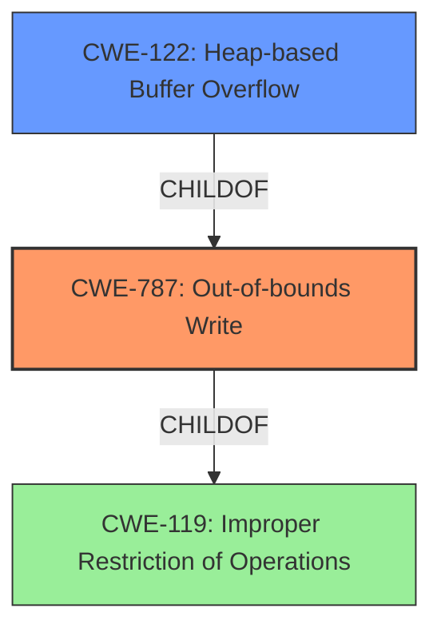

# Final Resolution for CVE-2022-41428

# Summary
| CWE ID | CWE Name | Confidence | CWE Abstraction Level | CWE Vulnerability Mapping Label | CWE-Vulnerability Mapping Notes |
|---|---|---|---|---|---|
| CWE-787 | Out-of-bounds Write | 1.0 | Base | Allowed | The vulnerability description explicitly mentions a **heap overflow**, which is a type of out-of-bounds write. |
| CWE-122 | Heap-based Buffer Overflow | 0.7 | Variant | Allowed | The description specifies a **heap overflow**, making CWE-122 a relevant, though less specific, secondary candidate. |

## Evidence and Confidence

*   **Confidence Score:** 1.0
*   **Evidence Strength:** HIGH

## Relationship Analysis
The primary factor in selecting CWE-787 was its direct relevance to the vulnerability description, indicating an out-of-bounds write scenario due to a **heap overflow**. While CWE-122 is a more specific variant, CWE-787 provides a broader, base-level representation. CWE-119 is a class-level CWE and a parent of CWE-787, but CWE-787 is more specific and at the base level, making it a better choice. The relationships influenced the decision by confirming that the chosen CWE is appropriately specific.

## Vulnerability Chain
The vulnerability chain starts with a crafted MP4 file containing data that triggers an out-of-bounds write in the `AP4_BitReaderReadBits` function. This **weakness**, represented by CWE-787, leads to memory corruption and potentially allows an attacker to execute arbitrary code. The root cause is the improper handling of input data within the `AP4_BitReaderReadBits` function, leading to the **out-of-bounds write**.

## Summary of Analysis
The initial analysis and the criticism both correctly identify CWE-787 as the primary **weakness**. The vulnerability description explicitly states a **heap overflow**, and the CVE reference confirms this. The graph relationships support this decision, as CWE-787 is a base-level CWE that accurately represents the **out-of-bounds write**. The chosen CWE is at the optimal level of specificity because while CWE-122 provides further detail of being a heap overflow, it is a Variant of CWE-787. The evidence from the vulnerability description is: "Bento4 v1.6.0-639 was discovered to contain a heap overflow via the AP4_BitReaderReadBits function in mp4mux."