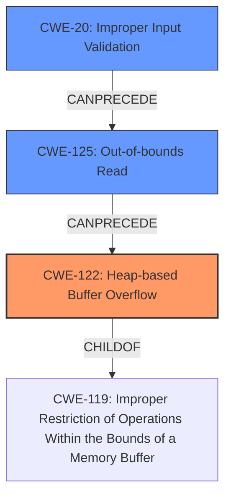

# Final Resolution for CVE-2022-41429

# Summary
| CWE ID  | CWE Name                       | Confidence | CWE Abstraction Level | CWE Vulnerability Mapping Label | CWE-Vulnerability Mapping Notes |
| :-------- | :----------------------------- | :--------- | :---------------------- | :------------------------------ | :------------------------------ |
| CWE-122 | Heap-based Buffer Overflow | 0.90       | Variant                | Allowed                         | Primary CWE                     |
| CWE-20 | Improper Input Validation | 0.75       | Base                | Allowed                         | Secondary CWE                     |
| CWE-125 | Out-of-bounds Read | 0.75       | Base                | Allowed                         | Secondary CWE                     |

## Evidence and Confidence

*   **Confidence Score:** 0.85
*   **Evidence Strength:** MEDIUM

## Relationship Analysis
The analysis identified a primary **CWE-122 (Heap-based Buffer Overflow)**, which is a variant of buffer overflow. The criticism suggested adding **CWE-20 (Improper Input Validation)** and **CWE-125 (Out-of-bounds Read)** as secondary CWEs for vulnerabilities 2 and 3, creating a vulnerability chain. This chain reflects the flow from initial flawed input handling to the eventual buffer overflow. **CWE-20** can precede **CWE-125**, which can precede **CWE-122**, showing how improper input leads to out-of-bounds reads, ultimately causing a heap overflow. The abstraction levels (Base for **CWE-20** and **CWE-125**, Variant for **CWE-122**) provide a good balance of specificity and generality.

## Vulnerability Chain
The vulnerability chain starts with **CWE-20 (Improper Input Validation)**, where a crafted bitstream is not properly validated. This leads to **CWE-125 (Out-of-bounds Read)** in the `AP4_BitReader::ReadBits` function, which ultimately results in **CWE-122 (Heap-based Buffer Overflow)**. The root cause is the lack of input sanitization, and the impact is a heap overflow, potentially leading to arbitrary code execution.

## Summary of Analysis
The initial analysis correctly identified **CWE-122 (Heap-based Buffer Overflow)** as the primary issue, supported by the description stating a "heap overflow" in `AP4_AtomTypeFromString`. The criticism enhanced this by pointing out the importance of **CWE-20 (Improper Input Validation)** and **CWE-125 (Out-of-bounds Read)** for vulnerabilities 2 and 3 involving `AP4_BitReader::ReadBits` and `AP4_BitReader::ReadBit`.

The statement "a crafted bitstream in the H264 track is parsed by `AP4_AvcFrameParser::ParsePPS`, leading to an out of bounds read in `AP4_BitReader::ReadBits`" directly supports the inclusion of **CWE-20** and **CWE-125** in the vulnerability chain. This chain accurately reflects the sequence of events from initial input to final impact.

The decision to include **CWE-20** and **CWE-125** is based on the evidence provided and the understanding of CWE relationships. These CWEs are at the optimal level of specificity, as they clearly describe the root cause and intermediate steps leading to the **heap overflow**.