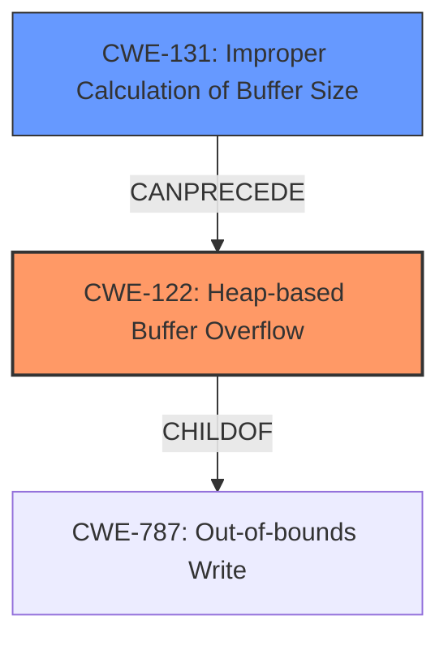

# Final Resolution for CVE-2022-41430

# Summary
| CWE ID  | CWE Name                       | Confidence | CWE Abstraction Level | CWE Vulnerability Mapping Label | CWE-Vulnerability Mapping Notes |
| :-------- | :----------------------------- | :--------- | :-------------------- | :------------------------------ | :---------------------------- |
| CWE-122 | Heap-based Buffer Overflow | 0.95       | Variant              | Allowed                         | Primary CWE                   |
| CWE-131 | Improper Calculation of Buffer Size | 0.60       | Base              | Allowed                         | Secondary Candidate                   |

## Evidence and Confidence

*   **Confidence Score:** 0.90
*   **Evidence Strength:** MEDIUM

## Relationship Analysis
The primary relationship that impacted the decision was the parent-child relationship between CWE-787 (**Out-of-bounds Write**) and CWE-122 (**Heap-based Buffer Overflow**). CWE-122 is a variant of CWE-787, providing a more specific classification for this heap-based overflow. The analysis also considered the possibility of CWE-131 (**Improper Calculation of Buffer Size**) contributing to the vulnerability, potentially preceding the heap overflow.

## Vulnerability Chain
The vulnerability chain starts with a potential **ROOTCAUSE** of CWE-131 (**Improper Calculation of Buffer Size**), which could lead to the allocation of an undersized buffer. This undersized buffer then becomes vulnerable to CWE-122 (**Heap-based Buffer Overflow**) when data is written past its boundaries. The final impact is a heap-based buffer overflow, potentially leading to arbitrary code execution or denial of service.

## Summary of Analysis
The initial analysis correctly identified CWE-122 (**Heap-based Buffer Overflow**) as the primary **WEAKNESS**. The vulnerability description explicitly mentions a "**heap overflow**" in the `AP4_BitReaderReadBit` function, making CWE-122 the most accurate classification.

The criticism suggested considering CWE-131 (**Improper Calculation of Buffer Size**) as a contributing factor, which is a valid point. While the vulnerability description doesn't explicitly state that the buffer size was miscalculated, it is a common precursor to heap overflows. Therefore, I am adding CWE-131 as a secondary candidate.

The graph relationships influenced the final decision by highlighting the hierarchical relationship between CWE-787 and CWE-122, reinforcing the selection of the more specific CWE-122. The potential chain relationship with CWE-131 further clarified the possible vulnerability lifecycle.

The selected CWEs are at the optimal level of specificity. CWE-122 accurately reflects the direct cause of the vulnerability, while CWE-131 acknowledges a potential contributing factor.