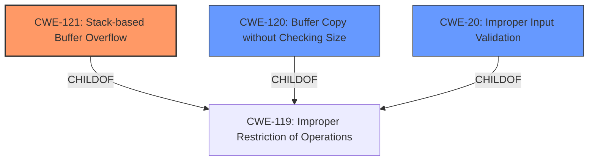

# Final Resolution for CVE-2022-41517

# Summary
| CWE ID | CWE Name | Confidence | CWE Abstraction Level | CWE Vulnerability Mapping Label | CWE-Vulnerability Mapping Notes |
|---|---|---|---|---|---|
| CWE-121 | Stack-based Buffer Overflow | 0.95 | Variant | Allowed | Primary CWE |
| CWE-120 | Buffer Copy without Checking Size of Input ('Classic Buffer Overflow') | 0.5 | Base | Allowed-with-Review | Secondary Candidate |
| CWE-20 | Improper Input Validation | 0.3 | Class | Discouraged | Secondary Candidate |

## Evidence and Confidence

*   **Confidence Score:** 0.95
*   **Evidence Strength:** HIGH

## Relationship Analysis
The primary relationship impacting the decision is the parent-child relationship between CWE-119 (Improper Restriction of Operations within the Bounds of a Memory Buffer) and CWE-121. CWE-121 is a variant of CWE-119, specifically addressing stack-based overflows. CWE-120 is also a child of CWE-119 but is less specific than CWE-121 in this case.

## Vulnerability Chain
The vulnerability chain starts with a lack of input validation, potentially represented by CWE-20, though this is not explicitly stated in the vulnerability description. This leads to a **buffer overflow** on the stack (CWE-121) when copying the `lang` parameter to a buffer without proper size checks, potentially causing a **denial of service**.
  - Root Cause: Missing Input Validation (CWE-20 - potential, not confirmed)
  - Weakness: Stack-based Buffer Overflow (CWE-121)
  - Impact: Denial of Service

## Summary of Analysis
The initial analysis correctly identified CWE-121 as the primary **weakness**. The vulnerability description explicitly mentions a "**stack overflow**" in the `lang` parameter, making CWE-121 the most specific and appropriate classification.

The criticism suggested considering CWE-120 and CWE-20. While CWE-120 (Buffer Copy without Checking Size of Input) could be a contributing factor, the explicit mention of "**stack overflow**" makes CWE-121 a more accurate and specific classification. CWE-20 (Improper Input Validation) is a potential contributing factor, but it is not explicitly mentioned in the vulnerability description. Therefore, classifying it as a secondary candidate with low confidence is appropriate.

The decision to prioritize CWE-121 is based on the direct evidence from the vulnerability description: "TOTOLINK NR1800X V9.1.0u.6279_B20210910 was discovered to contain a **stack overflow** in the lang parameter in the setLanguageCfg function." The graph relationships, specifically the child-of relationship of CWE-121 to CWE-119, reinforces this decision by confirming that CWE-121 is a specific type of buffer overflow. The abstraction level of CWE-121 (Variant) is also appropriate, as it provides a granular classification of the **weakness**. The suggested mitigations such as the use of compiler flags and safe string handling libraries, align with the nature of stack-based buffer overflows.