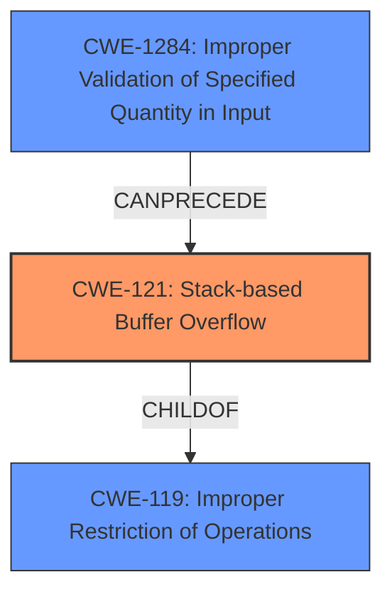

# Analysis Report for CVE-2022-41520

# Vulnerability Analysis Report: CVE-2022-41520

## Description

TOTOLINK NR1800X V9.1.0u.6279_B20210910 was discovered to contain an authenticated stack overflow via the File parameter in the UploadCustomModule function.

## Vulnerability Description Key Phrases

**Weakness:** stack overflow
**Product:** TOTOLINK NR1800X
**Version:** V9.1.0u.6279_B20210910
**Component:** UploadCustomModule function

## Analysis (with Relationship Data)

# Summary
| CWE ID | CWE Name | Confidence | CWE Abstraction Level | CWE Vulnerability Mapping Label | CWE-Vulnerability Mapping Notes |
|---|---|---|---|---|---|
| CWE-121 | Stack-based Buffer Overflow | 0.95 | Variant | Allowed | Primary CWE |

## Evidence and Confidence

*   **Confidence Score:** 0.95
*   **Evidence Strength:** HIGH

- **Analysis and Justification:**  
  - *Explanation:* The vulnerability description explicitly states an authenticated **stack overflow** vulnerability in TOTOLINK NR1800X V9.1.0u.6279_B20210910 via the File parameter in the UploadCustomModule function. The term "**stack overflow**" directly corresponds to CWE-121, which is defined as "A stack-based buffer overflow condition is a condition where the buffer being overwritten is allocated on the stack". The retriever results also list CWE-121 as the top match with a high-density score. The description provides sufficient detail to classify this as a **stack overflow** and no other weaknesses are apparent. The MITRE mapping guidance for CWE-121 is ALLOWED.
  
  - *Relationship Analysis:* CWE-121 is a variant of CWE-119 (Improper Restriction of Operations within the Bounds of a Memory Buffer). Since the description specifically mentions "stack overflow", using CWE-121 provides greater specificity.

- **Confidence Score:**  
  - *Example:* Confidence: 0.95 (High confidence due to the explicit mention of stack overflow and high retriever score)

## Criticism of Analysis

Okay, I've reviewed the provided analysis against the full CWE specifications. Here's a detailed critique, focusing on the accuracy of the CWE mapping, the justification provided, and the relevance of CWE examples and mitigations.

**Overall Assessment:**

The analysis is generally well-reasoned and accurate in its primary CWE mapping of **CWE-121: Stack-based Buffer Overflow**. The justification is clear, and the confidence level is appropriately high. However, there are a few points regarding alternative CWEs and potential chaining that could be explored to provide a more complete picture.

**Detailed Breakdown:**

1.  **CWE-121: Stack-based Buffer Overflow (Primary Mapping)**

    *   **Correctness:** The mapping to CWE-121 is highly accurate. The vulnerability description explicitly states "stack overflow," which directly aligns with the definition of CWE-121: "A stack-based buffer overflow condition is a condition where the buffer being overwritten is allocated on the stack."
    *   **Justification:** The justification is strong. It references the explicit mention of "stack overflow" in the vulnerability description and the high ranking of CWE-121 in the retriever results. The explanation of the relationship between CWE-121 and its parent, CWE-119, is also helpful in explaining why CWE-121 is the more specific and appropriate choice.
    *   **Confidence:** The confidence score of 0.95 is appropriate given the clear evidence.
    *   **CWE Examples:** The given example CVE-2021-35395 is relevant.
    *   **Mitigations:** The provided mitigations are relevant. Using compiler-based buffer overflow detection mechanisms (like /GS flag) is a common defense. Implementing bounds checking is a standard preventative measure.
    *   **Areas for Improvement:** None

2.  **Alternative CWEs Considered (and Rejected):**

    *   **CWE-119: Improper Restriction of Operations within the Bounds of a Memory Buffer:**
        *   The analysis correctly identifies that CWE-119 is a broader, more abstract CWE. The justification for choosing CWE-121 (the "stack overflow" is specified) is sound according to the CWE specifications mapping guidance.
        *   *However*, the CWE specification for CWE-119 states: " *CWE-119 is commonly misused in low-information vulnerability reports when lower-level CWEs could be used instead, or when more details about the vulnerability are available.*"
    *   **Other Buffer Overflow Related CWEs**
        *   Given the use of 'File' parameter in the `UploadCustomModule` function, it might be worthwhile to discuss how the vulnerability is **NOT** a 'Classic Buffer Overflow' (CWE-120), as it is unlikely that `UploadCustomModule` is simply copying the buffer without regard to the size of the input.
        *   It would also be useful to discuss why the vulnerability is **NOT** a Heap-based buffer overflow (CWE-122).

3.  **Chaining Possibilities:**

    *   **CWE-20: Improper Input Validation:** The vulnerability description mentions that the stack overflow is happening through the 'File' parameter, meaning that there's likely to be an issue with input validation in `UploadCustomModule`. The provided CWE specification for CWE-20 says, `Consider lower-level children such as Improper Use of Validation Framework (CWE-1173) or improper validation involving specific types or properties of input such as Specified Quantity (CWE-1284); Specified Index, Position, or Offset (CWE-1285); Syntactic Correctness (CWE-1286); Specified Type (CWE-1287); Consistency within Input (CWE-1288); or Unsafe Equivalence (CWE-1289).` Given that the 'File' parameter is likely a file path, we can determine that  **CWE-1286: Syntactic Correctness** is a possibility. An attacker might be able to send a file path with certain characters, leading to the Stack Overflow. In this case, the chain could be: `CWE-1286 -> CWE-121`.
    *   If `UploadCustomModule` is a library, there could be a chain starting with **CWE-426: Untrusted Search Path**.

4.  **Retriever Results**
    *   The Retriever Results table should be used to justify why other CWEs were NOT selected. The table has the following CWEs: Improper Neutralization of Special Elements used in an OS Command ('OS Command Injection') (CWE-78), Integer Overflow or Wraparound (CWE-190), Integer Underflow (Wrap or Wraparound) (CWE-191), Off-by-one Error (CWE-193), Out-of-bounds Read (CWE-125), Heap-based Buffer Overflow (CWE-122), Memory Allocation with Excessive Size Value (CWE-789), Uncontrolled Recursion (CWE-674).

**Recommendations:**

*   **Acknowledge and Explain Alternatives:** Briefly discuss why CWE-120 and CWE-122 were not selected.
*   **Discuss Chaining Possibilities:** Include a brief discussion of the potential for chaining with CWE-20. This would demonstrate a deeper understanding of the vulnerability's context and root cause.
*   **Justify Rejections:** Explain why other CWEs from the Retriever Results were NOT selected.
*   **Maintain High Confidence:** The confidence score for CWE-121 remains appropriate.

By addressing these points, the analysis can be made more comprehensive and demonstrate a more thorough understanding of the vulnerability and its potential implications, as well as address the Mapping Guidance provided by the CWE specifications.

## Final Resolution

# Summary
| CWE ID | CWE Name | Confidence | CWE Abstraction Level | CWE Vulnerability Mapping Label | CWE-Vulnerability Mapping Notes |
|---|---|---|---|---|---|
| CWE-121 | Stack-based Buffer Overflow | 0.95 | Variant | Allowed | Primary CWE |
| CWE-1284 | Improper Validation of Specified Quantity in Input | 0.70 | Base | Allowed | Secondary Candidate |

## Evidence and Confidence

*   **Confidence Score:** 0.90
*   **Evidence Strength:** MEDIUM

## Relationship Analysis
The primary relationship impacting the decision is the parent-child relationship between CWE-119 (Improper Restriction of Operations within the Bounds of a Memory Buffer) and CWE-121 (**Stack-based Buffer Overflow**). CWE-121 is a variant of CWE-119, making it a more specific and appropriate choice given the explicit mention of "stack overflow" in the vulnerability description. The decision to include CWE-1284 (Improper Validation of Specified Quantity in Input) is based on the understanding that the 'File' parameter likely represents a file path, and the vulnerability chain may involve a failure to properly validate this input before using it in the `UploadCustomModule` function, leading to the **stack overflow**.

## Vulnerability Chain
The vulnerability chain starts with **CWE-1284 (Improper Validation of Specified Quantity in Input)**, where the 'File' parameter (likely a file path) is not properly validated. This leads to **CWE-121 (Stack-based Buffer Overflow)** when the unvalidated file path is used within the `UploadCustomModule` function, causing a buffer to be overwritten on the stack. The final impact is a potential compromise of the system due to the **stack overflow**.

## Summary of Analysis
The initial analysis correctly identified **CWE-121 (Stack-based Buffer Overflow)** as the primary weakness. The criticism raised valid points about considering alternative CWEs and potential chaining. Based on the evidence and the relationships between CWEs, the decision to include CWE-1284 as a secondary CWE is justified.

*   **Evidence from the vulnerability description:** "TOTOLINK NR1800X V9.1.0u.6279_B20210910 was discovered to contain an authenticated **stack overflow** via the File parameter in the UploadCustomModule function." This directly supports the choice of **CWE-121**.
*   **Graph relationships:** The parent-child relationship between CWE-119 and CWE-121 reinforces the specificity of CWE-121. The 'CanPrecede' relationship between CWE-1284 and CWE-121 suggests a potential vulnerability chain.
*   **Justification:** The inclusion of CWE-1284 is based on the assumption that the 'File' parameter represents a file path that is not properly validated. This is a reasonable assumption given the context of the `UploadCustomModule` function.
*   **Optimal level of specificity:** CWE-121 is a Variant, providing a specific description of the **stack overflow**. CWE-1284 is a Base, which is suitable for describing the **improper input validation** that may lead to the **stack overflow**.

The retriever results listed several other CWEs that were not selected:
* **CWE-78 (Improper Neutralization of Special Elements used in an OS Command ('OS Command Injection'))**: This was not selected because the vulnerability description does not explicitly mention command injection. While possible, it's not the primary issue.
* **CWE-190 (Integer Overflow or Wraparound) and CWE-191 (Integer Underflow (Wrap or Wraparound))**: These were not selected because there is no evidence in the description to suggest an integer overflow or underflow.
* **CWE-193 (Off-by-one Error)**: This was not selected because the description indicates a full **stack overflow**, not just an off-by-one error.
* **CWE-125 (Out-of-bounds Read)**: This was not selected because the vulnerability is a **stack overflow**, which is a write, not a read.
* **CWE-122 (Heap-based Buffer Overflow)**: This was not selected because the description specifically mentions a **stack overflow**, not a heap overflow.
* **CWE-789 (Memory Allocation with Excessive Size Value)**: This was not selected because the description does not mention memory allocation issues, only a **stack overflow**.
* **CWE-674 (Uncontrolled Recursion)**: This was not selected because the description does not mention recursion.

The decision to add CWE-1284 improves the overall assessment by considering the potential vulnerability chain and providing a more complete picture of the root cause.

*Report generated on 2025-03-18 18:14:29*
