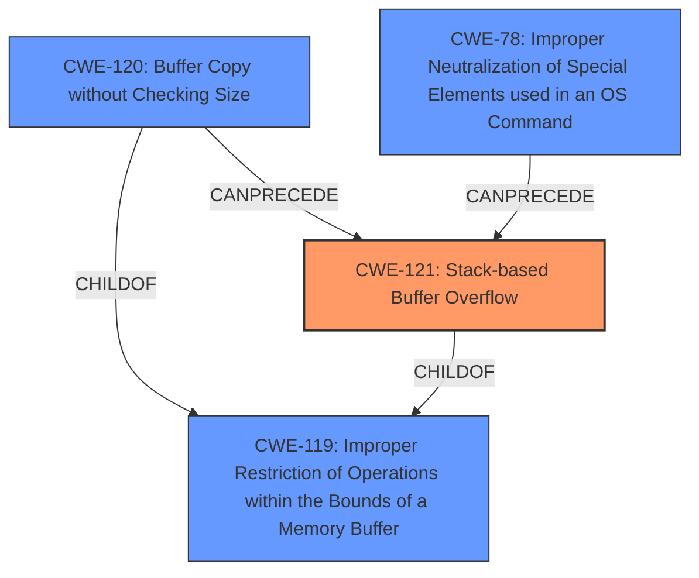

# Final Resolution for CVE-2022-41523

# Summary

| CWE ID | CWE Name | Confidence | CWE Abstraction Level | CWE Vulnerability Mapping Label | CWE-Vulnerability Mapping Notes |
|---|---|---|---|---|---|
| CWE-121 | Stack-based Buffer Overflow | 0.9 | Variant | Primary | Allowed |
| CWE-120 | Buffer Copy without Checking Size of Input ('Classic Buffer Overflow') | 0.5 | Base | Contributing Factor | While CWE-121 is more precise because the vulnerability description explicitly mentions a stack overflow, the core problem stems from a buffer copy without checking the size of the input. |
| CWE-78 | Improper Neutralization of Special Elements used in an OS Command ('OS Command Injection') | 0.3 | Base | Contributing Factor | While command injection *might* be a consequence if the `command` parameter is used to construct and execute OS commands without proper sanitization, the root cause is the unbounded copy of data into a stack buffer. The lack of proper input validation of the `command` parameter contributes to the exploitable nature of the buffer overflow, but the primary issue is the overflow itself. |

## Evidence and Confidence

*   **Confidence Score:** 0.9
*   **Evidence Strength:** HIGH

## Relationship Analysis

The decision to classify this vulnerability as CWE-121 is primarily based on the explicit mention of "stack overflow" in the vulnerability description. CWE-121 is a variant of CWE-119, providing a more specific classification. Although CWE-120 (Buffer Copy without Checking Size) and CWE-78 (OS Command Injection) are relevant, they are considered secondary because the description emphasizes the stack-based nature of the overflow, and because command injection is only a potential consequence, not necessarily the root cause.

## Vulnerability Chain

The vulnerability chain starts with the lack of input validation on the `command` parameter (potentially CWE-78). This allows an attacker to supply an overly long string. Subsequently, the `setTracerouteCfg` function copies this string to a stack-based buffer without proper bounds checking (**ROOTCAUSE**: CWE-120), leading to a **stack overflow** (**WEAKNESS**: CWE-121). This **stack overflow** allows the attacker to overwrite adjacent memory on the stack, potentially hijacking control flow and executing arbitrary code.

## Summary of Analysis

The initial analysis correctly identifies CWE-121 as the primary CWE due to the direct mention of "stack overflow" in the vulnerability description. The criticism highlights the relevance of CWE-120 and CWE-78, which contribute to the vulnerability.

The selection of CWE-121 is justified by the evidence: "TOTOLINK NR1800X V9.1.0u.6279_B20210910 was discovered to contain an authenticated **stack overflow** via the command parameter in the setTracerouteCfg function."

The graph relationships clarify the hierarchical relationship between CWE-121 and CWE-119, as well as the potential for CWE-120 and CWE-78 to precede CWE-121 in the vulnerability chain.

CWE-121 is selected as the primary CWE because it provides the most specific description of the vulnerability based on the available information. While CWE-120 represents the underlying **buffer copy** issue, and CWE-78 represents the potential for command injection, the explicit mention of a **stack overflow** makes CWE-121 the most appropriate primary classification. The inclusion of CWE-120 and CWE-78 as contributing factors provides a more complete picture of the vulnerability.