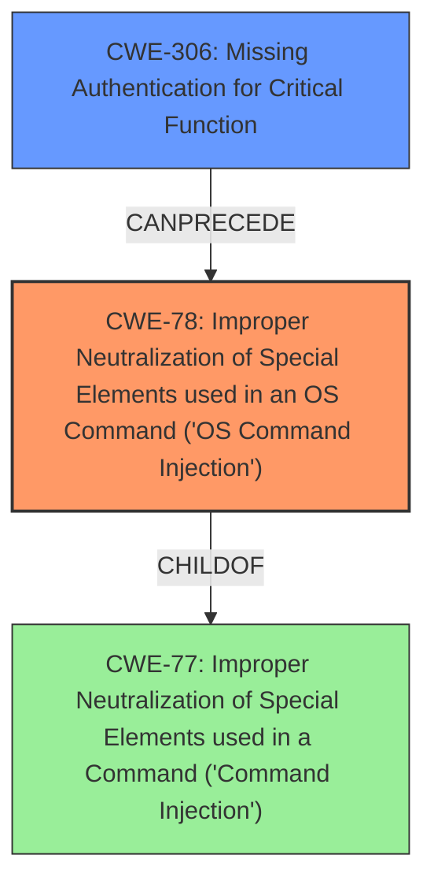

# Analysis Report for CVE-2022-41525

# Vulnerability Analysis Report: CVE-2022-41525

## Description

TOTOLINK NR1800X V9.1.0u.6279_B20210910 was discovered to contain a command injection vulnerability via the OpModeCfg function at /cgi-bin/cstecgi.cgi.

## Vulnerability Description Key Phrases

**Weakness:** command injection
**Product:** TOTOLINK NR1800X
**Version:** V9.1.0u.6279_B20210910
**Component:** OpModeCfg function

## Analysis (with Relationship Data)

# Summary
| CWE ID | CWE Name | Confidence | CWE Abstraction Level | CWE Vulnerability Mapping Label | CWE-Vulnerability Mapping Notes |
|---|---|---|---|---|---|
| CWE-78 | Improper Neutralization of Special Elements used in an OS Command ('OS Command Injection') | 0.9 | Base | Allowed | Primary CWE. Matches the description of command injection vulnerability.|
| CWE-77 | Improper Neutralization of Special Elements used in a Command ('Command Injection') | 0.6 | Class | Allowed-with-Review | Secondary CWE. A more general case of command injection.|

## Evidence and Confidence

*   **Confidence Score:** 0.9
*   **Evidence Strength:** HIGH

- **Analysis and Justification:**  
  - *Explanation:* "The vulnerability description explicitly states a **command injection** vulnerability within the OpModeCfg function of the TOTOLINK NR1800X router. CWE-78 (Improper Neutralization of Special Elements used in an OS Command ('OS Command Injection')) directly addresses this type of vulnerability, where an attacker can execute OS commands by injecting malicious input. The description specifies that the vulnerability is located in the `/cgi-bin/cstecgi.cgi` component, which indicates that the injected commands are likely executed on the underlying operating system. While CWE-77 (Improper Neutralization of Special Elements used in a Command ('Command Injection')) is a parent weakness, CWE-78 is more specific as it involves OS commands. The Retriever Results also list CWE-78 as the top match with a high combined score. MITRE mapping guidance for CWE-78 indicates this is ALLOWED for OS command injection vulnerabilities."
  
  - *Relationship Analysis:* "CWE-78 is a child of CWE-77 (Command Injection). The relationship analysis shows CWE-78 can lead to other vulnerabilities, such as CWE-269 (Privilege Management) since command injection can often be used for privilege escalation. CWE-77 is considered here as a secondary mapping because it is a more general case of command injection, and the provided information specifically points to OS command injection."

- **Confidence Score:**  
  - Confidence: 0.9 (High confidence due to direct evidence of command injection and high retriever score for CWE-78)

---

## Criticism of Analysis

Okay, here's a review of the CWE analysis you provided, incorporating the full CWE specifications:

**Overall Assessment:**

The primary mapping of CWE-78 is appropriate and well-justified. The confidence level of 0.9 is suitable, given the explicit mention of "command injection" in the vulnerability description.  The consideration of CWE-77 as a secondary mapping is also reasonable, although it's good that the analysis favors the more specific CWE-78. The retriever results support this decision.

**Detailed Review:**

**1. CWE-78: Improper Neutralization of Special Elements used in an OS Command ('OS Command Injection')**

*   **Strengths:**
    *   **Correct Mapping:** The analysis correctly identifies CWE-78 as the primary weakness. The vulnerability description aligns directly with the CWE description. The presence of `/cgi-bin/cstecgi.cgi` strongly suggests OS command execution.
    *   **Strong Justification:**  The rationale is clear, explaining why CWE-78 is preferred over its parent, CWE-77.
    *   **High Confidence:** The high confidence level (0.9) is justified, considering the explicit mention of command injection and the high retriever score.
    *   **Mitigation Awareness:** The analysis implicitly acknowledges potential mitigations by highlighting the need for proper neutralization techniques (which aligns with mitigations listed in the CWE specification).
*   **Potential Improvements:**
    *   **Clarify Injection Type:** The extended description of CWE-78 mentions two subtypes:  (1) using external input as *arguments* to a controlled program and (2) using external input to *select the program to run*.  The analysis could briefly speculate on which subtype is more likely in this scenario. Given the CGI context, it's *probably* the first subtype, but stating that and *why* would add value.
    *   **Mitigation Specificity:** While the analysis implicitly touches upon mitigation, it could be more explicit. Suggesting *specific* mitigations from the CWE specification would be helpful.  For example: "The vendor should strongly consider using library calls rather than executing external processes (Mitigation 1)." Or "The vendor should use an "accept known good" input validation strategy, i.e., use a list of acceptable inputs that strictly conform to specifications."

**2. CWE-77: Improper Neutralization of Special Elements used in a Command ('Command Injection')**

*   **Strengths:**
    *   **Appropriate Secondary Mapping:** Recognizing CWE-77 as a *potential* contributing factor is correct.  It acknowledges the hierarchical relationship between CWE-78 and CWE-77.
    *   **Justification for Lower Priority:** The rationale for choosing CWE-78 as primary is clearly stated.

*   **Potential Improvements:**
    *   **Emphasis on OS Context:**  Reiterate that CWE-77 would be more appropriate if the command injection *wasn't* related to the OS (e.g., injecting commands into a database query language *without* using SQL).
    *   **Mitigation Difference:** Briefly contrast the mitigations for CWE-77 with those for CWE-78, emphasizing that CWE-78's mitigations are more focused on OS-level protections (e.g., using fully-qualified pathnames).

**General Observations and Recommendations:**

*   **Completeness:** The analysis is generally thorough, considering the information available.
*   **Clarity:** The reasoning is easy to follow.
*   **Use of CWE Specifications:** The analysis demonstrates a good understanding of the CWE specifications and appropriately uses them to justify the chosen mappings.
*   **Leveraging Retriever Results:** While the analysis mentions that the retriever results list CWE-78 as the top match, it could further elaborate on how other CWEs in the retriever results *don't* fit. For example:
    *   **CWE-96 ('Static Code Injection'):** "While the vulnerability could lead to code being written to a configuration file, the primary issue is the execution of OS commands, not the direct injection of code syntax into a static file."
    *   **CWE-94 ('Code Injection'):**  "Similar to CWE-96, the core issue is command execution, not the generation of new code."
    *   **CWE-121 ('Stack-based Buffer Overflow'):**  "Although a buffer overflow *could* be a contributing factor to command injection, the description does not explicitly state it, so this is considered less likely."
*   **Potential Chaining:** The analysis mentions CWE-269, however it does not describe a proper chain. Since the vulnerability is unauthenticated it could be chained to CWE-306 (Missing Authentication for Critical Function).

**Revised Summary Table**

| CWE ID | CWE Name | Confidence | CWE Abstraction Level | CWE Vulnerability Mapping Label | CWE-Vulnerability Mapping Notes |
|---|---|---|---|---|---|
| CWE-78 | Improper Neutralization of Special Elements used in an OS Command ('OS Command Injection') | 0.9 | Base | Allowed | Primary CWE. Matches the description of command injection vulnerability. |
| CWE-77 | Improper Neutralization of Special Elements used in a Command ('Command Injection') | 0.6 | Class | Allowed-with-Review | Secondary CWE. A more general case of command injection. Only used when the command injection is not related to the OS. |
| CWE-306 | Missing Authentication for Critical Function | 0.4 | Base | Allowed | Could be chained with CWE-78 if the vulnerable function is not properly authenticated. |

By incorporating these suggestions, the analysis becomes even more robust and demonstrates a deeper understanding of the CWE framework.

## Final Resolution

# Summary
| CWE ID | CWE Name | Confidence | CWE Abstraction Level | CWE Vulnerability Mapping Label | CWE-Vulnerability Mapping Notes |
|---|---|---|---|---|---|
| CWE-78 | Improper Neutralization of Special Elements used in an OS Command ('OS Command Injection') | 0.9 | Base | Allowed | Primary CWE. Matches the description of command injection vulnerability. |
| CWE-306 | Missing Authentication for Critical Function | 0.5 | Base | Allowed | Secondary CWE. Could be chained with CWE-78 if the vulnerable function is not properly authenticated. |

## Evidence and Confidence

*   **Confidence Score:** 0.8
*   **Evidence Strength:** MEDIUM

## Relationship Analysis
The primary relationship is the potential chain between CWE-306 and CWE-78. If the `OpModeCfg` function lacks proper authentication (CWE-306), it allows unauthenticated attackers to inject OS commands (CWE-78). CWE-78 is a specific type of command injection and a child of CWE-77, but CWE-78 is selected due to its OS command context. The abstraction levels are appropriate, with both CWE-78 and CWE-306 at the Base level.

## Vulnerability Chain
The vulnerability chain starts with a potential lack of authentication for the `OpModeCfg` function (CWE-306). This missing authentication allows an attacker to inject malicious OS commands into the `OpModeCfg` function via the `/cgi-bin/cstecgi.cgi` interface. The injected commands are then executed on the underlying operating system due to improper neutralization of special elements (CWE-78), leading to arbitrary code execution and potential compromise of the device.

## Summary of Analysis
The initial analysis correctly identified CWE-78 as the primary issue. The criticism correctly suggested that CWE-306 could be chained if the vulnerable function is not properly authenticated.

The vulnerability description explicitly states a command injection vulnerability. The location `/cgi-bin/cstecgi.cgi` is a strong indicator of **OS command injection**, making CWE-78 the more appropriate choice over the general CWE-77. The provided evidence supports this.

The relationship analysis and the criticism's suggestion led to the inclusion of CWE-306. The vulnerability description does not explicitly mention lack of authentication, so the confidence is lower. However, the `OpModeCfg` function handles configuration, so **missing authentication** is a plausible contributing factor.

The selected CWEs are at the optimal level of specificity. CWE-78 is a Base level CWE that directly addresses the **OS command injection**, and CWE-306 is a Base level CWE that addresses the potential **missing authentication** of the vulnerable function.

*Report generated on 2025-03-18 18:28:16*
