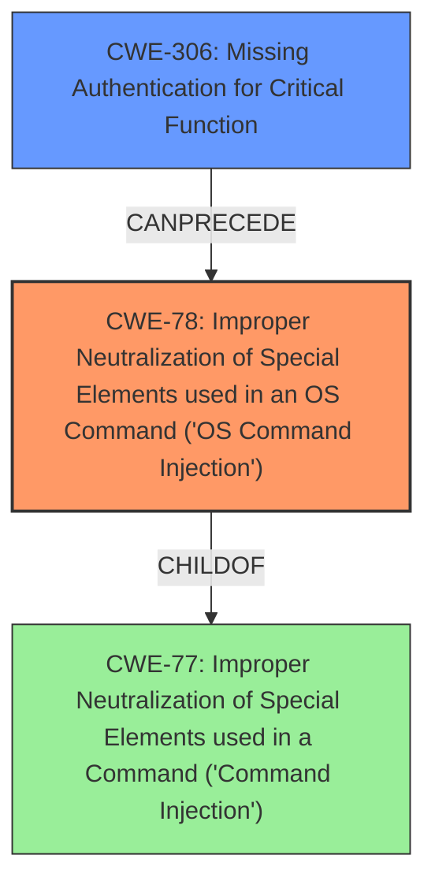

# Final Resolution for CVE-2022-41525

# Summary
| CWE ID | CWE Name | Confidence | CWE Abstraction Level | CWE Vulnerability Mapping Label | CWE-Vulnerability Mapping Notes |
|---|---|---|---|---|---|
| CWE-78 | Improper Neutralization of Special Elements used in an OS Command ('OS Command Injection') | 0.9 | Base | Allowed | Primary CWE. Matches the description of command injection vulnerability. |
| CWE-306 | Missing Authentication for Critical Function | 0.5 | Base | Allowed | Secondary CWE. Could be chained with CWE-78 if the vulnerable function is not properly authenticated. |

## Evidence and Confidence

*   **Confidence Score:** 0.8
*   **Evidence Strength:** MEDIUM

## Relationship Analysis
The primary relationship is the potential chain between CWE-306 and CWE-78. If the `OpModeCfg` function lacks proper authentication (CWE-306), it allows unauthenticated attackers to inject OS commands (CWE-78). CWE-78 is a specific type of command injection and a child of CWE-77, but CWE-78 is selected due to its OS command context. The abstraction levels are appropriate, with both CWE-78 and CWE-306 at the Base level.

## Vulnerability Chain
The vulnerability chain starts with a potential lack of authentication for the `OpModeCfg` function (CWE-306). This missing authentication allows an attacker to inject malicious OS commands into the `OpModeCfg` function via the `/cgi-bin/cstecgi.cgi` interface. The injected commands are then executed on the underlying operating system due to improper neutralization of special elements (CWE-78), leading to arbitrary code execution and potential compromise of the device.

## Summary of Analysis
The initial analysis correctly identified CWE-78 as the primary issue. The criticism correctly suggested that CWE-306 could be chained if the vulnerable function is not properly authenticated.

The vulnerability description explicitly states a command injection vulnerability. The location `/cgi-bin/cstecgi.cgi` is a strong indicator of **OS command injection**, making CWE-78 the more appropriate choice over the general CWE-77. The provided evidence supports this.

The relationship analysis and the criticism's suggestion led to the inclusion of CWE-306. The vulnerability description does not explicitly mention lack of authentication, so the confidence is lower. However, the `OpModeCfg` function handles configuration, so **missing authentication** is a plausible contributing factor.

The selected CWEs are at the optimal level of specificity. CWE-78 is a Base level CWE that directly addresses the **OS command injection**, and CWE-306 is a Base level CWE that addresses the potential **missing authentication** of the vulnerable function.