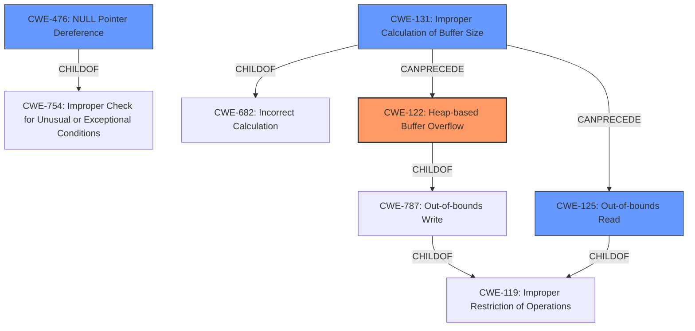

# Final Resolution for CVE-2022-41595

# Summary
| CWE ID    | CWE Name                       | Confidence | CWE Abstraction Level | CWE Vulnerability Mapping Label | CWE-Vulnerability Mapping Notes |
| :--------- | :----------------------------- | :--------- | :-------------------- | :------------------------------ | :------------------------------ |
| CWE-122     | Heap-based Buffer Overflow                 | 0.85       | Variant               | Allowed                       | Primary                         |
| CWE-125     | Out-of-bounds Read             | 0.85       | Base                 | Allowed                       | Secondary                       |
| CWE-476     | NULL Pointer Dereference       | 0.85       | Base                 | Allowed                       | Secondary                       |
| CWE-131     | Improper Calculation of Buffer Size       | 0.75       | Base                 | Allowed                       | Secondary                       |

## Evidence and Confidence

*   **Confidence Score:** 0.80
*   **Evidence Strength:** HIGH

## Relationship Analysis
The analysis builds upon the initial assessment by incorporating potential root causes, thus creating a more complete picture of the vulnerability.

Parent-child hierarchical relationships:
  - CWE-122 is a variant of CWE-787, which is a child of CWE-119.
  - CWE-125 is a child of CWE-119.
  - CWE-476 is a child of CWE-754.
  - CWE-131 is a child of CWE-682.

Chain relationships:
  - A potential chain is identified: CWE-131 -> CWE-122/125.

Peer relationships:
  - CWE-128, CWE-190, and CWE-1339 are identified as peers of each other, related to numeric errors.

Abstraction levels:
  - The analysis appropriately uses Base and Variant level CWEs.

## Vulnerability Chain
The vulnerability chain starts with a potential **root cause** such as **CWE-131: Improper Calculation of Buffer Size**. This can lead to **CWE-122: Heap-based Buffer Overflow** or **CWE-125: Out-of-bounds Read**. Separately, a lack of proper checks may result in **CWE-476: NULL Pointer Dereference**. These weaknesses in the fingerprint trusted application can affect the fingerprint service.

## Summary of Analysis
The initial analysis correctly identified the primary weaknesses: **CWE-122 (Heap Overflow)**, **CWE-125 (Out-of-bounds Read)**, and **CWE-476 (NULL Pointer Dereference)**. The criticism highlighted the importance of exploring potential root causes and considering CWE chains.

Based on the retriever results and the criticism, **CWE-131 (Improper Calculation of Buffer Size)** is added as a secondary CWE since this could have led to the **heap overflow** or **out-of-bounds read**.

The graph relationships influenced the decision by providing a framework for understanding how the different CWEs relate to each other. The chosen CWEs are at an optimal level of specificity, providing a balance between detail and broad applicability.

The vulnerability description explicitly states a **heap overflow**, **out-of-bounds read**, and **null pointer** vulnerabilities exist.