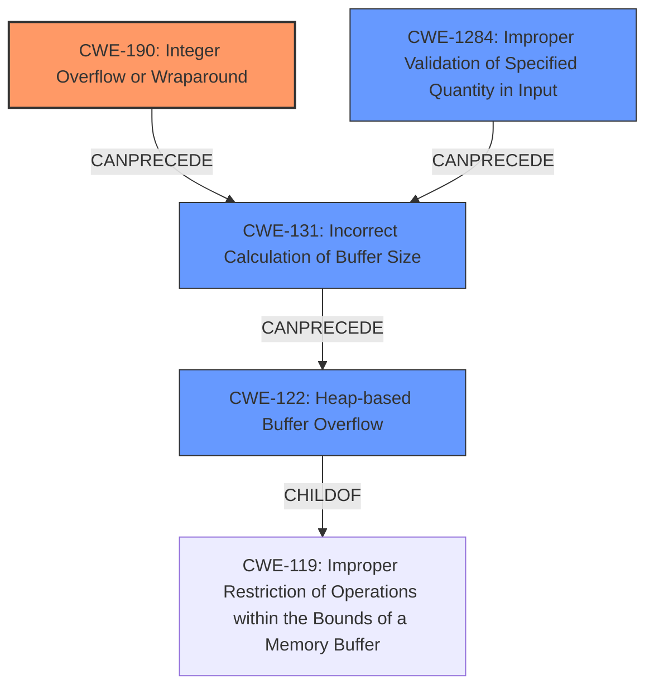

# Final Resolution for CVE-2022-4172

# Summary
| CWE ID | CWE Name | Confidence | CWE Abstraction Level | CWE Vulnerability Mapping Label | CWE-Vulnerability Mapping Notes |
|---|---|---|---|---|---|
| **CWE-190** | **Integer Overflow or Wraparound** | 0.95 | Base | Primary | Allowed |
| **CWE-131** | **Incorrect Calculation of Buffer Size** | 0.85 | Base | Secondary Candidate | Allowed |
| **CWE-1284** | **Improper Validation of Specified Quantity in Input** | 0.75 | Base | Secondary Candidate | Allowed |
| **CWE-122** | **Heap-based Buffer Overflow** | 0.75 | Variant | Secondary Candidate | Allowed |

## Evidence and Confidence

*   **Confidence Score:** 0.92
*   **Evidence Strength:** HIGH

## Relationship Analysis
The primary relationship that impacted the decision was the chain of events: **Integer Overflow** (CWE-190) leading to **Incorrect Calculation of Buffer Size** (CWE-131) and consequently, a **Heap-based Buffer Overflow** (CWE-122).
CWE-1284 (Improper Validation of Specified Quantity in Input) can also lead to the **Incorrect Calculation of Buffer Size** (CWE-131). The base abstraction levels of CWE-190, CWE-131 and CWE-1284 are preferred for root cause analysis, and the variant level of CWE-122 provides specificity about the location of the **buffer overflow**.

## Vulnerability Chain
The vulnerability chain starts with the **integer overflow** (CWE-190) during the calculation of the buffer size. This leads to an **incorrect buffer size calculation** (CWE-131) and a lack of validation on the size field itself (CWE-1284). This results in a **heap-based buffer overflow** (CWE-122) when data is written to the undersized buffer, potentially crashing the QEMU process on the host.

## Summary of Analysis
The initial analysis and criticism were both well-reasoned and accurate. The primary finding of **CWE-190 (Integer Overflow or Wraparound)** is strongly supported by the vulnerability description, which explicitly mentions the issue. The choice of **CWE-131 (Incorrect Calculation of Buffer Size)** and **CWE-122 (Heap-based Buffer Overflow)** as secondary CWEs is also justified.

The criticism's suggestion to include **CWE-1284 (Improper Validation of Specified Quantity in Input)** is appropriate, as the **incorrect calculation** could be prevented by validating the size before the memory allocation.

The graph relationships helped clarify the sequence of events, reinforcing the selection of CWE-190 as the root cause. While a buffer overflow (CWE-119) occurs, the root cause is the **integer overflow**, making CWE-190 the more appropriate primary mapping.

The selected CWEs are at the optimal level of specificity. CWE-190 is a base CWE that describes the root cause, CWE-131 clarifies how the **integer overflow** manifests, CWE-1284 highlights the missing input validation and CWE-122 specifies where the buffer is allocated, providing the location of the overflow.