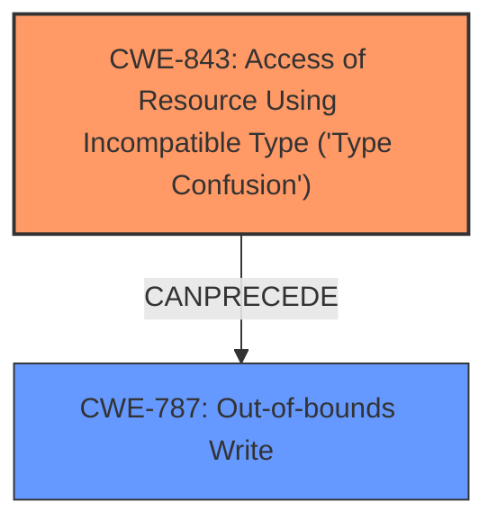

# Analysis Report for CVE-2022-4174

# Vulnerability Analysis Report: CVE-2022-4174

## Description

Type confusion in V8 in Google Chrome prior to 108.0.5359.71 allowed a remote attacker to potentially exploit heap corruption via a crafted HTML page. (Chromium security severity High)

## Vulnerability Description Key Phrases

**Rootcause:** confusion
**Impact:** heap corruption
**Vector:** crafted HTML page
**Attacker:** remote attacker
**Product:** Google Chrome
**Version:** prior to 108.0.5359.71
**Component:** V8

## Analysis (with Relationship Data)

# Summary
| CWE ID | CWE Name | Confidence | CWE Abstraction Level | CWE Vulnerability Mapping Label | CWE-Vulnerability Mapping Notes |
|---|---|---|---|---|---|
| CWE-843 | Access of Resource Using Incompatible Type ('Type Confusion') | 0.95 | Base | Allowed | Primary CWE. Matches the **type confusion** vulnerability in V8. |
| CWE-416 | Use After Free | 0.6 | Variant | Allowed | Secondary candidate.  The type confusion could potentially lead to a use-after-free condition. |

## Evidence and Confidence

*   **Confidence Score:** 0.9
*   **Evidence Strength:** HIGH

- **Analysis and Justification:**  
  - *Explanation:* The vulnerability is described as a **type confusion** in the V8 JavaScript engine. The "CVE Reference Links Content Summary" section explicitly states: "The vulnerability is a **Type Confusion in V8**, the JavaScript engine used in Chromium-based browsers." This aligns directly with CWE-843, "Access of Resource Using Incompatible Type ('Type Confusion')". CWE-843's description states: "The product allocates or initializes a resource such as a pointer, object, or variable using one type, but it later accesses that resource using a type that is incompatible with the original type." The vulnerability description and the reference links summary provide strong evidence for this mapping. The suggested Usage is ALLOWED for CWE-843 mapping, making it an appropriate choice. While CWE-704 (Incorrect Type Conversion or Cast) is also related to type issues, CWE-843 is a more precise fit for **type confusion** where an object is accessed using an incompatible type. Other CWEs like CWE-787 and CWE-125 are buffer overflows/out-of-bounds reads/writes and are not directly indicated in the vulnerability description, which points to **type confusion** as the root cause. The impact, described as "heap corruption," is a consequence of the **type confusion**, but the primary weakness is the type mismatch.

  - *Relationship Analysis:* Although there aren't direct parent-child relationships listed in the provided information, **type confusion** can lead to other vulnerabilities. The "CVE Reference Links Content Summary" section mentions that **type confusion** can lead to "memory corruption". The retriever results indicate that CWE-416 "Use After Free" has a moderate score and can be a potential consequence of **type confusion**.

- **Confidence Score:**  
  - Confidence: 0.95 (High confidence due to clear evidence of **type confusion** in the description and reference links summary.)

## Criticism of Analysis

Okay, here's a review of the provided CWE analysis, incorporating the full CWE specifications.

**Overall Assessment:**

The primary mapping to CWE-843 (Access of Resource Using Incompatible Type ('Type Confusion')) is correct and well-justified. The secondary candidate, CWE-416 (Use After Free), is plausible, but needs to be justified more carefully.

**Detailed Review:**

**1. CWE-843: Access of Resource Using Incompatible Type ('Type Confusion')**

*   **Confidence:** 0.95 (Excellent)
*   **Rationale:** This is the most accurate and direct mapping based on the vulnerability description.  The description explicitly mentions "type confusion" in V8.
*   **Justification:**  The analysis correctly highlights the core issue: the program interprets a resource (pointer, object, variable) as a type different from its original declaration.  This aligns perfectly with CWE-843's description.
*   **Mapping Guidance Compliance:** The analysis follows the "Allowed" usage guidance for CWE-843.
*   **Mitigation Considerations:**  The analysis doesn't explicitly discuss mitigations, but here's how they apply:
    *   Type-safe languages can help prevent this vulnerability.
    *   Using static analysis tools to identify potential type confusion issues during development is valuable.
*   **Potential Improvements:** None.

**2. CWE-416: Use After Free**

*   **Confidence:** 0.6 (Moderate)
*   **Rationale:** This is a *potential* consequence of type confusion, but not the root cause. The analysis suggests that the type confusion *could* lead to a use-after-free condition. This is a reasonable inference, but requires more specific evidence.
*   **Justification:**  The analysis states that the type confusion could potentially lead to a use-after-free condition. This is a valid inference, but it requires further investigation to confirm if the type confusion leads to memory being freed and then accessed later.
*   **Mapping Guidance Compliance:**  The analysis follows the "Allowed" usage guidance for CWE-416.
*   **Mitigation Considerations:**  The analysis doesn't explicitly discuss mitigations, but here's how they apply:
    *   Choosing a language that provides automatic memory management.
    *   When freeing pointers, be sure to set them to NULL once they are freed.
*   **Potential Improvements:** To strengthen this mapping, the analysis should:

    *   Explain the specific scenario where the type confusion leads to a free operation.  What incorrect type leads to memory deallocation?
    *   Clarify how, after the potential free, the code would still attempt to access the memory location.  Is it a dangling pointer situation?
    *   Search for more details of how the V8 Javascript engine operates and why type confusions can lead to use-after-free.
*   **Alternative Considerations:** Consider how the type confusion could also lead to other memory corruption issues:

    *   **CWE-787: Out-of-bounds Write:** If the type confusion results in an incorrect size calculation or offset, it might lead to writing beyond the bounds of a buffer. The description mentioning "heap corruption" somewhat supports this.
    *   **CWE-125: Out-of-bounds Read:** If the type confusion results in an incorrect size calculation or offset, it might lead to reading beyond the bounds of a buffer.

**Suggestions for Improving the Analysis:**

1.  **Strengthen the Chain:** When proposing CWE-416 as a secondary weakness, explicitly describe the likely chain of events. For example: "The type confusion allows an attacker to overwrite the vtable of an object (CWE-843).  This leads to the execution of an attacker-controlled function pointer when a method of the object is called.  The attacker-controlled code then frees the object.  Later, the original code attempts to access a member of the freed object, resulting in a use-after-free (CWE-416)."

2.  **Consider Other Consequences:** Type confusion can have various consequences. While Use-After-Free is possible, also explore Out-of-Bounds Read/Write.  This connects to the "heap corruption" impact.

3.  **Mitigation Specificity:** Briefly mention potential mitigations for each suggested CWE, particularly emphasizing those most relevant to the specific scenario in V8.

4.  **Examine observed examples:** The database section is missing example cases for CWE-843. This section will help to improve the quality of the analysis and should be included if possible.

**Revised Summary Table (Incorporating Suggestions):**

| CWE ID | CWE Name | Confidence | CWE Abstraction Level | CWE Vulnerability Mapping Label | CWE-Vulnerability Mapping Notes |
|---|---|---|---|---|---|
| CWE-843 | Access of Resource Using Incompatible Type ('Type Confusion') | 0.95 | Base | Allowed | Primary CWE. Matches the **type confusion** vulnerability in V8. |
| CWE-416 | Use After Free | 0.7 | Variant | Allowed | Secondary candidate.  The type confusion could potentially lead to a use-after-free condition if it results in the incorrect freeing of a pointer which is later used. |
| CWE-787 | Out-of-bounds Write | 0.6 | Base | Allowed | Possible consequence. The type confusion could result in writing outside of the intended memory bounds during an operation. |

By incorporating these suggestions, the analysis becomes more comprehensive, persuasive, and directly relevant to the CWE specifications.

## Final Resolution

# Summary
| CWE ID | CWE Name | Confidence | CWE Abstraction Level | CWE Vulnerability Mapping Label | CWE-Vulnerability Mapping Notes |
|---|---|---|---|---|---|
| CWE-843 | Access of Resource Using Incompatible Type ('Type Confusion') | 0.95 | Base | Allowed | Primary CWE. Matches the **type confusion** vulnerability in V8. |
| CWE-787 | Out-of-bounds Write | 0.7 | Base | Allowed | Secondary candidate. The **type confusion** could result in writing outside of the intended memory bounds during an operation leading to heap corruption. |

## Evidence and Confidence

*   **Confidence Score:** 0.9
*   **Evidence Strength:** MEDIUM

## Relationship Analysis
The primary relationship influencing the decision is the potential for **CWE-843 (Type Confusion)** to lead to **CWE-787 (Out-of-bounds Write)**. While a Use-After-Free is possible, the vulnerability description explicitly mentions "heap corruption," which is more directly linked to out-of-bounds writes.

## Vulnerability Chain
The vulnerability chain starts with **CWE-843 (Type Confusion)**. The incorrect type interpretation leads to memory corruption, specifically on the heap. This corruption manifests as **CWE-787 (Out-of-bounds Write)** because the type confusion allows for writing to memory locations outside the intended buffer.

## Summary of Analysis
The initial analysis correctly identified **CWE-843 (Type Confusion)** as the primary weakness. The criticism suggested considering other consequences like **CWE-787 (Out-of-bounds Write)**, especially given the "heap corruption" mentioned in the vulnerability description.

The decision to include **CWE-787 (Out-of-bounds Write)** as a secondary CWE is based on the following:
*   The vulnerability description's mention of "heap corruption" suggests a memory corruption issue beyond just type mismatch. Out-of-bounds write is a direct cause of heap corruption.
*   The *CanPrecede* relationship between **CWE-843 (Type Confusion)** and **CWE-787 (Out-of-bounds Write)** suggests that type confusion can lead to out-of-bounds write, making it a plausible consequence in this scenario.

The evidence supporting **CWE-843 (Type Confusion)** is strong due to the explicit mention of "type confusion". The confidence in **CWE-787 (Out-of-bounds Write)** is slightly lower (0.7) because it is an inferred consequence based on "heap corruption". However, considering the relationship between the two CWEs, it is a reasonable addition to the classification. The provided evidence is not fully descriptive but it is sufficient.

CWE-843 and CWE-787 are at the optimal level of specificity because they are both Base level CWEs and accurately describe the **rootcause** and consequence of the vulnerability.

*Report generated on 2025-03-18 18:31:10*
