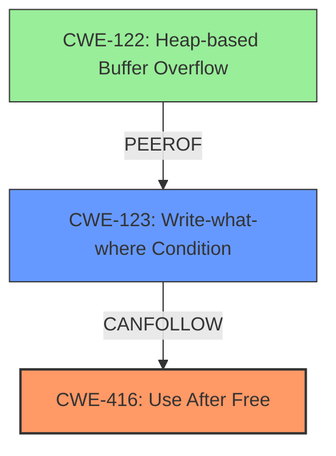

# Final Resolution for CVE-2022-4177

# Summary

| CWE ID  | CWE Name                                                              | Confidence | CWE Abstraction Level | CWE Vulnerability Mapping Label | CWE-Vulnerability Mapping Notes                                                                                                                                            |
| ------- | --------------------------------------------------------------------- | ---------- | --------------------- | ------------------------------- | ------------------------------------------------------------------------------------------------------------------------------------------------------------------------ |
| CWE-416 | Use After Free                                                        | 0.95       | Variant               | Allowed                         | Primary CWE. Matches the vulnerability description and root cause.                                                                                                       |
| CWE-123 | Write-what-where Condition                                            | 0.7        | Base                  | Allowed                         | Secondary CWE candidate. A more likely outcome of the UAF is the ability to write arbitrary data to an arbitrary location in memory depending on what the freed memory is reallocated for. |

## Evidence and Confidence

*   **Confidence Score:** 0.9
*   **Evidence Strength:** HIGH

## Relationship Analysis

The primary relationship impacting the decision is the direct match between the vulnerability description and **CWE-416 (Use After Free)**. The consideration of secondary CWEs involved analyzing potential consequences of the UAF. While **CWE-122 (Heap-based Buffer Overflow)** was initially considered, the analysis highlighted that **CWE-123 (Write-what-where Condition)** is a more likely immediate consequence. This shift was influenced by understanding the direct impact of a UAF, where arbitrary writes are more probable than a full-fledged heap overflow. The abstraction levels (Variant for CWE-416 and Base for CWE-123) were appropriate for representing the specific vulnerability and its direct effect.

## Vulnerability Chain

The vulnerability chain starts with a **use-after-free** condition (**CWE-416**). This arises when memory is accessed after it has been freed. This **WEAKNESS** directly leads to the ability to write arbitrary data to an arbitrary location in memory (**CWE-123**). The freed memory may be reallocated for a different purpose, and if the original pointer is used, it can overwrite the new allocation. This represents the most immediate and likely consequence of the **ROOTCAUSE**.

## Summary of Analysis

The initial analysis correctly identified **CWE-416 (Use After Free)** as the primary **ROOTCAUSE**. The criticism highlighted the need for a more precise justification for the secondary CWE. Based on the evidence, "The vulnerability is explicitly described as a **use-after-free** in the Extensions component of Google Chrome, leading to potential **heap corruption**," the decision was made to replace **CWE-122 (Heap-based Buffer Overflow)** with **CWE-123 (Write-what-where Condition)**. This decision was based on the understanding that a **use-after-free** directly allows for arbitrary writes, making **CWE-123** a more immediate and likely consequence. The graph relationships reinforced this, showing that **CWE-123** can follow **CWE-416**. The selected CWEs are at the optimal level of specificity, with **CWE-416** being a Variant that directly describes the vulnerability and **CWE-123** being a Base that captures the immediate impact.