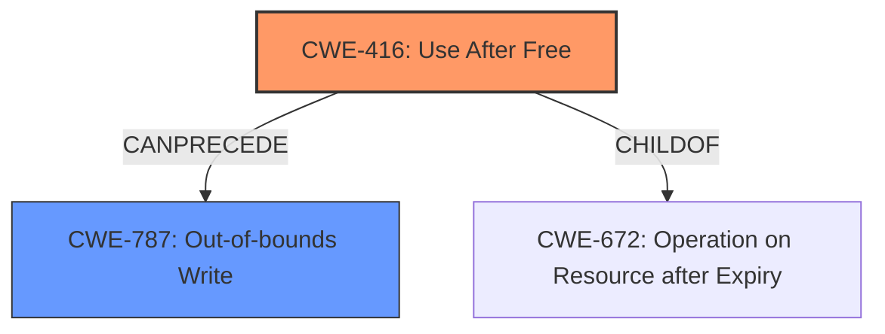

# Final Resolution for CVE-2022-4178

# Summary
| CWE ID | CWE Name | Confidence | CWE Abstraction Level | CWE Vulnerability Mapping Label | CWE-Vulnerability Mapping Notes |
|---|---|---|---|---|---|
| CWE-416 | Use After Free | 1.0 | Variant | Primary | Allowed |
| CWE-787 | Out-of-bounds Write | 0.6 | Base | Secondary Candidate | Allowed |

## Evidence and Confidence

*   **Confidence Score:** 0.9
*   **Evidence Strength:** MEDIUM

## Relationship Analysis
The primary relationship is that CWE-416 **Use After Free** can lead to CWE-787 **Out-of-bounds Write** if the freed memory is reallocated and then improperly accessed. CWE-416 is a variant, and CWE-787 is a base. CWE-416 is a child of CWE-672 (Operation on Resource after Expiry).

## Vulnerability Chain
The vulnerability chain starts with the **ROOTCAUSE** CWE-416, **Use After Free**, which allows for access to memory after it has been freed. This can then lead to CWE-787, **Out-of-bounds Write**, if the freed memory is reallocated and the program attempts to write data to the incorrect memory location.

## Summary of Analysis
The initial analysis correctly identified CWE-416 (**Use After Free**) as the primary weakness. The vulnerability description explicitly states "use after free", which is a strong indicator. The criticism suggested adding CWE-787 (**Out-of-bounds Write**) to the chain.

The evidence for CWE-416 is strong, with the vulnerability description directly mentioning "use after free". The evidence for CWE-787 is weaker, relying on the mention of "heap corruption" as a potential consequence.

The relationship analysis shows that CWE-416 can precede CWE-787. The mapping guidance for both CWEs allows their use. The abstraction level of CWE-416 (Variant) and CWE-787 (Base) are appropriate.

I am adding CWE-787 as a secondary candidate with a confidence of 0.6 because the vulnerability description mentions "heap corruption," and CWE-787 is a common consequence of use-after-free vulnerabilities that lead to writing to unexpected memory locations. The primary weakness is still the **ROOTCAUSE** of CWE-416 because that is what lead to the possibility of writing to an out-of-bounds memory location.