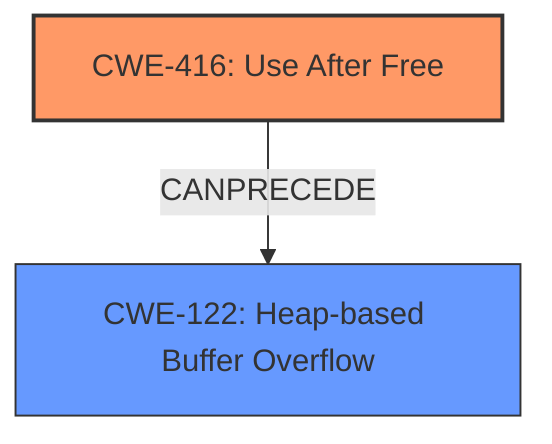

# Final Resolution for CVE-2022-4179

# Summary
| CWE ID  | CWE Name                          | Confidence | CWE Abstraction Level | CWE Vulnerability Mapping Label | CWE-Vulnerability Mapping Notes |
| :------- | :-------------------------------- | :--------- | :-------------------- | :------------------------------ | :------------------------------ |
| CWE-416 | Use After Free                    | 1.0        | Variant               | Allowed                         | Primary CWE                  |
| CWE-122 | Heap-based Buffer Overflow        | 0.6        | Variant               | Allowed                         | Secondary Candidate            |

## Evidence and Confidence

*   **Confidence Score:** 0.9
*   **Evidence Strength:** MEDIUM

## Relationship Analysis
The primary relationship is that CWE-416 can lead to CWE-122. The vulnerability description mentions a use-after-free condition that allows an attacker to exploit **heap corruption**. A use-after-free allows for writing to already freed memory which may have been reallocated, which can then cause a **heap overflow** if the written data exceeds the buffer size of the reallocated memory.

## Vulnerability Chain
The vulnerability chain starts with the **root cause** which is the **CWE-416 (Use After Free)**. The consequence of this **WEAKNESS** is the ability to write to memory that has already been freed. If this freed memory is reallocated, the write operation can lead to **CWE-122 (Heap-based Buffer Overflow)** if the amount of data written to the reallocated memory exceeds its buffer size. The vulnerability description only states that **heap corruption** is possible, but does not state that **heap overflow** occurred.

## Summary of Analysis
The initial analysis correctly identified **CWE-416 (Use After Free)** as the primary **WEAKNESS**, which is supported by the vulnerability description which states: "Use after free in Audio in Google Chrome prior to 108.0.5359.71 allowed an attacker who convinced a user to install a malicious extension to potentially exploit **heap corruption** via a crafted Chrome Extension."

The criticism made a good point that the **heap corruption** indicates that a **CWE-122 (Heap-based Buffer Overflow)** could have occurred. A use-after-free allows for writing to already freed memory which may have been reallocated, which can then cause a **heap overflow** if the written data exceeds the buffer size of the reallocated memory. Therefore, **CWE-122 (Heap-based Buffer Overflow)** is added as a secondary candidate.

The final decision is based on the evidence from the vulnerability description that states a **use after free** condition that allows an attacker to potentially exploit **heap corruption**. The selected CWEs are at the optimal level of specificity because they directly address the **root cause** (Use After Free) and a possible consequence (Heap-based Buffer Overflow).