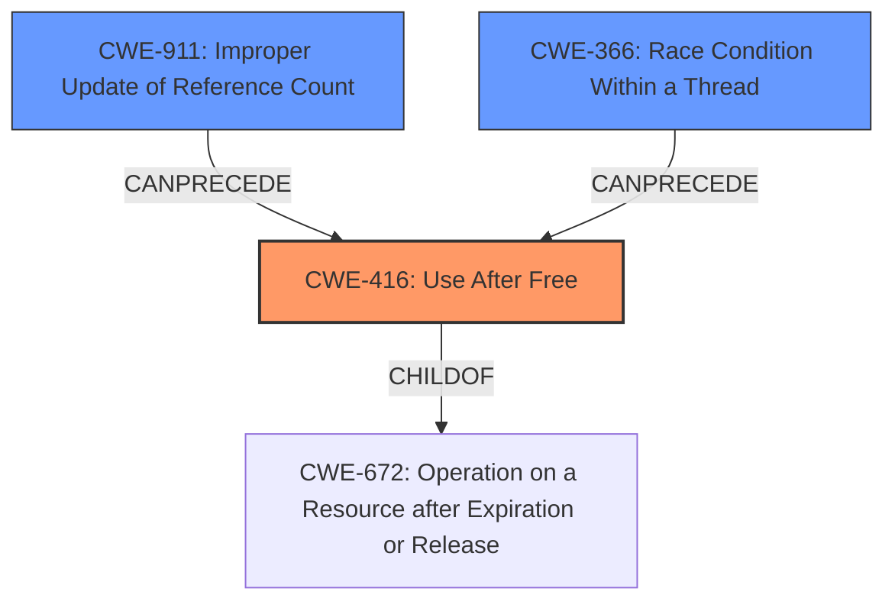

# Final Resolution for CVE-2022-4191

# Summary
| CWE ID | CWE Name | Confidence | CWE Abstraction Level | CWE Vulnerability Mapping Label | CWE-Vulnerability Mapping Notes |
|---|---|---|---|---|---|
| CWE-416 | Use After Free | 0.95 | Variant | Allowed | Primary CWE. The vulnerability is explicitly described as a Use-After-Free. |
| CWE-911 | Improper Update of Reference Count | 0.4 | Base | Contributing | Secondary Candidate. An incorrect reference count could lead to premature freeing of the profile and trigger the UAF. Requires further analysis to determine if reference counting is used. |
| CWE-366 | Race Condition Within a Thread | 0.3 | Base | Contributing | Secondary Candidate. A race condition might contribute to the UAF if the profile destruction involves concurrent threads. Requires further investigation. |

## Evidence and Confidence

*   **Confidence Score:** 0.85
*   **Evidence Strength:** MEDIUM

## Relationship Analysis
The primary relationship is that **CWE-416 (Use After Free)** is a variant of **CWE-672 (Operation on a Resource after Expiration or Release)**. This means **CWE-416** is a more specific case of operating on a resource that is no longer valid. The suggestion of **CWE-911 (Improper Update of Reference Count)** is based on the possibility that incorrect reference counting may lead to premature freeing of memory, which can then be exploited as a Use-After-Free. **CWE-366 (Race Condition within a Thread)** suggests that concurrent access and freeing of the same resource could lead to a UAF.

## Vulnerability Chain
The primary vulnerability chain starts with the **ROOTCAUSE** being a Use-After-Free (**CWE-416**). This occurs when memory is freed but then later accessed. A possible contributing factor to this could be **CWE-911 (Improper Update of Reference Count)**, where a resource is freed prematurely due to an incorrect reference count. Another possible contributing factor could be **CWE-366 (Race Condition within a Thread)**, where multiple threads concurrently access and free the same resource. The **IMPACT** of the **CWE-416** vulnerability is potential **heap corruption** via profile destruction, as stated in the vulnerability description.

## Summary of Analysis
The initial analysis correctly identified **CWE-416 (Use After Free)** as the primary vulnerability. The criticism suggested considering other CWEs that could contribute to the vulnerability, such as **CWE-366 (Race Condition within a Thread)** and **CWE-911 (Improper Update of Reference Count)**.

Evidence from the Vulnerability Description:
> "Use after free in Sign-In in Google Chrome prior to 108.0.5359.71 allowed a remote attacker who convinced a user to engage in specific UI interaction to potentially exploit heap corruption via profile destruction."

This statement directly supports the **CWE-416** classification. The phrase "heap corruption" indicates memory corruption due to the Use-After-Free, which can lead to exploitable conditions.

The relationship analysis shows that **CWE-416** is a specific type of **CWE-672 (Operation on a Resource after Expiration or Release)**, which is beneficial for specificity.

The decision to include **CWE-911** and **CWE-366** as secondary candidates is based on the possibility that they may have contributed to the UAF. However, further investigation is needed to confirm this. The confidence scores for these secondary CWEs are lower due to the lack of explicit evidence in the vulnerability description.
The selected CWEs are at the optimal level of specificity, with **CWE-416** being a Variant-level CWE, which is preferred.