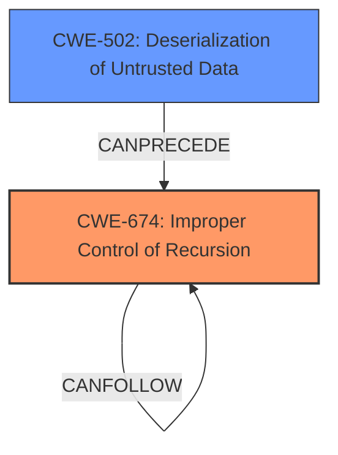

# Final Resolution for CVE-2022-41966

# Summary
| CWE ID | CWE Name | Confidence | CWE Abstraction Level | CWE Vulnerability Mapping Label | CWE-Vulnerability Mapping Notes |
|---|---|---|---|---|---|
| CWE-674 | Improper Control of Recursion | 0.85 | Class | Primary | Allowed-with-Review: This CWE entry is a Class and might have Base-level children that would be more appropriate. The description clearly states that the application can be terminated with a stack overflow error due to recursive calls, which directly relates to uncontrolled recursion. |
| CWE-502 | Deserialization of Untrusted Data | 0.75 | Base | Secondary | Allowed: The vulnerability arises from deserializing untrusted data, which is then used to trigger the stack overflow. |

## Evidence and Confidence

*   **Confidence Score:** 0.80
*   **Evidence Strength:** HIGH

## Relationship Analysis
The primary relationship is that **CWE-502 (Deserialization of Untrusted Data)** *enables* **CWE-674 (Improper Control of Recursion)**. The untrusted data is deserialized, and the resulting object structure triggers the recursive hash calculation, leading to a stack overflow. CWE-674 is a Class-level CWE, and while more specific Base or Variant CWEs could exist, the description does not provide enough detail to pinpoint a more precise weakness.

## Vulnerability Chain
The vulnerability chain starts with the **deserialization of untrusted data** (**CWE-502**). This leads to the creation of a specific object structure that, when processed, triggers **uncontrolled recursion** (**CWE-674**). The recursion causes a **stack overflow**, which results in a denial of service. The root cause is the combination of accepting untrusted data and the lack of proper control over recursion depth during processing.

## Summary of Analysis
The initial analysis and criticism both correctly identify the core issues. The vulnerability description explicitly states that the application is susceptible to a stack overflow due to the manipulation of the processed input stream.

The evidence provided is: "The vulnerability description explicitly states that the application is susceptible to a stack overflow due to the manipulation of the processed input stream, which uses the hash code implementation for collections and maps to force recursive hash calculation. This aligns directly with CWE-674, Improper Control of Recursion. The CVE Reference Links Content Summary further reinforces this, identifying the **stack overflow** as the core vulnerability caused by recursive hash calculations during the processing of manipulated XML input. Furthermore, because the input stream is untrusted, **deserialization of untrusted data** is an important part of the weakness and must be accounted for in the final CWE selection."

The graph relationships influenced the decision to keep both CWEs, highlighting that CWE-502 allows the exploitation of CWE-674.

The selected CWEs are at the optimal level of specificity. While more specific CWEs related to recursion might exist, they are not directly applicable based on the information provided in the vulnerability description. The combination of CWE-674 and CWE-502 provides a clear and accurate representation of the vulnerability.