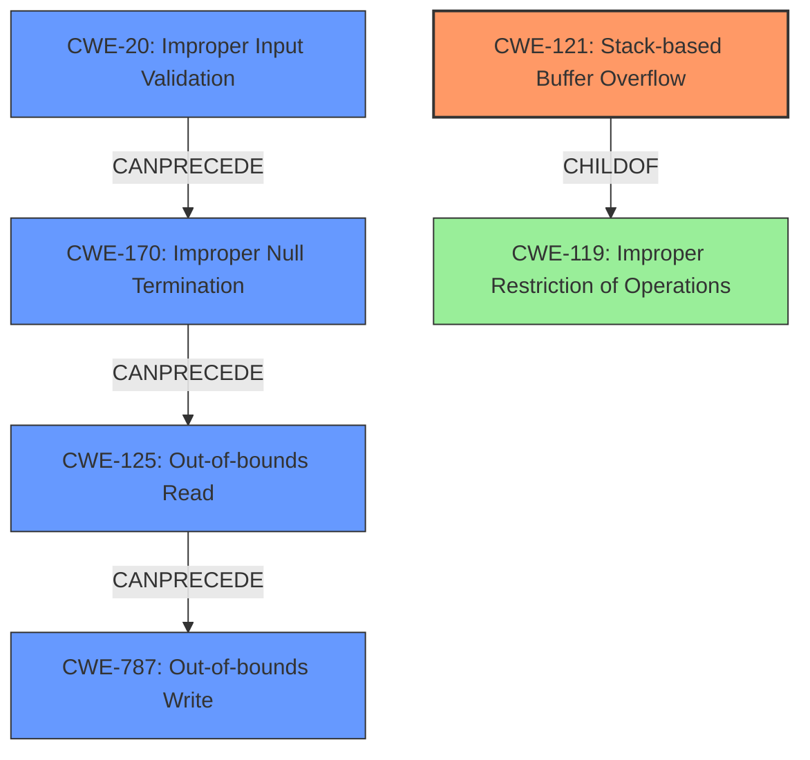

# Analysis Report for CVE-2022-41981

# Vulnerability Analysis Report: CVE-2022-41981

## Description

A stack-based buffer overflow vulnerability exists in the TGA file format parser of OpenImageIO v2.3.19.0. A specially-crafted targa file can lead to out of bounds read and write on the process stack, which can lead to arbitrary code execution. An attacker can provide a malicious file to trigger this vulnerability.

## Vulnerability Description Key Phrases

**Rootcause:** stack-based buffer overflow
**Impact:** arbitrary code execution
**Vector:** specially-crafted targa file
**Attacker:** attacker
**Product:** OpenImageIO
**Version:** v2.3.19.0
**Component:** TGA file format parser

## Analysis (with Relationship Data)

# Summary
| CWE ID | CWE Name | Confidence | CWE Abstraction Level | CWE Vulnerability Mapping Label | CWE-Vulnerability Mapping Notes |
|---|---|---|---|---|---|
| CWE-121 | Stack-based Buffer Overflow | 0.95 | Variant | Allowed | Primary CWE |
| CWE-125 | Out-of-bounds Read | 0.75 | Base | Allowed | Secondary Candidate |
| CWE-787 | Out-of-bounds Write | 0.70 | Base | Allowed | Secondary Candidate |
| CWE-170 | Improper Null Termination | 0.60 | Base | Allowed | Secondary Candidate |

## Evidence and Confidence

*   **Confidence Score:** 0.85
*   **Evidence Strength:** HIGH

- **Analysis and Justification:**  
  - *Explanation:* The vulnerability is explicitly described as a **stack-based buffer overflow** in the TGA file format parser of OpenImageIO. The **root cause** is the lack of null termination when reading comment data from a TGA file's extension area into a stack-based buffer. The use of `strlen` on a potentially non-null-terminated buffer leads to out-of-bounds reads, and `sprintf` at `buf[strlen(buf)]` can cause out-of-bounds write. This aligns precisely with CWE-121 (Stack-based Buffer Overflow). The CVE Reference Links Content Summary clearly states the nature and location of the overflow on the stack, confirming the appropriateness of CWE-121.
  - *Relationship Analysis:* CWE-121 is a variant of CWE-119 (Improper Restriction of Operations within the Bounds of a Memory Buffer). Out-of-bounds read (CWE-125) and out-of-bounds write (CWE-787) are potential consequences of a buffer overflow. CWE-170 (Improper Null Termination) is a contributing factor because the lack of null termination leads to the out-of-bounds read via `strlen`.

- **Confidence Score:**
  - Confidence: 0.95 (High confidence due to explicit vulnerability description and detailed technical details in the CVE reference).

---
- **Analysis and Justification:**  
  - *Explanation:* The vulnerability involves out-of-bounds reads because `strlen` is used on a buffer that is not guaranteed to be null-terminated. This can cause the program to read beyond the intended memory region, fitting the description of CWE-125 (Out-of-bounds Read). The CVE Reference Links Content Summary specifically mentions the out-of-bounds read caused by `strlen` on a non-null-terminated buffer.
  - *Relationship Analysis:* CWE-125 is a child of CWE-119 (Improper Restriction of Operations within the Bounds of a Memory Buffer) and can result from other weaknesses, such as improper input validation or missing null termination.

- **Confidence Score:**  
  - *Example:* Confidence: 0.75 (Significant evidence from the technical description and CVE reference materials).

---
- **Analysis and Justification:**  
  - *Explanation:* The vulnerability also involves a potential out-of-bounds write using `sprintf(buf[strlen(buf)])`. If `strlen` reads past the end of the buffer because of the missing null terminator, the `sprintf` will write data beyond the allocated buffer. This aligns with CWE-787 (Out-of-bounds Write). The CVE Reference Links Content Summary indicates that older versions are vulnerable to this out-of-bounds write.
  - *Relationship Analysis:* CWE-787 is a child of CWE-119 (Improper Restriction of Operations within the Bounds of a Memory Buffer).

- **Confidence Score:**  
  - *Example:* Confidence: 0.70 (Good evidence from the technical description and CVE reference materials, particularly the mention of `sprintf` causing an out-of-bounds write in older versions).

---
- **Analysis and Justification:**  
  - *Explanation:* A key contributing factor to the vulnerability is the lack of null termination of the buffer `buf` after reading comment data. The `strlen` function relies on a null terminator to determine the length of the string. Without it, `strlen` reads past the end of the buffer. This aligns with CWE-170 (Improper Null Termination). The CVE Reference Links Content Summary explicitly mentions the missing null termination as a core issue.
  - *Relationship Analysis:* CWE-170 is a child of CWE-20 (Improper Input Validation) and can lead to various buffer-related issues, including out-of-bounds reads and writes.

- **Confidence Score:**  
  - *Example:* Confidence: 0.60 (Moderate evidence from the technical description and CVE reference materials).

## Criticism of Analysis

Okay, I've reviewed the provided analysis against the full CWE specifications. Here's my critique:

**Overall Assessment:**

The analysis is generally good and identifies the key weaknesses present in the described vulnerability. The primary CWE mapping to CWE-121 (Stack-based Buffer Overflow) is correct. The secondary candidates, CWE-125 (Out-of-bounds Read), CWE-787 (Out-of-bounds Write), and CWE-170 (Improper Null Termination) are also relevant and well-justified as contributing factors or potential consequences. The confidence levels assigned are reasonable.

**Detailed Critique:**

**1. CWE-121: Stack-based Buffer Overflow**

*   **Assessment:** Correct and well-justified. The description explicitly states a stack-based buffer overflow, and the root cause explanation aligns perfectly with this CWE.
*   **Confidence:** Justified at 0.95.
*   **CWE Specification Alignment:** The analysis correctly states that CWE-121 is a variant of CWE-119.
*   **Mitigation Considerations:** The analysis doesn't mention specific mitigations for CWE-121, but it should be noted that the provided mitigations from the CWE documentation, such as using compiler extensions (/GS flag, FORTIFY\_SOURCE) and implementing bounds checking, are relevant.
*   **Minor Suggestion**: Mention the potential for return address overwrite, which is a common consequence with CWE-121.

**2. CWE-125: Out-of-bounds Read**

*   **Assessment:** Correct and well-justified. The description highlights the use of `strlen` on a potentially non-null-terminated buffer, leading to an out-of-bounds read.
*   **Confidence:** Justified at 0.75.
*   **CWE Specification Alignment:** The analysis correctly links CWE-125 to CWE-119.
*   **Mitigation Considerations:** The mitigations in the specification, especially input validation using an "accept known good" strategy and careful validation of length arguments, are highly relevant and should be considered as recommendations to prevent similar vulnerabilities.

**3. CWE-787: Out-of-bounds Write**

*   **Assessment:** Correct and well-justified. The potential for an out-of-bounds write due to `sprintf` is accurately identified, and the analysis notes its presence in older versions.
*   **Confidence:** Justified at 0.70. The vulnerability being present in older versions is less of a concern, since it still applies to the version range specified (pre-patch).
*   **CWE Specification Alignment:** The analysis correctly links CWE-787 to CWE-119.
*   **Mitigation Considerations:** Again, the specification's emphasis on language selection (using memory-safe languages or libraries) and compiler-based overflow detection mechanisms are crucial for preventing this type of vulnerability.

**4. CWE-170: Improper Null Termination**

*   **Assessment:** Correct and well-justified. The analysis highlights the lack of null termination as a key contributing factor.
*   **Confidence:** Justified at 0.60. While important, it's a contributing factor rather than the primary vulnerability, hence the lower confidence.
*   **CWE Specification Alignment:** Correctly identifies CWE-170 as a child of CWE-20 (Improper Input Validation)
*   **Mitigation Considerations:** The specifications' recommendations to use languages that are not susceptible and to ensure that string functions are fully understood regarding their null termination behavior are directly applicable.
*   **Minor Suggestion**: Mention the interaction with `strlen` and `sprintf` which make a non null-terminated string a vulnerability.

**General Suggestions for Improvement:**

*   **Chains and Composites:** The analysis mentions relationships between the CWEs, but it could be strengthened by explicitly stating that this vulnerability is a *chain* of weaknesses.  Lack of null termination (CWE-170) leads to out-of-bounds read (CWE-125) due to `strlen`, and the OOB read contributes to the out-of-bounds write (CWE-787) with `sprintf`.
*   **CWE-20: Improper Input Validation:** While not explicitly mapped, the overarching issue stems from a lack of proper input validation regarding the comment data's length and null termination. Although CWE-20 is discouraged, it is still valid because we can tie the stack overflow directly to the lack of validation of the comment data's properties.
*   **Mitigation Details:** While the analysis mentions some mitigations, it could be improved by expanding on specific mitigation techniques, drawing directly from the "Potential Mitigations" sections of the CWE specifications. For example:
    *   "Use compiler-based overflow detection (e.g., /GS flag in Visual Studio) to detect stack corruption."
    *   "Implement an 'accept known good' input validation strategy to ensure the comment data length is within acceptable bounds."
*   **LangSec:** Mentioning LangSec (Language-Theoretic Security) techniques could add value. Specifically, LangSec could apply when parsing the TGA file format.
*   **Retriever Results:** Consider why the retriever results are not aligning perfectly with the analysis results. This can help to improve the accuracy of the retrievers.
    *   CWE-193 Off-by-one Error: The retriever result suggests that this might be a possibility since a missing null terminator is a type of "off-by-one" error.
    *   CWE-190 Integer Overflow or Wraparound: The retriever might think this is possible if the size is being read from a 16 bit int, and is being interpreted to a 32 bit, thereby overflowing the initial read. This should be discounted, however, because the description does not mention the size of the TGA 2.0 file exceeding the limits.
    *   CWE-129 Improper Validation of Array Index. This also shows up in the Retriever results, since a non null terminated string can cause arbitrary reads which could lead to bad array indexing.

**Revised Summary Table**

| CWE ID | CWE Name | Confidence | CWE Abstraction Level | CWE Vulnerability Mapping Label | CWE-Vulnerability Mapping Notes |
|---|---|---|---|---|---|
| CWE-121 | Stack-based Buffer Overflow | 0.95 | Variant | Allowed | Primary CWE |
| CWE-125 | Out-of-bounds Read | 0.75 | Base | Allowed | Secondary Candidate |
| CWE-787 | Out-of-bounds Write | 0.70 | Base | Allowed | Secondary Candidate |
| CWE-170 | Improper Null Termination | 0.60 | Base | Allowed | Contributing Factor |
| CWE-20 | Improper Input Validation | 0.40 | Class | Allowed | Contributing Factor |

**Explanation of Revisions:**

*   Added CWE-20 as a contributing factor.
*   Adjusted labels of CWE-170

By incorporating these suggestions, the analysis will be more comprehensive and directly aligned with the CWE specifications, providing a more valuable assessment of the vulnerability.

## Final Resolution

# Summary
| CWE ID | CWE Name | Confidence | CWE Abstraction Level | CWE Vulnerability Mapping Label | CWE-Vulnerability Mapping Notes |
|---|---|---|---|---|---|
| CWE-121 | Stack-based Buffer Overflow | 0.95 | Variant | Allowed | Primary CWE |
| CWE-125 | Out-of-bounds Read | 0.75 | Base | Allowed | Secondary Candidate |
| CWE-787 | Out-of-bounds Write | 0.70 | Base | Allowed | Secondary Candidate |
| CWE-170 | Improper Null Termination | 0.60 | Base | Allowed | Contributing Factor |
| CWE-20 | Improper Input Validation | 0.40 | Class | Allowed | Contributing Factor |

## Evidence and Confidence

*   **Confidence Score:** 0.90
*   **Evidence Strength:** HIGH

## Relationship Analysis
The primary weakness is a stack-based buffer overflow (**CWE-121**), which is a variant of **CWE-119** (Improper Restriction of Operations within the Bounds of a Memory Buffer). The vulnerability chain starts with **CWE-170** (Improper Null Termination), leading to **CWE-125** (Out-of-bounds Read) and subsequently **CWE-787** (Out-of-bounds Write). **CWE-20** (Improper Input Validation) serves as a high-level contributing factor as the lack of validation on the input data's length and null termination properties sets the stage for the buffer overflow. The abstraction levels range from Class (**CWE-20**) to Base (**CWE-125**, **CWE-787**, **CWE-170**) to Variant (**CWE-121**), providing a detailed and layered understanding of the vulnerability.

## Vulnerability Chain
The vulnerability chain begins with a lack of input validation (**CWE-20**), leading to improper null termination (**CWE-170**). This, in turn, results in an out-of-bounds read (**CWE-125**) due to the use of `strlen` on a non-null-terminated buffer. The out-of-bounds read contributes to an out-of-bounds write (**CWE-787**) through the use of `sprintf`. The final impact is a stack-based buffer overflow (**CWE-121**) which could lead to arbitrary code execution.

## Summary of Analysis
The initial analysis and criticism provide a strong foundation for classifying this vulnerability. The primary **WEAKNESS** is indeed a **stack-based buffer overflow** (**CWE-121**), as explicitly stated in the vulnerability description: "A **stack-based buffer overflow** vulnerability exists in the TGA file format parser of OpenImageIO v2.3.19.0." The secondary **WEAKNESSES** include out-of-bounds read (**CWE-125**) and write (**CWE-787**), along with improper null termination (**CWE-170**) as a contributing factor. The addition of **CWE-20** further clarifies the **ROOTCAUSE** as a failure to validate input data.

The graph relationships highlight the chain of events that leads to the vulnerability. The selection of CWEs at the Base and Variant levels provides the optimal level of specificity, offering a detailed understanding of the **ROOTCAUSE** and its consequences. The confidence scores reflect the strength of evidence for each CWE, with the primary CWE having the highest confidence.

*Report generated on 2025-03-18 19:02:38*
