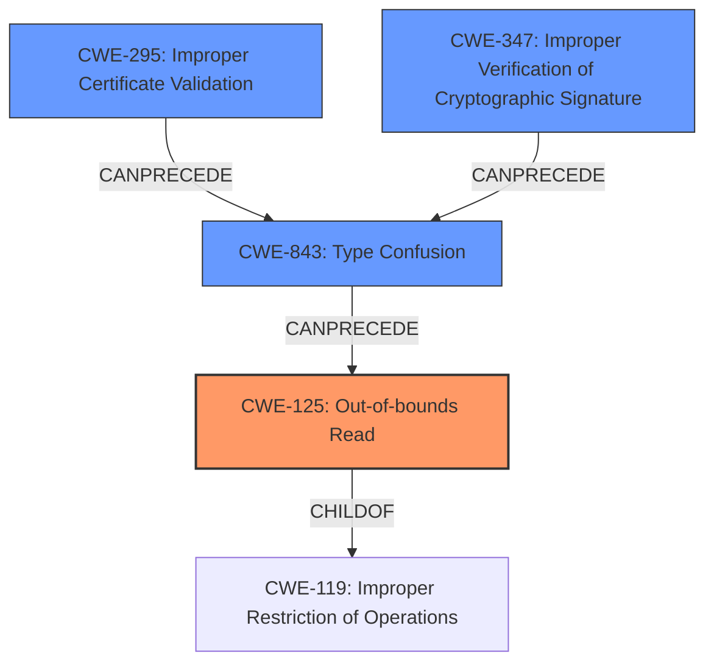

# Final Resolution for CVE-2022-4203

# Summary
| CWE ID | CWE Name | Confidence | CWE Abstraction Level | CWE Vulnerability Mapping Label | CWE-Vulnerability Mapping Notes |
|---|---|---|---|---|---|
| **CWE-125** | **Out-of-bounds Read** | 0.95 | Base | Primary | Allowed |
| **CWE-843** | **Type Confusion** | 0.75 | Base | Secondary | Allowed |
| **CWE-295** | **Improper Certificate Validation** | 0.60 | Base | Contributing | Allowed |
| **CWE-347** | **Improper Verification of Cryptographic Signature** | 0.50 | Base | Contributing | Allowed |

## Evidence and Confidence

*   **Confidence Score:** 0.85
*   **Evidence Strength:** HIGH

## Relationship Analysis
The primary weakness is **CWE-125** (Out-of-bounds Read), which is a consequence of the **CWE-843** (Type Confusion). The type confusion leads to reading beyond buffer boundaries. The fact that a malicious certificate is used and potentially signed by a CA brings in **CWE-295** (Improper Certificate Validation) and **CWE-347** (Improper Verification of Cryptographic Signature), suggesting that the certificate validation process might be flawed or bypassed.

## Vulnerability Chain
The vulnerability chain starts with either a failure to validate the certificate (**CWE-295**) or a failure to properly verify the cryptographic signature (**CWE-347**). This leads to the acceptance of a crafted certificate, which triggers **CWE-843** (Type Confusion) within the `nc_match_single()` function. This type confusion results in an attempt to read an `ASN1_IA5STRING` from an address containing arbitrary data, ultimately causing **CWE-125** (Out-of-bounds Read). The impact is a potential denial-of-service (DoS) or, theoretically, the disclosure of sensitive memory contents.

## Summary of Analysis
The initial analysis correctly identified **CWE-125** (Out-of-bounds Read) as the primary issue. The vulnerability description explicitly mentions a "read buffer overrun," making this a strong match. The secondary classification of **CWE-843** (Type Confusion) is also accurate, as the type confusion in `nc_match_single()` directly contributes to the out-of-bounds read.

The criticism correctly suggests adding **CWE-295** (Improper Certificate Validation) and **CWE-347** (Improper Verification of Cryptographic Signature) to account for the conditions under which the malicious certificate is processed. The description states this occurs "after certificate chain signature verification and requires either a CA to have signed the malicious certificate or for the application to continue certificate verification despite failure to construct a path to a trusted issuer." This strongly suggests that the certificate validation or signature verification processes are flawed.

I am basing my assessment on the provided evidence and relationships. The vulnerability description and the retriever results support the inclusion of these CWEs. The mapping guidance allows for all these CWEs.

The final classification includes the primary **CWE-125** (Out-of-bounds Read) and the contributing factors **CWE-843** (Type Confusion), **CWE-295** (Improper Certificate Validation), and **CWE-347** (Improper Verification of Cryptographic Signature). This provides a more complete picture of the vulnerability and its potential root causes. The selected CWEs are at the base level of abstraction, which is appropriate for mapping to the root causes of vulnerabilities.