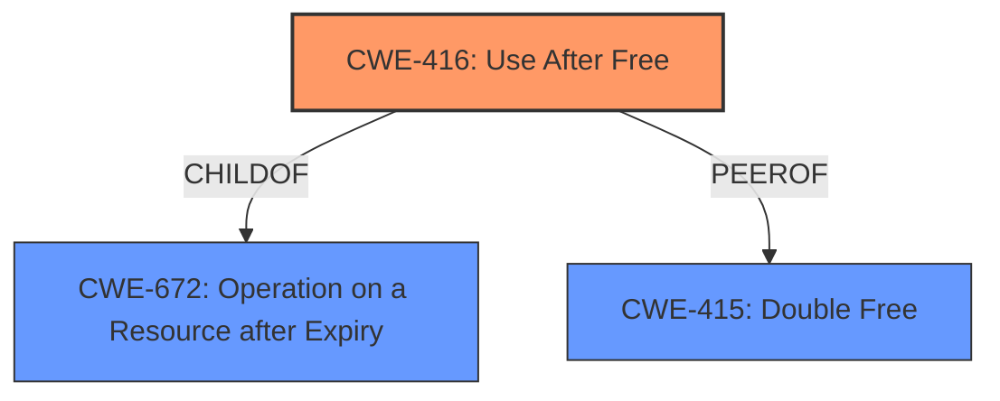

# Final Resolution for CVE-2022-42332

# Summary
| CWE ID | CWE Name | Confidence | CWE Abstraction Level | CWE Vulnerability Mapping Label | CWE-Vulnerability Mapping Notes |
|---|---|---|---|---|---|
| CWE-416 | Use After Free | 0.95 | Variant | Primary | Allowed |

## Evidence and Confidence

*   **Confidence Score:** 0.95
*   **Evidence Strength:** HIGH

## Relationship Analysis
The primary CWE is CWE-416 (**CWE-416: Use After Free**), which is a variant. The criticism correctly identifies its relationship to parent CWEs like CWE-672 (**CWE-672: Operation on a Resource after Expiry**), but it is the most specific and appropriate. Other CWEs such as CWE-415 (**CWE-415: Double Free**) and concurrency-related CWEs were considered but deemed less relevant based on the available information. The abstraction level of Variant is appropriate as it represents a specific type of memory management issue.

## Vulnerability Chain
The vulnerability chain starts with insufficient memory accounting in shadow mode logic, leading to premature freeing of shadow page tables. This results in a **use-after-free** condition (CWE-416) when other code attempts to access the freed memory. The impact is undefined behavior and potential system instability.

## Summary of Analysis
The initial analysis correctly identified CWE-416 (**CWE-416: Use After Free**) as the primary weakness. The criticism reinforced this decision and provided additional context by considering other CWEs and their potential relationships. The decision is strongly based on the vulnerability description, which explicitly states that the root cause is a **use-after-free** error: "As a result, just established shadow page tables could be freed again immediately, while other code is still accessing them on the assumption that they would remain allocated." The graph relationships helped confirm that CWE-416 is the most specific and relevant classification. The chosen CWE is at the optimal level of specificity, providing a clear and accurate representation of the vulnerability.