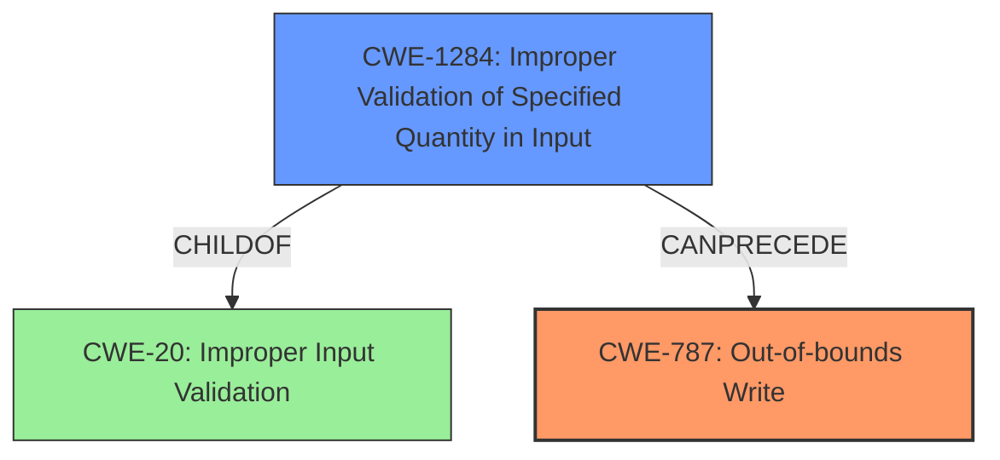

# Analysis Report for CVE-2022-42377

# Vulnerability Analysis Report: CVE-2022-42377

## Description

This vulnerability allows remote attackers to execute arbitrary code on affected installations of PDF-XChange Editor. User interaction is required to exploit this vulnerability in that the target must visit a malicious page or open a malicious file. The specific flaw exists within the parsing of U3D files. The issue results from the lack of proper validation of user-supplied data, which can result in a memory corruption condition. An attacker can leverage this vulnerability to execute code in the context of the current process. Was ZDI-CAN-18630.

## Vulnerability Description Key Phrases

**Rootcause:** lack of proper validation of user-supplied data
**Impact:** memory corruption
**Vector:** ['malicious page', 'malicious file']
**Attacker:** remote attacker
**Product:** PDF-XChange Editor
**Component:** U3D files parsing

## Analysis (with Relationship Data)

# Summary
| CWE ID | CWE Name | Confidence | CWE Abstraction Level | CWE Vulnerability Mapping Label | CWE-Vulnerability Mapping Notes |
|---|---|---|---|---|---|
| CWE-787 | Out-of-bounds Write | 0.9 | Base | Primary | Allowed |
| CWE-1284 | Improper Validation of Specified Quantity in Input | 0.7 | Base | Secondary | Allowed |

## Evidence and Confidence

*   **Confidence Score:** 0.8
*   **Evidence Strength:** HIGH

- **Analysis and Justification:**  
  - *Explanation:* The vulnerability description explicitly mentions a "**lack of proper validation of user-supplied data**, which can result in a **memory corruption** condition." The CVE reference links content summary confirms that the root cause is a lack of input validation during the parsing of U3D files, leading to memory corruption. Given this direct evidence and the high count for CWE-787 in the "Top CWEs" section, CWE-787 (Out-of-bounds Write) is the most appropriate primary CWE. It accurately captures the nature of the memory corruption resulting from writing outside the intended buffer. Although other CWEs like CWE-119 (Improper Restriction of Operations within the Bounds of a Memory Buffer) are related, CWE-787 is more specific.

  - *Relationship Analysis:* CWE-787 is a Base level CWE, which is preferred. It describes a specific type of memory corruption where data is written outside the intended buffer. CWE-787 is related to CWE-119 (Improper Restriction of Operations within the Bounds of a Memory Buffer), but CWE-787 is more specific.

- **Confidence Score:**
  - Confidence: 0.9 (High confidence due to explicit mention of memory corruption and lack of input validation)

---
- **Analysis and Justification:**  
  - *Explanation:* The vulnerability stems from a "**lack of proper validation of user-supplied data**". CWE-1284 (Improper Validation of Specified Quantity in Input) is a strong secondary candidate because the parsing of U3D files involves handling quantities, sizes, or lengths. The "**lack of proper validation of user-supplied data**" directly relates to CWE-1284's description. While not the direct cause of memory corruption (CWE-787), this **lack of validation** allows the condition to occur. CWE-20 (Improper Input Validation) is too broad and discouraged, while CWE-1284 is more specific.

  - *Relationship Analysis:* CWE-1284 is a Base level CWE, which is preferred. CWE-1284 is a child of CWE-20 (Improper Input Validation) but it is more specific.

- **Confidence Score:**
  - Confidence: 0.7 (Medium confidence. The link between quantity and U3D parsing isn't fully explicit, but plausible.)

## Criticism of Analysis

Okay, I've reviewed the analysis against the full CWE specifications provided. Here's a breakdown of my critique:

**Overall Assessment:**

The analysis is generally good, providing clear justifications for the CWE mappings. It demonstrates a strong understanding of the vulnerability and the related CWEs. The use of high and medium confidence scores are also appropriate.

**Critique of Specific CWE Mappings:**

*   **CWE-787: Out-of-bounds Write (Primary)**

    *   **Strength:** The mapping to CWE-787 is excellent. The description explicitly mentions memory corruption due to a write outside the intended buffer. The justification is clear, concise, and directly supported by the evidence. The high confidence level (0.9) is warranted.
    *   **Considerations:** The analysis correctly highlights that CWE-787 is a Base-level CWE, which is preferred. It also correctly notes the relationship to CWE-119 but chooses the more specific option. No changes are needed.
    *   The analysis highlights the relevance of mitigation strategies such as using memory safe languages, libraries or frameworks. The mitigations discussed in the CWE details are applicable to the identified vulnerability.

*   **CWE-1284: Improper Validation of Specified Quantity in Input (Secondary)**

    *   **Strength:** The reasoning for including CWE-1284 is plausible. U3D files are likely to contain information about sizes, counts, or lengths of data structures within the file. Insufficiently validating those quantities can lead to the memory corruption described.
    *   **Weakness:** The connection between U3D parsing and quantities isn't as directly evident as the link to memory corruption and writing out of bounds. The confidence level of 0.7 is appropriate.
    *   **Considerations:** It might be worthwhile to explore other, perhaps more direct, children of CWE-20 related to structured file formats. For example, if the U3D format specifies a specific "type" for a data field, then perhaps `CWE-1287: Improper Validation of Specified Type of Input` could be considered. If there is a header which specifies the format of the subsequent data then potentially, `CWE-130: Improper Handling of Length Parameter Inconsistency` may be relevant, if the length parameter is then used to allocate memory. If an index or offset is read from the file, and not validated then `CWE-1285: Improper Validation of Specified Index, Position, or Offset in Input` could be considered.
    *   The analysis should check whether the mitigations listed for CWE-1284 are relevant for the described vulnerability.

**General Comments:**

*   **Abstraction Level:** The choice of Base-level CWEs is good, adhering to best practices for identifying root causes.
*   **Clarity of Justification:** The explanations are well-written and easy to follow.
*   **Evidence Strength:** The "Evidence Strength: HIGH" assertion is accurate given the explicit details in the description.
*   **Use of CWE Documentation:** The analysis demonstrates a good understanding of the CWE specifications and applies them correctly.

**Suggestions for Improvement:**

*   **Consider Alternative CWEs for Secondary Mapping:** As noted above, spend some time to more fully explore other CWEs that are children of CWE-20 as alternate secondary CWEs.
*   **Address Potential Misuse:** While the analysis is sound, it's good practice to explicitly address and rule out commonly misused CWEs even if you don't think they apply. For example, CWE-119 (Improper Restriction of Operations within the Bounds of a Memory Buffer) is often used as a general "buffer overflow" CWE, even when more specific ones are applicable. Briefly explaining *why* CWE-119 isn't the primary CWE (because CWE-787 is more specific) can strengthen the analysis. This has already been done to some extent.

**Revised Summary Table (with confidence levels):**

| CWE ID   | CWE Name                                   | Confidence | CWE Abstraction Level | CWE Vulnerability Mapping Label | CWE-Vulnerability Mapping Notes |
| :------- | :----------------------------------------- | :--------- | :-------------------- | :------------------------------ | :------------------------------ |
| CWE-787 | Out-of-bounds Write                        | 0.9        | Base                 | Primary                         | Allowed                         |
| CWE-1284  | Improper Validation of Specified Quantity in Input   | 0.7        | Base                 | Secondary                       | Allowed                         |

**In summary,** the original analysis is well-reasoned and accurate. The suggestions for improvement are minor and aimed at further strengthening the justification and addressing potential areas of misinterpretation.

## Final Resolution

# Summary
| CWE ID | CWE Name | Confidence | CWE Abstraction Level | CWE Vulnerability Mapping Label | CWE-Vulnerability Mapping Notes |
|---|---|---|---|---|---|
| **CWE-787** | **Out-of-bounds Write** | 0.9 | Base | Primary | Allowed |
| **CWE-1284** | **Improper Validation of Specified Quantity in Input** | 0.7 | Base | Secondary | Allowed |

## Evidence and Confidence

*   **Confidence Score:** 0.85
*   **Evidence Strength:** HIGH

## Relationship Analysis
The primary weakness is **CWE-787 (Out-of-bounds Write)** which stems from writing data beyond the allocated buffer. The secondary weakness, **CWE-1284 (Improper Validation of Specified Quantity in Input)**, highlights the root cause - lack of proper validation of the size or length related data, thus leading to the memory corruption.

## Vulnerability Chain
The vulnerability chain starts with the **ROOTCAUSE** of **CWE-1284 (Improper Validation of Specified Quantity in Input)**, where the application fails to validate the size or length of data from the U3D file. This leads to the allocation of an improperly sized buffer or the use of an invalid index. Consequently, when the application attempts to write data into the buffer, it results in **CWE-787 (Out-of-bounds Write)**, causing memory corruption and potential arbitrary code execution.

## Summary of Analysis
The initial analysis and criticism are accurate and well-justified. The vulnerability description clearly states the "**lack of proper validation of user-supplied data, which can result in a memory corruption condition**". This directly supports the selection of **CWE-787 (Out-of-bounds Write)** as the primary **WEAKNESS**, due to the resulting memory corruption, and **CWE-1284 (Improper Validation of Specified Quantity in Input)** as a secondary **WEAKNESS**, as the **ROOTCAUSE**. The selection of Base level CWEs is appropriate, and the confidence levels are well-reasoned.

The criticism also suggests exploring other children of **CWE-20 (Improper Input Validation)**. While this is a valid suggestion, **CWE-1284 (Improper Validation of Specified Quantity in Input)** is the most relevant because it directly relates to handling sizes/lengths in the U3D file parsing, which leads to the **CWE-787 (Out-of-bounds Write)** condition.

The graph relationships highlight the chain of events: **CWE-1284 (Improper Validation of Specified Quantity in Input)** leads to **CWE-787 (Out-of-bounds Write)**. This chain accurately reflects the vulnerability described.

The selected CWEs are at the optimal level of specificity because they accurately describe the **ROOTCAUSE** and the resulting **WEAKNESS** based on the available evidence.

*Report generated on 2025-03-18 19:05:33*
