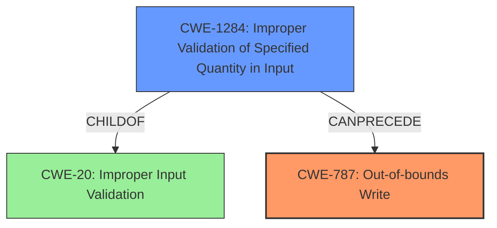

# Final Resolution for CVE-2022-42377

# Summary
| CWE ID | CWE Name | Confidence | CWE Abstraction Level | CWE Vulnerability Mapping Label | CWE-Vulnerability Mapping Notes |
|---|---|---|---|---|---|
| **CWE-787** | **Out-of-bounds Write** | 0.9 | Base | Primary | Allowed |
| **CWE-1284** | **Improper Validation of Specified Quantity in Input** | 0.7 | Base | Secondary | Allowed |

## Evidence and Confidence

*   **Confidence Score:** 0.85
*   **Evidence Strength:** HIGH

## Relationship Analysis
The primary weakness is **CWE-787 (Out-of-bounds Write)** which stems from writing data beyond the allocated buffer. The secondary weakness, **CWE-1284 (Improper Validation of Specified Quantity in Input)**, highlights the root cause - lack of proper validation of the size or length related data, thus leading to the memory corruption.

## Vulnerability Chain
The vulnerability chain starts with the **ROOTCAUSE** of **CWE-1284 (Improper Validation of Specified Quantity in Input)**, where the application fails to validate the size or length of data from the U3D file. This leads to the allocation of an improperly sized buffer or the use of an invalid index. Consequently, when the application attempts to write data into the buffer, it results in **CWE-787 (Out-of-bounds Write)**, causing memory corruption and potential arbitrary code execution.

## Summary of Analysis
The initial analysis and criticism are accurate and well-justified. The vulnerability description clearly states the "**lack of proper validation of user-supplied data, which can result in a memory corruption condition**". This directly supports the selection of **CWE-787 (Out-of-bounds Write)** as the primary **WEAKNESS**, due to the resulting memory corruption, and **CWE-1284 (Improper Validation of Specified Quantity in Input)** as a secondary **WEAKNESS**, as the **ROOTCAUSE**. The selection of Base level CWEs is appropriate, and the confidence levels are well-reasoned.

The criticism also suggests exploring other children of **CWE-20 (Improper Input Validation)**. While this is a valid suggestion, **CWE-1284 (Improper Validation of Specified Quantity in Input)** is the most relevant because it directly relates to handling sizes/lengths in the U3D file parsing, which leads to the **CWE-787 (Out-of-bounds Write)** condition.

The graph relationships highlight the chain of events: **CWE-1284 (Improper Validation of Specified Quantity in Input)** leads to **CWE-787 (Out-of-bounds Write)**. This chain accurately reflects the vulnerability described.

The selected CWEs are at the optimal level of specificity because they accurately describe the **ROOTCAUSE** and the resulting **WEAKNESS** based on the available evidence.