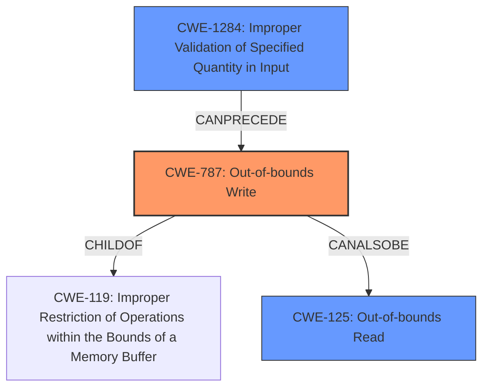

# Final Resolution for CVE-2022-42498

# Summary
| CWE ID | CWE Name | Confidence | CWE Abstraction Level | CWE Vulnerability Mapping Label | CWE-Vulnerability Mapping Notes |
|---|---|---|---|---|---|
| CWE-787 | Out-of-bounds Write | 0.95 | Base | Allowed | Primary CWE. Directly reflects the vulnerability description and key phrases. |
| CWE-1284 | Improper Validation of Specified Quantity in Input | 0.75 | Base | Allowed | Secondary candidate. Contributes to the **out-of-bounds write** due to the **missing bounds check**. |
| CWE-125 | Out-of-bounds Read | 0.5 | Base | Allowed | Secondary candidate. Related to **out-of-bounds write**, but less directly supported by the description. |

## Evidence and Confidence

*   **Confidence Score:** 0.9
*   **Evidence Strength:** HIGH

## Relationship Analysis
The primary CWE is CWE-787, which is a child of CWE-119. CWE-1284 can precede CWE-787 by failing to validate the size of the input, thus enabling the **out-of-bounds write**. CWE-125 is a peer of CWE-787, representing a related but distinct vulnerability. The base abstraction level of CWE-787 and CWE-1284 ensures the classification is at an appropriate level of specificity.

## Vulnerability Chain
The vulnerability chain starts with CWE-1284, where the input size is not validated. This leads to CWE-787, the **out-of-bounds write**. The **out-of-bounds write** can potentially lead to CWE-125, the **out-of-bounds read**, or remote code execution.

## Summary of Analysis
The initial analysis correctly identified CWE-787 as the primary weakness, which is directly supported by the vulnerability description stating "**out of bounds write** due to a **missing bounds check**". The criticism suggested strengthening the justification for the secondary CWEs, particularly CWE-1284. After reviewing the specifications, the "Description" of CWE-1284 maps well to the **missing bounds check** because it constitutes "incorrectly validates that the quantity has the required properties." Therefore, CWE-1284 is included as a secondary weakness with increased confidence. CWE-125 remains a possible, but less directly supported secondary weakness. The suggestion to explicitly reject CWE-119 is addressed by noting that while it is a parent of CWE-787, it is discouraged for use when more specific CWEs are available. The suggestion to consider CWE-788 was reviewed, but CWE-787 is more appropriate because the description explicitly states the write is **out of bounds** due to a missing bounds check, not necessarily that it is writing to a memory location after the end of the buffer. The selected CWEs are at the optimal level of specificity, providing a clear and accurate representation of the vulnerability.