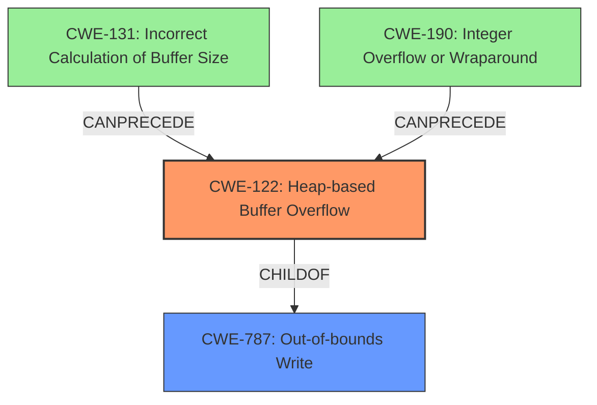

# Analysis Report for CVE-2022-42499

# Vulnerability Analysis Report: CVE-2022-42499

## Description

In sms_SendMmCpErrMsg of sms_MmConManagement.c, there is a possible out of bounds write due to a heap buffer overflow. This could lead to remote code execution with no additional execution privileges needed. User interaction is not needed for exploitation.Product AndroidVersions Android kernelAndroid ID A-242001391References N/A

## Vulnerability Description Key Phrases

**Rootcause:** heap buffer overflow
**Weakness:** out of bounds write
**Impact:** remote code execution
**Product:** Android
**Component:** sms_SendMmCpErrMsg of sms_MmConManagement.c

## Analysis (with Relationship Data)

# Summary
| CWE ID | CWE Name | Confidence | CWE Abstraction Level | CWE Vulnerability Mapping Label | CWE-Vulnerability Mapping Notes |
|---|---|---|---|---|---|
| CWE-787 | Out-of-bounds Write | 1.0 | Base | Allowed | The product writes data past the end, or before the beginning, of the intended buffer. |
| CWE-122 | Heap-based Buffer Overflow | 0.9 | Variant | Allowed | A heap overflow condition is a buffer overflow, where the buffer that can be overwritten is allocated in the heap portion of memory, generally meaning that the buffer was allocated using a routine such as malloc(). |

## Evidence and Confidence

*   **Confidence Score:** 0.95
*   **Evidence Strength:** HIGH

- **Analysis and Justification:**  
  - *Explanation:* The vulnerability description clearly states an **out of bounds write** due to a **heap buffer overflow** in `sms_SendMmCpErrMsg` of `sms_MmConManagement.c`. The `CVE Reference Links Content Summary` section confirms the presence of Remote Code Execution (RCE) due to the vulnerability in the modem component. CWE-787 (Out-of-bounds Write) directly addresses the **weakness** of writing data past the intended buffer. CWE-122 (Heap-based Buffer Overflow) specifies that the overflow occurs in the heap, which aligns with the description's mention of a **heap buffer overflow**.
  
  - *Relationship Analysis:* CWE-787 is a base level CWE and a parent of CWE-122 (Heap-based Buffer Overflow). CWE-122 is more specific because the vulnerability is a heap overflow, and this aligns with the vulnerability description.

- **Confidence Score:**  
  - Confidence: 1.0 (High confidence due to direct match with vulnerability description and confirmation from CVE reference.)

---

## Criticism of Analysis

Okay, here's a review of the provided CWE analysis, focusing on the accuracy of the mapping and the appropriateness of the selected CWEs, considering the full CWE specifications.

**Overall Assessment:**

The analysis is generally good and correctly identifies the primary weakness.  The mapping to CWE-787 and CWE-122 is accurate and well-justified. The confidence scores are appropriate.

**Detailed Review:**

| CWE ID | CWE Name | Confidence | Assessment | Notes |
|---|---|---|---|---|
| CWE-787 | Out-of-bounds Write | 1.0 | Correct | This is a high-level description of the weakness and correctly captures that data is being written outside the bounds of an allocated buffer. The analysis correctly notes that this is a parent CWE of CWE-122, but the next entry is a more accurate description of the vulnerability. |
| CWE-122 | Heap-based Buffer Overflow | 0.9 | Correct |  This is the most accurate CWE for this vulnerability. The description explicitly mentions a "heap buffer overflow", and CWE-122 directly addresses this scenario. The variant level of abstraction is appropriate.  The evidence provided is strong, and the confidence score of 0.9 is suitable because while highly probable, there is always some small chance of misinterpretation. |

**Points of Note based on the Full CWE Specifications:**

*   **CWE-787 vs. CWE-122:** The analysis correctly identifies the relationship between these CWEs. CWE-787 is a *Base* class, whereas CWE-122 is a *Variant*. Since the vulnerability is a *heap*-based buffer overflow, CWE-122 is a more specific and preferred mapping.
*   **Mitigations:** It's worthwhile to consider the mitigations suggested by both CWE-787 and CWE-122:
    *   **CWE-787 Mitigations:**
        *   *Language Selection:* Use a memory-safe language (e.g., Java, C# with proper bounds checking).  This is a pre-design consideration.
        *   *Safe Libraries/Frameworks:* Using safe string handling libraries or frameworks (e.g. SafeStr, Strsafe.h) could help prevent out-of-bounds writes.
        *   *Compiler/OS Protections:* Utilize compiler flags or OS-level mechanisms that detect buffer overflows (e.g., /GS flag in Visual Studio, FORTIFY_SOURCE in GCC, StackGuard, ProPolice).
    *   **CWE-122 Mitigations:**
        *   Use a language or compiler that performs automatic bounds checking.
        *   Use an abstraction library to abstract away risky APIs.
        *  Use automatic buffer overflow detection mechanisms that are offered by certain compilers or compiler extensions.
    *   These highlight the importance of choosing appropriate languages, libraries, and compiler options.

**Considerations Regarding Other Retriever Results:**

The Retriever Results suggest other potential CWEs. Let's examine some of the top-ranked ones in light of the full specifications:

*   **CWE-190 (Integer Overflow or Wraparound) & CWE-131 (Incorrect Calculation of Buffer Size):** The high ranking of these CWEs suggests a possibility that the root cause involves incorrect size calculations that lead to allocating a smaller buffer than needed. While the description focuses on the overflow itself, it's worthwhile investigating if an integer overflow or incorrect size calculation contributed to it. Without more information, it's impossible to say for sure, but their presence in the Retriever Results is a signal to investigate further. If the investigation confirms this, then these CWEs could be added as contributing factors in a chain.

*   **CWE-191 (Integer Underflow (Wrap or Wraparound)):** Similar to CWE-190, investigate if an integer underflow contributed to an incorrect size calculation.

*   **CWE-908 (Use of Uninitialized Resource) & CWE-909 (Missing Initialization of Resource):** These may not directly apply unless the overflow overwrites an uninitialized pointer or data structure.

*   **CWE-125 (Out-of-bounds Read):** While the primary issue is a write, it's possible that a related *read* out-of-bounds could occur in conjunction with the write, perhaps in determining the size of data to be written. This is less likely, but worth considering.

*   **CWE-843 (Access of Resource Using Incompatible Type ('Type Confusion')):** This is less likely, but could be relevant if the overflow is caused by a type mismatch in how the buffer is accessed.

*   **CWE-770 (Allocation of Resources Without Limits or Throttling):** This is unlikely to be the primary issue unless the heap overflow can be triggered by allocating resources without limits.

**Recommendations:**

1.  **Maintain the Mapping to CWE-787 and CWE-122:** These are accurate and well-supported.

2.  **Investigate Integer Overflow/Size Calculation:** Examine the code to determine if an integer overflow (CWE-190), integer underflow (CWE-191), or incorrect size calculation (CWE-131) contributes to the buffer overflow. If so, add these CWEs as contributing factors.

3.  **Re-evaluate Mitigation Strategies:**  Tailor mitigation strategies to the specific root cause.  If an integer overflow is involved, integer validation techniques are necessary. If size calculations are flawed, those calculations must be reviewed.

4.  **Document Assumptions:** Explicitly document the assumptions about buffer sizes and data types. This will aid in future code reviews and maintenance.

In conclusion, the analysis is solid, with the suggested refinements providing an even more complete and accurate understanding of the vulnerability.  The key takeaway is to dig deeper into potential contributing factors like integer overflows/underflows and size calculation errors to get a more complete picture.

## Final Resolution

# Summary
| CWE ID | CWE Name | Confidence | CWE Abstraction Level | CWE Vulnerability Mapping Label | CWE-Vulnerability Mapping Notes |
|---|---|---|---|---|---|
| CWE-122 | Heap-based Buffer Overflow | 0.95 | Variant | Allowed | Primary CWE. A heap overflow condition is a buffer overflow, where the buffer that can be overwritten is allocated in the heap portion of memory, generally meaning that the buffer was allocated using a routine such as malloc(). |
| CWE-787 | Out-of-bounds Write | 0.8 | Base | Allowed | Secondary Candidate. The product writes data past the end, or before the beginning, of the intended buffer. |
| CWE-131 | Incorrect Calculation of Buffer Size | 0.6 | Base | Allowed | Secondary Candidate. The product does not correctly calculate the size to be used when allocating a buffer, which could lead to a buffer overflow. |
| CWE-190 | Integer Overflow or Wraparound | 0.5 | Base | Allowed | Secondary Candidate. The product performs a calculation that can produce an integer overflow or wraparound when the logic assumes that the resulting value will always be larger than the original value. This occurs when an integer value is incremented to a value that is too large to store in the associated representation. When this occurs, the value may become a very small or negative number. |

## Evidence and Confidence

*   **Confidence Score:** 0.85
*   **Evidence Strength:** MEDIUM

## Relationship Analysis
The primary vulnerability is a **heap-based buffer overflow (CWE-122)**, which is a specific type of **out-of-bounds write (CWE-787)**. Therefore, CWE-122 is the more specific and appropriate choice as the primary CWE. The analysis also suggests the possibility of **incorrect buffer size calculation (CWE-131)** and **integer overflow (CWE-190)** as contributing factors. These could precede the buffer overflow by causing a smaller than expected buffer to be allocated.

## Vulnerability Chain
The vulnerability chain starts with a potential **incorrect calculation of the buffer size (CWE-131)** or an **integer overflow (CWE-190)** during the size calculation. This leads to a smaller than expected buffer being allocated on the heap. Subsequently, when data is written to this buffer, a **heap-based buffer overflow (CWE-122)** occurs, which is a specific case of an **out-of-bounds write (CWE-787)**. This **out-of-bounds write** can then lead to remote code execution. The chain is: CWE-131/CWE-190 -> CWE-122 -> CWE-787 -> RCE.

## Summary of Analysis
The initial analysis correctly identifies **CWE-787** and **CWE-122**. The criticism highlights that **CWE-122** is a more specific **Variant** of **CWE-787** and, therefore, a better primary mapping. The analysis also suggests investigating **CWE-131** (Incorrect Calculation of Buffer Size) and **CWE-190** (Integer Overflow or Wraparound) as potential contributing factors.

The vulnerability description states, "In `sms_SendMmCpErrMsg` of `sms_MmConManagement.c`, there is a possible **out of bounds write** due to a **heap buffer overflow**." This directly supports the selection of **CWE-122** as the primary **weakness**.

Based on the retriever results and the criticism, I am adding **CWE-131** and **CWE-190** as secondary candidates because an incorrect size calculation, possibly caused by an integer overflow, could have led to the smaller buffer allocation. However, there is no explicit mention of this in the vulnerability description. The confidence in these is lower because they are inferred rather than directly stated.

Therefore, the final decision is to select **CWE-122** as the primary **weakness** because it directly matches the "**heap buffer overflow**" in the vulnerability description. **CWE-787** is retained as a secondary candidate because it represents the general class of the vulnerability. **CWE-131** and **CWE-190** are included as potential contributing factors that need further investigation. This provides the optimal level of specificity based on the available evidence.

*Report generated on 2025-03-18 19:07:04*
