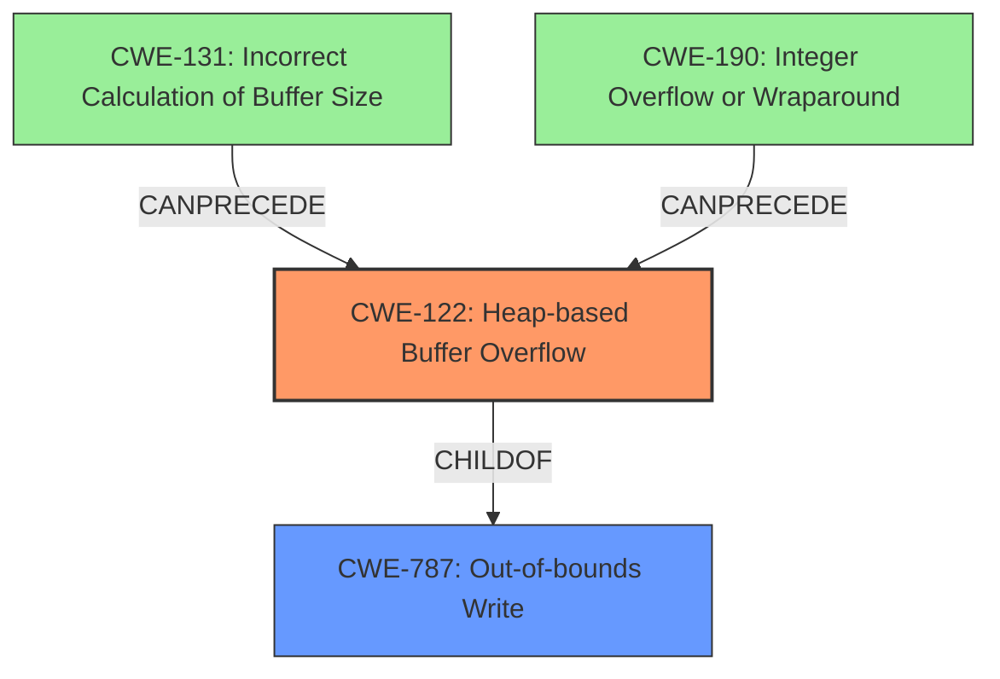

# Final Resolution for CVE-2022-42499

# Summary
| CWE ID | CWE Name | Confidence | CWE Abstraction Level | CWE Vulnerability Mapping Label | CWE-Vulnerability Mapping Notes |
|---|---|---|---|---|---|
| CWE-122 | Heap-based Buffer Overflow | 0.95 | Variant | Allowed | Primary CWE. A heap overflow condition is a buffer overflow, where the buffer that can be overwritten is allocated in the heap portion of memory, generally meaning that the buffer was allocated using a routine such as malloc(). |
| CWE-787 | Out-of-bounds Write | 0.8 | Base | Allowed | Secondary Candidate. The product writes data past the end, or before the beginning, of the intended buffer. |
| CWE-131 | Incorrect Calculation of Buffer Size | 0.6 | Base | Allowed | Secondary Candidate. The product does not correctly calculate the size to be used when allocating a buffer, which could lead to a buffer overflow. |
| CWE-190 | Integer Overflow or Wraparound | 0.5 | Base | Allowed | Secondary Candidate. The product performs a calculation that can produce an integer overflow or wraparound when the logic assumes that the resulting value will always be larger than the original value. This occurs when an integer value is incremented to a value that is too large to store in the associated representation. When this occurs, the value may become a very small or negative number. |

## Evidence and Confidence

*   **Confidence Score:** 0.85
*   **Evidence Strength:** MEDIUM

## Relationship Analysis
The primary vulnerability is a **heap-based buffer overflow (CWE-122)**, which is a specific type of **out-of-bounds write (CWE-787)**. Therefore, CWE-122 is the more specific and appropriate choice as the primary CWE. The analysis also suggests the possibility of **incorrect buffer size calculation (CWE-131)** and **integer overflow (CWE-190)** as contributing factors. These could precede the buffer overflow by causing a smaller than expected buffer to be allocated.

## Vulnerability Chain
The vulnerability chain starts with a potential **incorrect calculation of the buffer size (CWE-131)** or an **integer overflow (CWE-190)** during the size calculation. This leads to a smaller than expected buffer being allocated on the heap. Subsequently, when data is written to this buffer, a **heap-based buffer overflow (CWE-122)** occurs, which is a specific case of an **out-of-bounds write (CWE-787)**. This **out-of-bounds write** can then lead to remote code execution. The chain is: CWE-131/CWE-190 -> CWE-122 -> CWE-787 -> RCE.

## Summary of Analysis
The initial analysis correctly identifies **CWE-787** and **CWE-122**. The criticism highlights that **CWE-122** is a more specific **Variant** of **CWE-787** and, therefore, a better primary mapping. The analysis also suggests investigating **CWE-131** (Incorrect Calculation of Buffer Size) and **CWE-190** (Integer Overflow or Wraparound) as potential contributing factors.

The vulnerability description states, "In `sms_SendMmCpErrMsg` of `sms_MmConManagement.c`, there is a possible **out of bounds write** due to a **heap buffer overflow**." This directly supports the selection of **CWE-122** as the primary **weakness**.

Based on the retriever results and the criticism, I am adding **CWE-131** and **CWE-190** as secondary candidates because an incorrect size calculation, possibly caused by an integer overflow, could have led to the smaller buffer allocation. However, there is no explicit mention of this in the vulnerability description. The confidence in these is lower because they are inferred rather than directly stated.

Therefore, the final decision is to select **CWE-122** as the primary **weakness** because it directly matches the "**heap buffer overflow**" in the vulnerability description. **CWE-787** is retained as a secondary candidate because it represents the general class of the vulnerability. **CWE-131** and **CWE-190** are included as potential contributing factors that need further investigation. This provides the optimal level of specificity based on the available evidence.